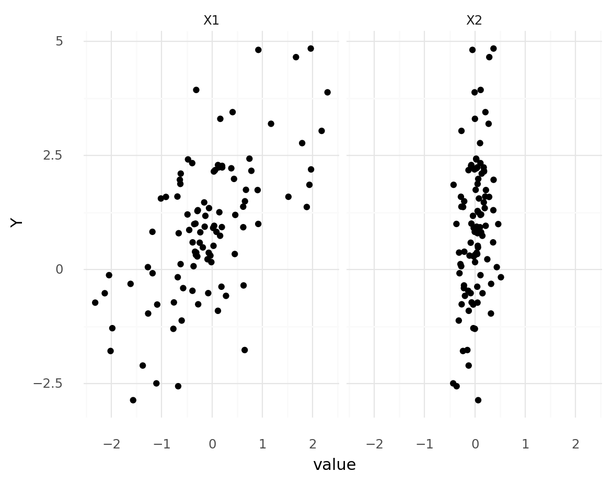
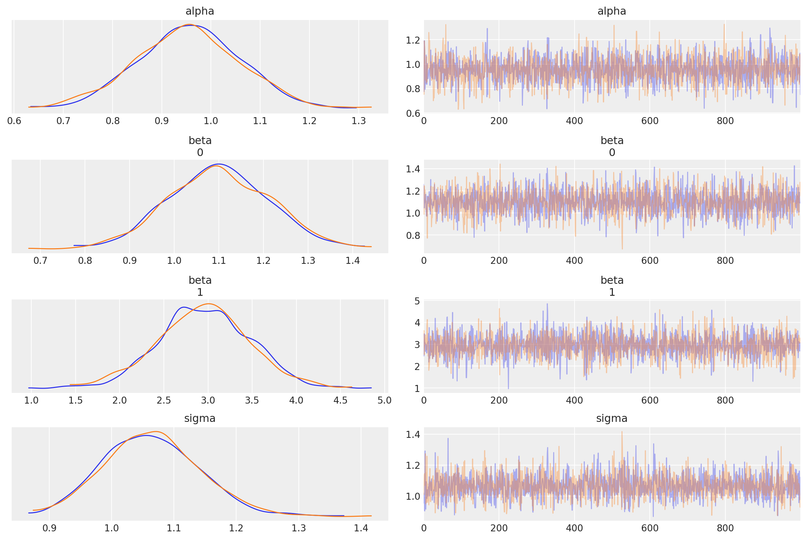
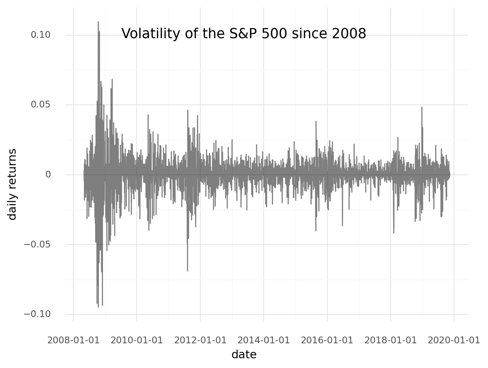
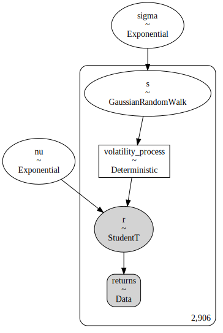
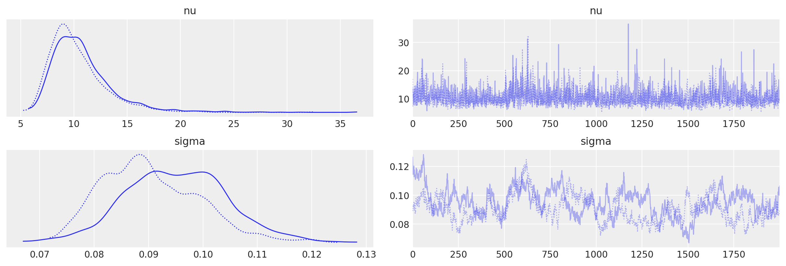
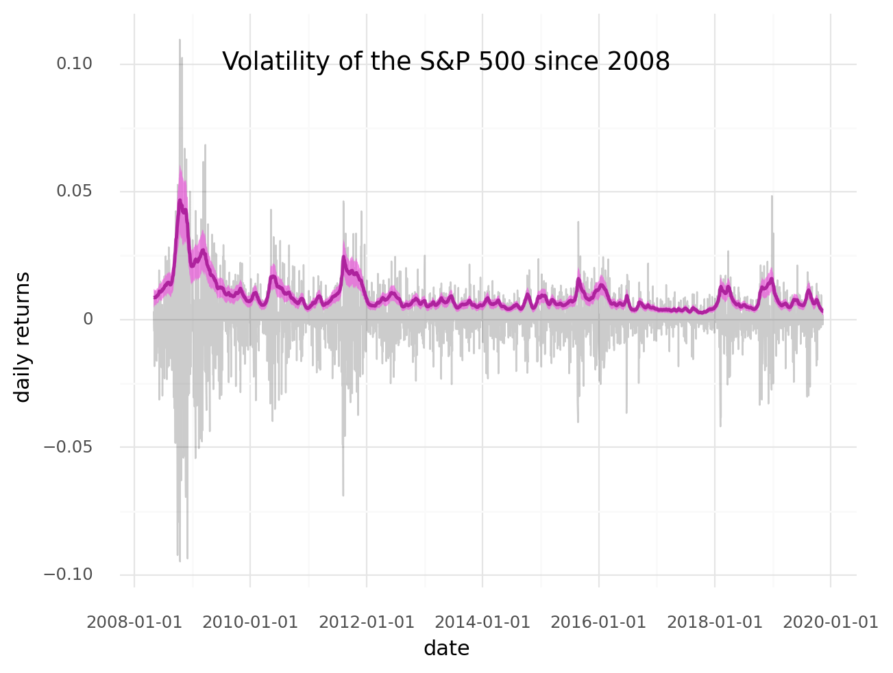

# Getting started with PyMC3

[Tutorial](https://docs.pymc.io/notebooks/getting_started.html)

```python
import arviz as az
import matplotlib.pyplot as plt
import numpy as np
import pandas as pd
import plotnine as gg
import pymc3 as pm

%config InlineBackend.figure_format = "retina"
RANDOM_SEED = 8927
np.random.seed(RANDOM_SEED)
az.style.use("arviz-darkgrid")
gg.theme_set(gg.theme_minimal)
```

## A Motivating Example: Linear Regression

$$
Y \sim \mathcal{N}(\mu, \sigma^2) \\
\mu = \alpha + \beta_1 X_1 + \beta_2 X_2 \\
\alpha \sim \mathcal{N}(0, 10) \\
\beta_1 \sim \mathcal{N}(0, 10) \\
\beta_2 \sim \mathcal{N}(0, 10) \\
\sigma \sim |\mathcal{N}(0, 1)|
$$

```python
alpha, sigma = 1, 1
beta = [1, 2.5]

size = 100

X1 = np.random.randn(size)
X2 = np.random.randn(size) * 0.2

Y = alpha + beta[0] * X1 + beta[1] * X2 + (np.random.randn(size) * sigma)

d = pd.DataFrame({"X1": X1, "X2": X2, "Y": Y}).melt(id_vars="Y")

(
    gg.ggplot(d, gg.aes("value", "Y"))
    + gg.facet_wrap("variable", nrow=1, scales="fixed")
    + gg.geom_point()
)
```

    /usr/local/Caskroom/miniconda/base/envs/pymc3-tutorials/lib/python3.9/site-packages/plotnine/facets/facet_wrap.py:215: UserWarning: This figure was using constrained_layout==True, but that is incompatible with subplots_adjust and or tight_layout: setting constrained_layout==False.



    <ggplot: (349776827)>

```python
with pm.Model() as basic_model:
    alpha = pm.Normal("alpha", 0, 10)
    beta = pm.Normal("beta", 0, 10, shape=2)
    sigma = pm.HalfNormal("sigma", 1)

    mu = alpha + beta[0] * X1 + beta[1] * X2

    Y_obs = pm.Normal("Y_obs", mu=mu, sigma=sigma, observed=Y)

    trace = pm.sample(5000, return_inferencedata=True)
```

    Auto-assigning NUTS sampler...
    Initializing NUTS using jitter+adapt_diag...
    Multiprocess sampling (2 chains in 2 jobs)
    NUTS: [sigma, beta, alpha]

<div>
    <style>
        /*Turns off some styling*/
        progress {
            /*gets rid of default border in Firefox and Opera.*/
            border: none;
            /*Needs to be in here for Safari polyfill so background images work as expected.*/
            background-size: auto;
        }
        .progress-bar-interrupted, .progress-bar-interrupted::-webkit-progress-bar {
            background: #F44336;
        }
    </style>
  <progress value='12000' class='' max='12000' style='width:300px; height:20px; vertical-align: middle;'></progress>
  100.00% [12000/12000 00:12<00:00 Sampling 2 chains, 0 divergences]
</div>

    Sampling 2 chains for 1_000 tune and 5_000 draw iterations (2_000 + 10_000 draws total) took 23 seconds.

```python
az.plot_trace(trace, compact=False)
plt.show()
```



```python
az.summary(trace)
```

<div>
<style scoped>
    .dataframe tbody tr th:only-of-type {
        vertical-align: middle;
    }

    .dataframe tbody tr th {
        vertical-align: top;
    }

    .dataframe thead th {
        text-align: right;
    }
</style>
<table border="1" class="dataframe">
  <thead>
    <tr style="text-align: right;">
      <th></th>
      <th>mean</th>
      <th>sd</th>
      <th>hdi_3%</th>
      <th>hdi_97%</th>
      <th>mcse_mean</th>
      <th>mcse_sd</th>
      <th>ess_mean</th>
      <th>ess_sd</th>
      <th>ess_bulk</th>
      <th>ess_tail</th>
      <th>r_hat</th>
    </tr>
  </thead>
  <tbody>
    <tr>
      <th>alpha</th>
      <td>0.958</td>
      <td>0.107</td>
      <td>0.759</td>
      <td>1.162</td>
      <td>0.001</td>
      <td>0.001</td>
      <td>15834.0</td>
      <td>15524.0</td>
      <td>15831.0</td>
      <td>8046.0</td>
      <td>1.0</td>
    </tr>
    <tr>
      <th>beta[0]</th>
      <td>1.101</td>
      <td>0.114</td>
      <td>0.893</td>
      <td>1.319</td>
      <td>0.001</td>
      <td>0.001</td>
      <td>13106.0</td>
      <td>12921.0</td>
      <td>13088.0</td>
      <td>7863.0</td>
      <td>1.0</td>
    </tr>
    <tr>
      <th>beta[1]</th>
      <td>2.952</td>
      <td>0.540</td>
      <td>1.891</td>
      <td>3.920</td>
      <td>0.004</td>
      <td>0.003</td>
      <td>15443.0</td>
      <td>14832.0</td>
      <td>15497.0</td>
      <td>7830.0</td>
      <td>1.0</td>
    </tr>
    <tr>
      <th>sigma</th>
      <td>1.064</td>
      <td>0.079</td>
      <td>0.917</td>
      <td>1.209</td>
      <td>0.001</td>
      <td>0.001</td>
      <td>12512.0</td>
      <td>12036.0</td>
      <td>13024.0</td>
      <td>7047.0</td>
      <td>1.0</td>
    </tr>
  </tbody>
</table>
</div>

## Case Study 1: Stochastic volatility

A case study on stock market volatility.
The distribution of market returns is non-normal, making smapling more difficult.

Asset prices have *time-varying volatility*, variance of day-over-day returns.
Sometimes, returns are highly volatile and other times prices are more stable.
This *stochasitc volatility model* addresses this with a latent volatility variable than changes over time.

$$
\log(r_i) \sim t(\nu, 0, \exp(-2s_i)) \\
s_i \sim \mathcal{N}(s_{i-1}, \sigma^2) \\
\nu \sim \exp(0.1) \\
\sigma \sim \exp(50)
$$

Here, $R$ is the faily return series modeled with a Student's *t*-distribution with an unknown degrees of freedom parameter $\nu$ and a scale parameter determined by a latent process $s$.
An individual $s_i$ is an individual daily log volatilities in the latent log volatility process.

Use data from S&P 500 indexsince the 2008 crisis.

```python
returns = pd.read_csv(
    pm.get_data("SP500.csv"), parse_dates=True, index_col=0, usecols=["Date", "change"]
).reset_index(drop=False)

(
    gg.ggplot(returns, gg.aes(x="Date", y="change"))
    + gg.geom_line(alpha=0.5, size=0.5)
    + gg.labs(x="date", y="daily returns", title="Volatility of the S&P 500 since 2008")
)
```



    <ggplot: (351797041)>

Use a `GaussianRandomWalk` as the prior for the latent volatilities.
It is a vector-valued distribution where the values of the vector form a random normal walk of length $n$, specified by the `shape` parameter.

We can provide initial values for any distribution, known as *test values*, using the `testval` parameter.
This can be useful if some values are illegal and we want to ensure a legal value is selected.

```python
with pm.Model() as sp500_model:
    change_returns = pm.Data(
        "returns", returns["change"], dims="date", export_index_as_coords=True
    )

    nu = pm.Exponential("nu", 1.0 / 10.0, testval=5.0)
    sigma = pm.Exponential("sigma", 2.0, testval=0.1)

    s = pm.GaussianRandomWalk("s", sigma=sigma, dims="date")

    volatility_process = pm.Deterministic(
        "volatility_process", pm.math.exp(-2 * s) ** 0.5, dims="date"
    )

    r = pm.StudentT(
        "r", nu=nu, sigma=volatility_process, observed=change_returns, dims="date"
    )
```

```python
pm.model_to_graphviz(sp500_model)
```



```python
sp500_model.RV_dims
```

    {'returns': ('date',),
     's': ('date',),
     'volatility_process': ('date',),
     'r': ('date',)}

```python
sp500_model.coords
```

    {'date': RangeIndex(start=0, stop=2906, step=1)}

```python
with sp500_model:
    trace = pm.sample(2000, init="adapt_diag", return_inferencedata=False)
```

    Auto-assigning NUTS sampler...
    Initializing NUTS using adapt_diag...
    Multiprocess sampling (2 chains in 2 jobs)
    NUTS: [s, sigma, nu]

<div>
    <style>
        /*Turns off some styling*/
        progress {
            /*gets rid of default border in Firefox and Opera.*/
            border: none;
            /*Needs to be in here for Safari polyfill so background images work as expected.*/
            background-size: auto;
        }
        .progress-bar-interrupted, .progress-bar-interrupted::-webkit-progress-bar {
            background: #F44336;
        }
    </style>
  <progress value='6000' class='' max='6000' style='width:300px; height:20px; vertical-align: middle;'></progress>
  100.00% [6000/6000 08:22<00:00 Sampling 2 chains, 0 divergences]
</div>

    Sampling 2 chains for 1_000 tune and 2_000 draw iterations (2_000 + 4_000 draws total) took 512 seconds.


    0, dim: date, 2906 =? 2906


    The rhat statistic is larger than 1.05 for some parameters. This indicates slight problems during sampling.
    The estimated number of effective samples is smaller than 200 for some parameters.

```python
az.plot_trace(trace, combined=False, var_names=["nu", "sigma"])
plt.show()
```

    /usr/local/Caskroom/miniconda/base/envs/pymc3-tutorials/lib/python3.9/site-packages/arviz/data/io_pymc3.py:88: FutureWarning: Using `from_pymc3` without the model will be deprecated in a future release. Not using the model will return less accurate and less useful results. Make sure you use the model argument or call from_pymc3 within a model context.


    0, dim: date, 2906 =? 2906
    0, dim: date, 2906 =? 2906



```python
volatility_post = 1 / np.exp(trace["s", ::5].T)
volatility_post_hdi = az.hdi(volatility_post.T, hdi_prob=0.89)
plot_data = returns.copy()
plot_data["volatility"] = volatility_post.mean(axis=1)
plot_data["volatility_lower"] = volatility_post_hdi[:, 0]
plot_data["volatility_high"] = volatility_post_hdi[:, 1]

(
    gg.ggplot(plot_data, gg.aes(x="Date"))
    + gg.geom_line(gg.aes(y="change"), alpha=0.2, size=0.5)
    + gg.geom_ribbon(
        gg.aes(ymin="volatility_lower", ymax="volatility_high"),
        alpha=0.7,
        fill="#EF5BDE",
    )
    + gg.geom_line(gg.aes(y="volatility"), alpha=0.8, color="#A10D90", size=1)
    + gg.labs(x="date", y="daily returns", title="Volatility of the S&P 500 since 2008")
)
```

    /usr/local/Caskroom/miniconda/base/envs/pymc3-tutorials/lib/python3.9/site-packages/arviz/stats/stats.py:493: FutureWarning: hdi currently interprets 2d data as (draw, shape) but this will change in a future release to (chain, draw) for coherence with other functions



    <ggplot: (351180939)>

## Case Study 2: Coal mining disasters

Data is a time series of recorded coal mining disasters in the UK from 1851 to 1962.
The number of disasters is affected by changes in safety regulations.
There are two years with missing data, but *these missing values with be automatically imputed by PyMC3*.

Build a model to estimate when the change occurred and see how the model handles missing data.

```python
disasters_data = pd.read_csv("data/mining_disasters.txt", header=None)
disasters_data.columns = ["n_disasters"]
disasters_data[["year"]] = np.arange(1851, 1962)
disasters_data.head()
```

```python
# Missing data
disasters_data[disasters_data.n_disasters.isna()]
```

```python
(
    gg.ggplot(
        disasters_data[~disasters_data.n_disasters.isna()],
        gg.aes(x="year", y="n_disasters"),
    )
    + gg.geom_smooth(se=False, linetype="--", color="#BC272A")
    + gg.geom_line(group="a", alpha=0.2, color="#3F7BB1")
    + gg.geom_point(color="#3F7BB1")
    + gg.labs(x="year", y="disaster count")
)
```

The occurrence of disasters follows a Poisson process with a large rate parameter early on but a smaller parameter later.
We want to locate the change point in the series.

$$
\begin{align}
D_t & \sim \text{Pois}(r_t), r_t =
\begin{cases}
 e, & \text{if } t \leq s \\
 l, & \text{if } t \gt s
\end{cases} \\
s & \sim \text{Unif}(t_l, t_h) \\
e & \sim \exp(1) \\
l & \sim \exp(1)
\end{align}
$$

In this model, $s$ is the switchpoint between "early" and "late" rate parameters ($e$ and $l$).

```python
with pm.Model() as disaster_model:

    # Data
    years_shared = pm.Data("years_shared", disasters_data.year)
    disasters_shared = pm.Data("disasters_shared", disasters_data.n_disasters)

    # Switchpiont
    switchpoint = pm.DiscreteUniform(
        "switchpoint", lower=years_shared.min(), upper=years_shared.max(), testval=1900
    )

    # Priors for early and late rates.
    early_rate = pm.Exponential("early_rate", 1.0)
    late_rate = pm.Exponential("late_rate", 1.0)

    # Allocate appropriate Poisson rates using the switchpoint.
    rate = pm.math.switch(switchpoint >= years_shared, early_rate, late_rate)

    # Observed data.
    disasters = pm.Poisson("disasters", rate, observed=disasters_shared)
```

```python
pm.model_to_graphviz(disaster_model)
```

NUTS cannot be used to sample because the data is discrete.
Instead, need to use a Metropolis step method that implements adaptive Metropolis-Hastings.
PyMC3 handles this automatically.

**TODO: use this [link](http://stronginference.com/missing-data-imputation.html) to create a masked array for data imputation.**

```python
with disaster_model:
    trace = pm.sample(10000, random_seed=RANDOM_SEED)
```

```python

```

```python

```

```python

```

```python

```

```python

```

```python

```

---

```python
%load_ext watermark
%watermark -n -u -v -iv -w
```

```python

```
