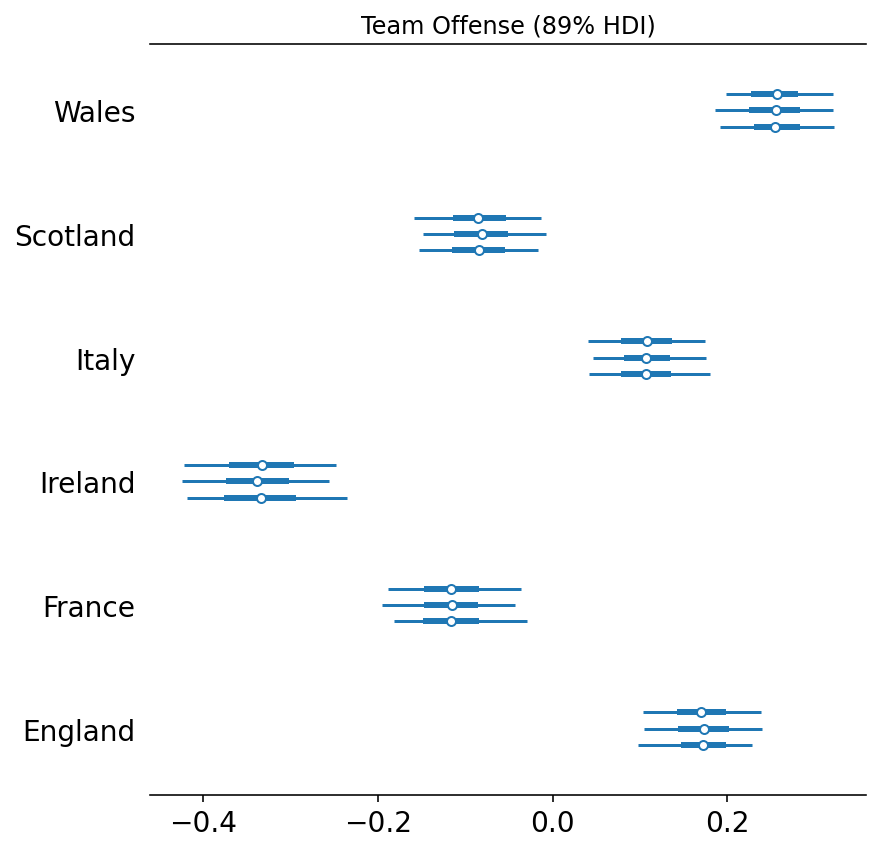

# A Hierarchical model for rugby prediction

Our goal is to infer a latent parameter for the "strength" of a team based on their scoring intensity.

```python
from io import StringIO

import arviz as az
import matplotlib.pyplot as plt
import numpy as np
import pandas as pd
import plotnine as gg
import pymc3 as pm
import seaborn as sns
import theano.tensor as tt

%matplotlib inline
%config InlineBackend.figure_format = "retina"

gg.theme_set(gg.theme_minimal())

RANDOM_SEED = 847
np.random.seed(RANDOM_SEED)
```

## Data

```python
df_all = pd.read_csv(pm.get_data("rugby.csv"), index_col=0)

df_all["difference"] = np.abs(df_all["home_score"] - df_all["away_score"])
df_all["difference_non_abs"] = df_all["home_score"] - df_all["away_score"]

df_all.head()
```

<div>
<style scoped>
    .dataframe tbody tr th:only-of-type {
        vertical-align: middle;
    }

    .dataframe tbody tr th {
        vertical-align: top;
    }

    .dataframe thead th {
        text-align: right;
    }
</style>
<table border="1" class="dataframe">
  <thead>
    <tr style="text-align: right;">
      <th></th>
      <th>home_team</th>
      <th>away_team</th>
      <th>home_score</th>
      <th>away_score</th>
      <th>year</th>
      <th>difference</th>
      <th>difference_non_abs</th>
    </tr>
  </thead>
  <tbody>
    <tr>
      <th>0</th>
      <td>Wales</td>
      <td>Italy</td>
      <td>23</td>
      <td>15</td>
      <td>2014</td>
      <td>8</td>
      <td>8</td>
    </tr>
    <tr>
      <th>1</th>
      <td>France</td>
      <td>England</td>
      <td>26</td>
      <td>24</td>
      <td>2014</td>
      <td>2</td>
      <td>2</td>
    </tr>
    <tr>
      <th>2</th>
      <td>Ireland</td>
      <td>Scotland</td>
      <td>28</td>
      <td>6</td>
      <td>2014</td>
      <td>22</td>
      <td>22</td>
    </tr>
    <tr>
      <th>3</th>
      <td>Ireland</td>
      <td>Wales</td>
      <td>26</td>
      <td>3</td>
      <td>2014</td>
      <td>23</td>
      <td>23</td>
    </tr>
    <tr>
      <th>4</th>
      <td>Scotland</td>
      <td>England</td>
      <td>0</td>
      <td>20</td>
      <td>2014</td>
      <td>20</td>
      <td>-20</td>
    </tr>
  </tbody>
</table>
</div>

## Visualization / EDA

```python
(
    gg.ggplot(df_all, gg.aes(x="factor(year)", y="difference"))
    + gg.geom_boxplot(fill="black", alpha=0.2, outlier_alpha=0)
    + gg.labs(
        x="year",
        y="Average (abs) point difference",
        title="Average magnitude of scores differences of Six Nations",
    )
)
```


    <ggplot: (284558409)>

```python
df_all.head()
```

<div>
<style scoped>
    .dataframe tbody tr th:only-of-type {
        vertical-align: middle;
    }

    .dataframe tbody tr th {
        vertical-align: top;
    }

    .dataframe thead th {
        text-align: right;
    }
</style>
<table border="1" class="dataframe">
  <thead>
    <tr style="text-align: right;">
      <th></th>
      <th>home_team</th>
      <th>away_team</th>
      <th>home_score</th>
      <th>away_score</th>
      <th>year</th>
      <th>difference</th>
      <th>difference_non_abs</th>
    </tr>
  </thead>
  <tbody>
    <tr>
      <th>0</th>
      <td>Wales</td>
      <td>Italy</td>
      <td>23</td>
      <td>15</td>
      <td>2014</td>
      <td>8</td>
      <td>8</td>
    </tr>
    <tr>
      <th>1</th>
      <td>France</td>
      <td>England</td>
      <td>26</td>
      <td>24</td>
      <td>2014</td>
      <td>2</td>
      <td>2</td>
    </tr>
    <tr>
      <th>2</th>
      <td>Ireland</td>
      <td>Scotland</td>
      <td>28</td>
      <td>6</td>
      <td>2014</td>
      <td>22</td>
      <td>22</td>
    </tr>
    <tr>
      <th>3</th>
      <td>Ireland</td>
      <td>Wales</td>
      <td>26</td>
      <td>3</td>
      <td>2014</td>
      <td>23</td>
      <td>23</td>
    </tr>
    <tr>
      <th>4</th>
      <td>Scotland</td>
      <td>England</td>
      <td>0</td>
      <td>20</td>
      <td>2014</td>
      <td>20</td>
      <td>-20</td>
    </tr>
  </tbody>
</table>
</div>

We can see that Italy and England have poor away-form.

```python
plot_data = (
    df_all[["difference_non_abs", "home_team", "away_team", "year"]]
    .melt(id_vars=["difference_non_abs", "year"])
    .assign(variable=lambda d: [s.replace("_team", "") for s in d.variable])
)

(
    gg.ggplot(plot_data, gg.aes(x="value", y="difference_non_abs"))
    + gg.geom_hline(yintercept=0, linetype="--", alpha=0.5, color="black")
    + gg.geom_boxplot(
        gg.aes(color="variable", fill="variable"),
        position="dodge",
        alpha=0.2,
        outlier_alpha=0.3,
    )
    + gg.scale_color_brewer(type="qual", palette="Set1")
    + gg.scale_fill_brewer(type="qual", palette="Set1")
    + gg.theme(legend_title=gg.element_blank())
    + gg.labs(x=None, y="Score difference (home score - away score)")
)
```


    <ggplot: (353563146)>

```python

```

```python
plot_data_summary = (
    plot_data.groupby(["year", "variable", "value"]).mean().reset_index(drop=False)
)

(
    gg.ggplot(plot_data, gg.aes(x="year", y="difference_non_abs"))
    + gg.facet_grid("value ~ variable")
    + gg.geom_hline(yintercept=0, linetype="--", color="black", alpha=0.5)
    + gg.geom_line(
        group="a", data=plot_data_summary, alpha=0.7, color="#3F7BB1", size=1
    )
    + gg.geom_point()
    + gg.theme(figure_size=(8, 12))
)
```

    /usr/local/Caskroom/miniconda/base/envs/pymc3-tutorials/lib/python3.9/site-packages/plotnine/facets/facet_grid.py:136: FutureWarning: Index.__and__ operating as a set operation is deprecated, in the future this will be a logical operation matching Series.__and__.  Use index.intersection(other) instead
    /usr/local/Caskroom/miniconda/base/envs/pymc3-tutorials/lib/python3.9/site-packages/plotnine/facets/facet_grid.py:137: FutureWarning: Index.__and__ operating as a set operation is deprecated, in the future this will be a logical operation matching Series.__and__.  Use index.intersection(other) instead


    <ggplot: (353688052)>

## Model

There are 6 teams ($T=6$) that play each other once in a season.
The number of points scored by the home and away team in the $g$-th game of the season (15 games in total) as $y_{g1}$ and $y_{g2}$.
The vector of observed counts $y = (y_{g1}, y_{g2})$ is modelled as an independent Poisson: $\mathbb{y}_{gi} | \theta_{gj} \sim \text{Poisson}(\theta_{gj})$ where the $\theta$ parameters represents the scoring intensity in the $g$-th game for the team playing at home ($j=1$) or away ($j=2$).

The model is shown below constructed of two equations, one for the number of points by the home team and one for the away team.
The only differences is that the home team has the $home$ covariate to include for the "home-field advantage".

$$
\begin{align}
\log \theta_{g1} &= home + att_{h(g)} + def_{a(g)} \\
\log \theta_{g2} &= att_{a(g)} + def_{h(g)} \\
\end{align}
$$

The $home$ covariate will be constant through time and for all teams.
The score for a team is determined by the "attack" ($att$) and "defensibility" ($def$) of the two teams.

The attack and defensibility for each team $t$ come from common distributions.

$$
\begin{align}
att_t &\sim \mathcal{N}(\mu_{att}, \tau_{att}) \\
def_t &\sim \mathcal{N}(\mu_{def}, \tau_{def}) \\
\end{align}
$$

To help with sampling, the actual model will be reparamaterized using "non-centered parameterization." Here is a good link for learning about this technique: ["Why hierarchical models are awesome, tricky, and Bayesian"](https://twiecki.io/blog/2017/02/08/bayesian-hierchical-non-centered/#Reparameterization).

```python
df = df_all[["home_team", "away_team", "home_score", "away_score", "year"]].reset_index(
    drop=True
)

for col in ["home_team", "away_team"]:
    df[col] = pd.Categorical(df[col].values, ordered=True)

home_team = df.home_team.cat.codes.to_numpy()
away_team = df.away_team.cat.codes.to_numpy()

num_teams = len(np.unique(home_team))
num_games = df.shape[0]
```

```python
with pm.Model() as model:

    # Global model parameters.
    home = pm.Normal("home", 1, 10)
    τ_att = pm.HalfStudentT("τ_att", nu=3, sigma=2.5)
    τ_def = pm.HalfStudentT("τ_def", nu=3, sigma=2.5)
    α = pm.Normal("α", 0, 5)  # shared intercept

    # Team-specific model parameters.
    att_star_g = pm.Normal("att_star_g", 0, τ_att, shape=num_teams)
    def_star_g = pm.Normal("def_star_g", 0, τ_def, shape=num_teams)

    att_g = pm.Deterministic("att_g", att_star_g - tt.mean(att_star_g))
    def_g = pm.Deterministic("def_g", def_star_g - tt.mean(def_star_g))
    θ_home = tt.exp(α + home + att_g[home_team] + def_g[away_team])
    θ_away = tt.exp(α + att_g[away_team] + def_g[home_team])

    # Likelihood of observed data.
    home_points = pm.Poisson("home_points", mu=θ_home, observed=df.home_score)
    away_points = pm.Poisson("away_points", mu=θ_away, observed=df.away_score)
```

```python
pm.model_to_graphviz(model)
```


```python
with model:
    trace = pm.sample(1000, tune=2000, chains=3, cores=3, random_seed=RANDOM_SEED)
```

    Auto-assigning NUTS sampler...
    Initializing NUTS using jitter+adapt_diag...
    Multiprocess sampling (3 chains in 3 jobs)
    NUTS: [def_star_g, att_star_g, α, τ_def, τ_att, home]

<div>
    <style>
        /*Turns off some styling*/
        progress {
            /*gets rid of default border in Firefox and Opera.*/
            border: none;
            /*Needs to be in here for Safari polyfill so background images work as expected.*/
            background-size: auto;
        }
        .progress-bar-interrupted, .progress-bar-interrupted::-webkit-progress-bar {
            background: #F44336;
        }
    </style>
  <progress value='9000' class='' max='9000' style='width:300px; height:20px; vertical-align: middle;'></progress>
  100.00% [9000/9000 00:57<00:00 Sampling 3 chains, 0 divergences]
</div>

    Sampling 3 chains for 2_000 tune and 1_000 draw iterations (6_000 + 3_000 draws total) took 71 seconds.

```python
az_model = az.from_pymc3(trace=trace, model=model)
```

```python
az.plot_trace(az_model)
plt.show()
```


As in an good statistical workflow, let us check some evaluation metrics to ensure the NUTS sampler converged.

```python
bfmi = np.max(az.bfmi(az_model))
max_gr = np.max(list(np.max(gr_stats) for gr_stats in az.rhat(az_model).values()))

az.plot_energy(az_model, figsize=(6, 4)).set_title(
    f"BFMI = {bfmi:.3f} | Gelman-Rubin = {max_gr:.3f}"
)
plt.show()
```


## Results

### Covariate estimates

```python
for var, title in zip(("def_g", "att_g"), ("Defense", "Offense")):
    ax = az.plot_forest(az_model, var_names=[var], hdi_prob=0.89)
    ax[0].set_yticklabels(df.home_team.values.categories.to_list())
    ax[0].set_title(f"Team {title} (89% HDI)")
    plt.show()
```




```python
az.plot_posterior(az_model, var_names="home", hdi_prob=0.89)
plt.show()
```


### Predictions

Simulate 1000 seasons and calculate probability of the outcomes of the games.

```python
with model:
    pp_trace = pm.sample_posterior_predictive(
        trace=trace, samples=1000, random_seed=RANDOM_SEED
    )
```

    /usr/local/Caskroom/miniconda/base/envs/pymc3-tutorials/lib/python3.9/site-packages/pymc3/sampling.py:1707: UserWarning: samples parameter is smaller than nchains times ndraws, some draws and/or chains may not be represented in the returned posterior predictive sample

<div>
    <style>
        /*Turns off some styling*/
        progress {
            /*gets rid of default border in Firefox and Opera.*/
            border: none;
            /*Needs to be in here for Safari polyfill so background images work as expected.*/
            background-size: auto;
        }
        .progress-bar-interrupted, .progress-bar-interrupted::-webkit-progress-bar {
            background: #F44336;
        }
    </style>
  <progress value='1000' class='' max='1000' style='width:300px; height:20px; vertical-align: middle;'></progress>
  100.00% [1000/1000 00:02<00:00]
</div>

```python
home_sim_df = pd.DataFrame(
    {
        f"sim_points_{i}": 3 * home_won
        for i, home_won in enumerate(pp_trace["home_points"] > pp_trace["away_points"])
    }
)
home_sim_df.insert(0, "team", df["home_team"])

away_sim_df = pd.DataFrame(
    {
        f"sim_points_{i}": 3 * away_won
        for i, away_won in enumerate(pp_trace["home_points"] < pp_trace["away_points"])
    }
)
away_sim_df.insert(0, "team", df["away_team"])

draw_sim_df = pd.DataFrame(
    {
        f"sim_points_{i}": 1 * draw
        for i, draw in enumerate(pp_trace["home_points"] == pp_trace["away_points"])
    }
)

home_draw = draw_sim_df.copy().assign(team=home_sim_df.team)
away_draw = draw_sim_df.copy().assign(team=away_sim_df.team)
```

```python
simulated_table = (
    home_sim_df.groupby("team")
    .sum()
    .add(away_sim_df.groupby("team").sum())
    .add(home_draw.groupby("team").sum())
    .add(away_draw.groupby("team").sum())
    .rank(ascending=False, method="min", axis=0)
    .reset_index()
    .melt(id_vars="team", value_name="rank")
    .groupby("team")["rank"]
    .value_counts()
    .unstack(level="rank")
    .fillna(0)
)

n_samples = simulated_table.sum(axis=1).values[0]
simulated_table = simulated_table.div(n_samples).reset_index(drop=False)

simulated_table
```

<div>
<style scoped>
    .dataframe tbody tr th:only-of-type {
        vertical-align: middle;
    }

    .dataframe tbody tr th {
        vertical-align: top;
    }

    .dataframe thead th {
        text-align: right;
    }
</style>
<table border="1" class="dataframe">
  <thead>
    <tr style="text-align: right;">
      <th>rank</th>
      <th>team</th>
      <th>1.0</th>
      <th>2.0</th>
      <th>3.0</th>
      <th>4.0</th>
      <th>5.0</th>
      <th>6.0</th>
    </tr>
  </thead>
  <tbody>
    <tr>
      <th>0</th>
      <td>England</td>
      <td>0.429</td>
      <td>0.443</td>
      <td>0.126</td>
      <td>0.002</td>
      <td>0.000</td>
      <td>0.0</td>
    </tr>
    <tr>
      <th>1</th>
      <td>France</td>
      <td>0.000</td>
      <td>0.000</td>
      <td>0.028</td>
      <td>0.901</td>
      <td>0.071</td>
      <td>0.0</td>
    </tr>
    <tr>
      <th>2</th>
      <td>Ireland</td>
      <td>0.609</td>
      <td>0.294</td>
      <td>0.097</td>
      <td>0.000</td>
      <td>0.000</td>
      <td>0.0</td>
    </tr>
    <tr>
      <th>3</th>
      <td>Italy</td>
      <td>0.000</td>
      <td>0.000</td>
      <td>0.000</td>
      <td>0.000</td>
      <td>0.000</td>
      <td>1.0</td>
    </tr>
    <tr>
      <th>4</th>
      <td>Scotland</td>
      <td>0.000</td>
      <td>0.000</td>
      <td>0.000</td>
      <td>0.129</td>
      <td>0.871</td>
      <td>0.0</td>
    </tr>
    <tr>
      <th>5</th>
      <td>Wales</td>
      <td>0.070</td>
      <td>0.226</td>
      <td>0.687</td>
      <td>0.017</td>
      <td>0.000</td>
      <td>0.0</td>
    </tr>
  </tbody>
</table>
</div>

```python
plot_data = simulated_table.melt(id_vars="team", var_name="rank", value_name="prob")

expected_rankings = (
    plot_data.assign(memo_score=lambda d: d[["rank"]].values ** 2 * d[["prob"]].values)
    .groupby("team")["memo_score"]
    .sum()
    .reset_index()
    .sort_values("memo_score")
    .team.to_list()
)

plot_data["team"] = pd.Categorical(
    plot_data.team.to_list(), categories=expected_rankings, ordered=True
)

(
    gg.ggplot(plot_data, gg.aes(x="team", y="prob"))
    + gg.geom_col(gg.aes(fill="factor(rank)"))
    + gg.scale_fill_brewer(type="seq", palette=1, direction=-1)
    + gg.scale_y_continuous(expand=(0, 0, 0, 0))
    + gg.labs(
        x=None,
        y="probability of final rank",
        fill="rank",
        title="Expected final rankings",
    )
)
```


    <ggplot: (284510612)>

---

```python
%load_ext watermark
%watermark -n -u -v -iv -w
```

    Last updated: Thu Feb 04 2021

    Python implementation: CPython
    Python version       : 3.9.1
    IPython version      : 7.20.0

    pymc3     : 3.9.3
    theano    : 1.0.5
    numpy     : 1.20.0
    pandas    : 1.2.1
    matplotlib: 3.3.4
    arviz     : 0.11.0
    plotnine  : 0.7.1
    seaborn   : 0.11.1

    Watermark: 2.1.0
