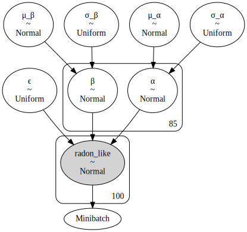

# GLM: Mini-batch ADVI on hierarchical regression model

Regression models have independent variables ($x$).
They affect the likelihood function, but are not random variables.
"When using mini-batch, we should take care of that."

```python
%env THEANO_FLAGS=device=cpu, floatX=float32, warn_float64=ignore

import arviz as az
import matplotlib.pyplot as plt
import numpy as np
import pandas as pd
import plotnine as gg
import pymc3 as pm
import theano
import theano.tensor as tt

%config InlineBackend.figure_format = 'retina'
gg.theme_set(gg.theme_minimal())

%load_ext memory_profiler

RANDOM_SEED = 606
np.random.seed(RANDOM_SEED)
```

    env: THEANO_FLAGS=device=cpu, floatX=float32, warn_float64=ignore

```python
data = pd.read_csv(pm.get_data("radon.csv"))

county_names = data.county.unique()
county_idx = data["county_code"].values
n_counties = len(county_names)
total_size = data.shape[0]
```

For this example, `log_radon_t` is the dependent variable ($y$) and `floor_t` and `county_idx_t` are the independent variables ($x$).

```python
log_radon_t = pm.Minibatch(data.log_radon.values, 100)
floor_t = pm.Minibatch(data.floor.values, 100)
county_idx_t = pm.Minibatch(data.county_code.values, 100)
```

    /usr/local/Caskroom/miniconda/base/envs/pymc3-tutorials/lib/python3.9/site-packages/pymc3/data.py:307: FutureWarning: Using a non-tuple sequence for multidimensional indexing is deprecated; use `arr[tuple(seq)]` instead of `arr[seq]`. In the future this will be interpreted as an array index, `arr[np.array(seq)]`, which will result either in an error or a different result.
    /usr/local/Caskroom/miniconda/base/envs/pymc3-tutorials/lib/python3.9/site-packages/pymc3/data.py:307: FutureWarning: Using a non-tuple sequence for multidimensional indexing is deprecated; use `arr[tuple(seq)]` instead of `arr[seq]`. In the future this will be interpreted as an array index, `arr[np.array(seq)]`, which will result either in an error or a different result.

```python
theano.config.profile = True
theano.config.profile_memory = True

with pm.Model() as hierarchical_model_batch:
    # Hyperpriors
    μ_α = pm.Normal("μ_α", 0, 100 ** 2)
    σ_α = pm.Uniform("σ_α", lower=0, upper=100)
    μ_β = pm.Normal("μ_β", 0, 100 ** 2)
    σ_β = pm.Uniform("σ_β", 0, 100)

    # Prios
    α = pm.Normal("α", μ_α, σ_α, shape=n_counties)
    β = pm.Normal("β", μ_β, σ_β, shape=n_counties)

    # Main level
    radon_est = α[county_idx_t] + β[county_idx_t] * floor_t

    # Likelihood
    ϵ = pm.Uniform("ϵ", lower=0, upper=100)
    radon_like = pm.Normal(
        "radon_like", radon_est, ϵ, observed=log_radon_t, total_size=total_size
    )
```

```python
pm.model_to_graphviz(hierarchical_model_batch)
```

    /usr/local/Caskroom/miniconda/base/envs/pymc3-tutorials/lib/python3.9/site-packages/theano/gof/vm.py:886: UserWarning: CVM does not support memory profile, using Stack VM.



Run ADVI with mini-batch.

```python
# with hierarchical_model_batch:
#     approx = pm.fit(
#         100000, callbacks=[pm.callbacks.CheckParametersConvergence(tolerance=1e-4)]
#     )
```

```python
# plot_data = pd.DataFrame({"x": np.arange(0, len(approx.hist)), "loss": approx.hist})

# (
#     gg.ggplot(plot_data, gg.aes(x="x", y="loss"))
#     + gg.geom_line(alpha=0.5, color="blue", size=1)
#     + gg.labs(x="sample", y="loss")
# )
```

```python
with hierarchical_model_batch:
    hierarchical_batch_trace = pm.sample(draws=1000, tune=2000, random_seed=RANDOM_SEED)
```

    Auto-assigning NUTS sampler...
    Initializing NUTS using jitter+adapt_diag...
    /usr/local/Caskroom/miniconda/base/envs/pymc3-tutorials/lib/python3.9/site-packages/theano/gof/vm.py:886: UserWarning: CVM does not support memory profile, using Stack VM.
    Multiprocess sampling (2 chains in 2 jobs)
    NUTS: [ϵ, β, α, σ_β, μ_β, σ_α, μ_α]
    /usr/local/Caskroom/miniconda/base/envs/pymc3-tutorials/lib/python3.9/site-packages/theano/gof/vm.py:886: UserWarning: CVM does not support memory profile, using Stack VM.

<div>
    <style>
        /*Turns off some styling*/
        progress {
            /*gets rid of default border in Firefox and Opera.*/
            border: none;
            /*Needs to be in here for Safari polyfill so background images work as expected.*/
            background-size: auto;
        }
        .progress-bar-interrupted, .progress-bar-interrupted::-webkit-progress-bar {
            background: #F44336;
        }
    </style>
  <progress value='6000' class='' max='6000' style='width:300px; height:20px; vertical-align: middle;'></progress>
  100.00% [6000/6000 01:43<00:00 Sampling 2 chains, 254 divergences]
</div>

    Sampling 2 chains for 2_000 tune and 1_000 draw iterations (4_000 + 2_000 draws total) took 112 seconds.
    /usr/local/Caskroom/miniconda/base/envs/pymc3-tutorials/lib/python3.9/site-packages/theano/gof/vm.py:886: UserWarning: CVM does not support memory profile, using Stack VM.
    There were 248 divergences after tuning. Increase `target_accept` or reparameterize.
    There were 6 divergences after tuning. Increase `target_accept` or reparameterize.
    The rhat statistic is larger than 1.2 for some parameters.
    The estimated number of effective samples is smaller than 200 for some parameters.

```python
hierarchical_model_batch.profile(hierarchical_model_batch.logpt).summary()
```

    /usr/local/Caskroom/miniconda/base/envs/pymc3-tutorials/lib/python3.9/site-packages/theano/gof/vm.py:886: UserWarning: CVM does not support memory profile, using Stack VM.
    Function profiling
    ==================
      Message: /usr/local/Caskroom/miniconda/base/envs/pymc3-tutorials/lib/python3.9/site-packages/pymc3/model.py:1191
      Time in 1000 calls to Function.__call__: 9.056106e-01s
      Time in Function.fn.__call__: 8.458211e-01s (93.398%)
      Time in thunks: 1.236014e-01s (13.648%)
      Total compile time: 6.830299e-01s
        Number of Apply nodes: 52
        Theano Optimizer time: 5.623939e-01s
           Theano validate time: 5.196095e-03s
        Theano Linker time (includes C, CUDA code generation/compiling): 4.581690e-02s
           Import time 9.930849e-03s
           Node make_thunk time 4.395700e-02s
               Node Elemwise{Composite{((i0 + Switch(Cast{int8}((GE(i1, i2) * LE(i1, i3))), i4, i5)) - ((i6 * scalar_softplus((-i7))) + i7))}}(TensorConstant{4.6051702}, ϵ, TensorConstant{0.0}, TensorConstant{100.0}, TensorConstant{-4.6051702}, TensorConstant{-inf}, TensorConstant{2.0}, ϵ_interval__) time 5.662918e-03s
               Node Elemwise{Composite{Switch(i0, (i1 * ((-(i2 * sqr((i3 - i4)))) + i5)), i6)}}(Elemwise{Composite{Cast{int8}(GT(i0, i1))}}.0, TensorConstant{(1,) of 0.5}, Elemwise{Composite{inv(sqr(i0))}}[(0, 0)].0, β, InplaceDimShuffle{x}.0, Elemwise{Composite{log((i0 * i1))}}.0, TensorConstant{(1,) of -inf}) time 3.886938e-03s
               Node Elemwise{Composite{((i0 * i1) / Cast{float32}(i2))}}[(0, 1)](TensorConstant{919.0}, Sum{acc_dtype=float64}.0, Shape_i{0}.0) time 3.831148e-03s
               Node Sum{acc_dtype=float64}(MakeVector{dtype='float32'}.0) time 1.574039e-03s
               Node InplaceDimShuffle{x}(ϵ) time 1.155853e-03s

    Time in all call to theano.grad() 1.204489e+00s
    Time since theano import 132.535s
    Class
    ---
    <% time> <sum %> <apply time> <time per call> <type> <#call> <#apply> <Class name>
      39.3%    39.3%       0.049s       1.80e-06s     C    27000      27   theano.tensor.elemwise.Elemwise
      20.1%    59.4%       0.025s       4.96e-06s     C     5000       5   theano.tensor.subtensor.AdvancedSubtensor1
      14.6%    74.0%       0.018s       2.25e-06s     C     8000       8   theano.tensor.elemwise.DimShuffle
      11.4%    85.3%       0.014s       4.69e-06s     C     3000       3   theano.sandbox.rng_mrg.mrg_uniform
       7.4%    92.7%       0.009s       2.28e-06s     C     4000       4   theano.tensor.elemwise.Sum
       5.6%    98.3%       0.007s       1.74e-06s     C     4000       4   theano.compile.ops.Shape_i
       1.7%   100.0%       0.002s       2.05e-06s     C     1000       1   theano.tensor.opt.MakeVector
       ... (remaining 0 Classes account for   0.00%(0.00s) of the runtime)

    Ops
    ---
    <% time> <sum %> <apply time> <time per call> <type> <#call> <#apply> <Op name>
      20.1%    20.1%       0.025s       4.96e-06s     C     5000        5   AdvancedSubtensor1
      14.6%    34.7%       0.018s       2.25e-06s     C     8000        8   InplaceDimShuffle{x}
      11.4%    46.0%       0.014s       4.69e-06s     C     3000        3   mrg_uniform{TensorType(float32, vector),inplace}
       7.4%    53.4%       0.009s       2.28e-06s     C     4000        4   Sum{acc_dtype=float64}
       5.6%    59.0%       0.007s       1.74e-06s     C     4000        4   Shape_i{0}
       4.7%    63.8%       0.006s       1.96e-06s     C     3000        3   Elemwise{Composite{((i0 + Switch(Cast{int8}((GE(i1, i2) * LE(i1, i3))), i4, i5)) - ((i6 * scalar_softplus((-i7))) + i7))}}
       4.5%    68.2%       0.006s       1.83e-06s     C     3000        3   Elemwise{Composite{(i0 + Cast{float32}(i1))}}
       4.4%    72.7%       0.005s       1.83e-06s     C     3000        3   Elemwise{Composite{(i0 * scalar_sigmoid(i1))}}
       4.2%    76.9%       0.005s       1.74e-06s     C     3000        3   Elemwise{Composite{Cast{int64}((i0 * i1))}}
       4.1%    81.0%       0.005s       1.70e-06s     C     3000        3   Elemwise{Composite{log((i0 * i1))}}
       3.9%    84.9%       0.005s       1.60e-06s     C     3000        3   Elemwise{Composite{Cast{int8}(GT(i0, i1))}}
       3.5%    88.5%       0.004s       2.18e-06s     C     2000        2   Elemwise{Composite{Switch(i0, (i1 * ((-(i2 * sqr((i3 - i4)))) + i5)), i6)}}
       3.3%    91.8%       0.004s       1.36e-06s     C     3000        3   Elemwise{Composite{inv(sqr(i0))}}[(0, 0)]
       2.9%    94.6%       0.004s       1.78e-06s     C     2000        2   Elemwise{Composite{(i0 * (i1 + (i2 * sqr(i3))))}}
       2.4%    97.0%       0.003s       2.92e-06s     C     1000        1   Elemwise{Composite{Switch(i0, (i1 * ((-(i2 * sqr((i3 - (i4 + (i5 * i6)))))) + i7)), i8)}}[(0, 3)]
       1.7%    98.7%       0.002s       2.05e-06s     C     1000        1   MakeVector{dtype='float32'}
       1.3%   100.0%       0.002s       1.65e-06s     C     1000        1   Elemwise{Composite{((i0 * i1) / Cast{float32}(i2))}}[(0, 1)]
       ... (remaining 0 Ops account for   0.00%(0.00s) of the runtime)

    Apply
    ------
    <% time> <sum %> <apply time> <time per call> <#call> <id> <Mflops> <Gflops/s> <Apply name>
       5.5%     5.5%       0.007s       6.74e-06s   1000    38                     AdvancedSubtensor1(<TensorType(float32, vector)>, Elemwise{Composite{Cast{int64}((i0 * i1))}}.0)
        input 0: dtype=float32, shape=(919,), strides=c
        input 1: dtype=int64, shape=(100,), strides=c
        output 0: dtype=float32, shape=(100,), strides=c
       4.9%    10.3%       0.006s       6.04e-06s   1000     0                     mrg_uniform{TensorType(float32, vector),inplace}(<TensorType(int32, matrix)>, TensorConstant{(1,) of 100})
        input 0: dtype=int32, shape=(16, 6), strides=c
        input 1: dtype=int64, shape=(1,), strides=c
        output 0: dtype=int32, shape=(16, 6), strides=c
        output 1: dtype=float32, shape=(100,), strides=c
       4.2%    14.5%       0.005s       5.16e-06s   1000    39                     AdvancedSubtensor1(<TensorType(int64, vector)>, Elemwise{Composite{Cast{int64}((i0 * i1))}}.0)
        input 0: dtype=int64, shape=(919,), strides=c
        input 1: dtype=int64, shape=(100,), strides=c
        output 0: dtype=int64, shape=(100,), strides=c
       4.0%    18.5%       0.005s       4.98e-06s   1000    40                     AdvancedSubtensor1(<TensorType(float32, vector)>, Elemwise{Composite{Cast{int64}((i0 * i1))}}.0)
        input 0: dtype=float32, shape=(919,), strides=c
        input 1: dtype=int64, shape=(100,), strides=c
        output 0: dtype=float32, shape=(100,), strides=c
       3.4%    22.0%       0.004s       4.23e-06s   1000     1                     mrg_uniform{TensorType(float32, vector),inplace}(<TensorType(int32, matrix)>, TensorConstant{(1,) of 100})
        input 0: dtype=int32, shape=(16, 6), strides=c
        input 1: dtype=int64, shape=(1,), strides=c
        output 0: dtype=int32, shape=(16, 6), strides=c
        output 1: dtype=float32, shape=(100,), strides=c
       3.4%    25.4%       0.004s       4.21e-06s   1000    44                     AdvancedSubtensor1(α, Minibatch)
        input 0: dtype=float32, shape=(85,), strides=c
        input 1: dtype=int64, shape=(100,), strides=c
        output 0: dtype=float32, shape=(100,), strides=c
       3.1%    28.4%       0.004s       3.80e-06s   1000     2                     mrg_uniform{TensorType(float32, vector),inplace}(<TensorType(int32, matrix)>, TensorConstant{(1,) of 100})
        input 0: dtype=int32, shape=(16, 6), strides=c
        input 1: dtype=int64, shape=(1,), strides=c
        output 0: dtype=int32, shape=(16, 6), strides=c
        output 1: dtype=float32, shape=(100,), strides=c
       3.0%    31.4%       0.004s       3.71e-06s   1000    43                     AdvancedSubtensor1(β, Minibatch)
        input 0: dtype=float32, shape=(85,), strides=c
        input 1: dtype=int64, shape=(100,), strides=c
        output 0: dtype=float32, shape=(100,), strides=c
       2.4%    33.8%       0.003s       2.92e-06s   1000    47                     Elemwise{Composite{Switch(i0, (i1 * ((-(i2 * sqr((i3 - (i4 + (i5 * i6)))))) + i7)), i8)}}[(0, 3)](Elemwise{Composite{Cast{int8}(GT(i0, i1))}}.0, TensorConstant{(1,) of 0.5}, Elemwise{Composite{inv(sqr(i0))}}[(0, 0)].0, Minibatch, AdvancedSubtensor1.0, AdvancedSubtensor1.0, Minibatch, Elemwise{Composite{log((i0 * i1))}}.0, TensorConstant{(1,) of -inf})
        input 0: dtype=int8, shape=(1,), strides=c
        input 1: dtype=float32, shape=(1,), strides=c
        input 2: dtype=float32, shape=(1,), strides=c
        input 3: dtype=float32, shape=(100,), strides=c
        input 4: dtype=float32, shape=(100,), strides=c
        input 5: dtype=float32, shape=(100,), strides=c
        input 6: dtype=float32, shape=(100,), strides=c
        input 7: dtype=float32, shape=(1,), strides=c
        input 8: dtype=float32, shape=(1,), strides=c
        output 0: dtype=float32, shape=(100,), strides=c
       2.4%    36.2%       0.003s       2.91e-06s   1000    48                     Sum{acc_dtype=float64}(Elemwise{Composite{Switch(i0, (i1 * ((-(i2 * sqr((i3 - (i4 + (i5 * i6)))))) + i7)), i8)}}[(0, 3)].0)
        input 0: dtype=float32, shape=(100,), strides=c
        output 0: dtype=float32, shape=(), strides=c
       2.2%    38.3%       0.003s       2.66e-06s   1000    20                     InplaceDimShuffle{x}(σ_β)
        input 0: dtype=float32, shape=(), strides=c
        output 0: dtype=float32, shape=(1,), strides=c
       2.1%    40.4%       0.003s       2.63e-06s   1000    17                     InplaceDimShuffle{x}(Shape_i{0}.0)
        input 0: dtype=int64, shape=(), strides=c
        output 0: dtype=int64, shape=(1,), strides=c
       2.1%    42.5%       0.003s       2.56e-06s   1000    15                     InplaceDimShuffle{x}(ϵ)
        input 0: dtype=float32, shape=(), strides=c
        output 0: dtype=float32, shape=(1,), strides=c
       1.9%    44.4%       0.002s       2.33e-06s   1000    41                     Elemwise{Composite{Switch(i0, (i1 * ((-(i2 * sqr((i3 - i4)))) + i5)), i6)}}(Elemwise{Composite{Cast{int8}(GT(i0, i1))}}.0, TensorConstant{(1,) of 0.5}, Elemwise{Composite{inv(sqr(i0))}}[(0, 0)].0, β, InplaceDimShuffle{x}.0, Elemwise{Composite{log((i0 * i1))}}.0, TensorConstant{(1,) of -inf})
        input 0: dtype=int8, shape=(1,), strides=c
        input 1: dtype=float32, shape=(1,), strides=c
        input 2: dtype=float32, shape=(1,), strides=c
        input 3: dtype=float32, shape=(85,), strides=c
        input 4: dtype=float32, shape=(1,), strides=c
        input 5: dtype=float32, shape=(1,), strides=c
        input 6: dtype=float32, shape=(1,), strides=c
        output 0: dtype=float32, shape=(85,), strides=c
       1.7%    46.2%       0.002s       2.16e-06s   1000    18                     InplaceDimShuffle{x}(Shape_i{0}.0)
        input 0: dtype=int64, shape=(), strides=c
        output 0: dtype=int64, shape=(1,), strides=c
       1.7%    47.9%       0.002s       2.13e-06s   1000    45                     Sum{acc_dtype=float64}(Elemwise{Composite{Switch(i0, (i1 * ((-(i2 * sqr((i3 - i4)))) + i5)), i6)}}.0)
        input 0: dtype=float32, shape=(85,), strides=c
        output 0: dtype=float32, shape=(), strides=c
       1.7%    49.6%       0.002s       2.12e-06s   1000    46                     Sum{acc_dtype=float64}(Elemwise{Composite{Switch(i0, (i1 * ((-(i2 * sqr((i3 - i4)))) + i5)), i6)}}.0)
        input 0: dtype=float32, shape=(85,), strides=c
        output 0: dtype=float32, shape=(), strides=c
       1.7%    51.3%       0.002s       2.12e-06s   1000    22                     InplaceDimShuffle{x}(σ_α)
        input 0: dtype=float32, shape=(), strides=c
        output 0: dtype=float32, shape=(1,), strides=c
       1.7%    53.0%       0.002s       2.08e-06s   1000    19                     Elemwise{Composite{((i0 + Switch(Cast{int8}((GE(i1, i2) * LE(i1, i3))), i4, i5)) - ((i6 * scalar_softplus((-i7))) + i7))}}(TensorConstant{4.6051702}, σ_β, TensorConstant{0.0}, TensorConstant{100.0}, TensorConstant{-4.6051702}, TensorConstant{-inf}, TensorConstant{2.0}, σ_β_interval__)
        input 0: dtype=float32, shape=(), strides=c
        input 1: dtype=float32, shape=(), strides=c
        input 2: dtype=float32, shape=(), strides=c
        input 3: dtype=float32, shape=(), strides=c
        input 4: dtype=float32, shape=(), strides=c
        input 5: dtype=float32, shape=(), strides=c
        input 6: dtype=float32, shape=(), strides=c
        input 7: dtype=float32, shape=(), strides=c
        output 0: dtype=float32, shape=(), strides=c
       1.7%    54.7%       0.002s       2.05e-06s   1000    16                     InplaceDimShuffle{x}(Shape_i{0}.0)
        input 0: dtype=int64, shape=(), strides=c
        output 0: dtype=int64, shape=(1,), strides=c
       ... (remaining 32 Apply instances account for 45.35%(0.06s) of the runtime)

    Memory Profile
    (Sparse variables are ignored)
    (For values in brackets, it's for linker = c|py
    ---
        Max peak memory with current setting
            CPU: 2KB (3KB)
            GPU: 0KB (0KB)
            CPU + GPU: 2KB (3KB)
        Max peak memory with current setting and Theano flag optimizer_excluding=inplace
            CPU: 3KB (4KB)
            GPU: 0KB (0KB)
            CPU + GPU: 3KB (4KB)
        Max peak memory if allow_gc=False (linker don't make a difference)
            CPU: 7KB
            GPU: 0KB
            CPU + GPU: 7KB
    ---

        <Sum apply outputs (bytes)> <Apply outputs shape> <created/inplace/view> <Apply node>

       ... (remaining 52 Apply account for 8431B/8431B ((100.00%)) of the Apply with dense outputs sizes)

        All Apply nodes have output sizes that take less than 1024B.
        <created/inplace/view> is taken from the Op's declaration.
        Apply nodes marked 'inplace' or 'view' may actually allocate memory, this is not reported here. If you use DebugMode, warnings will be emitted in those cases.

    Here are tips to potentially make your code run faster
                     (if you think of new ones, suggest them on the mailing list).
                     Test them first, as they are not guaranteed to always provide a speedup.
      - Try installing amdlibm and set the Theano flag lib.amdlibm=True. This speeds up only some Elemwise operation.

```python
with pm.Model() as hierarchical_model:
    # Hyperpriors
    μ_α = pm.Normal("μ_α", 0, 100 ** 2)
    σ_α = pm.Uniform("σ_α", lower=0, upper=100)
    μ_β = pm.Normal("μ_β", 0, 100 ** 2)
    σ_β = pm.Uniform("σ_β", 0, 100)

    # Prios
    α = pm.Normal("α", μ_α, σ_α, shape=n_counties)
    β = pm.Normal("β", μ_β, σ_β, shape=n_counties)

    # Main level
    radon_est = α[county_idx] + β[county_idx] * data.floor.values

    # Likelihood
    ϵ = pm.Uniform("ϵ", lower=0, upper=100)
    radon_like = pm.Normal("radon_like", radon_est, ϵ, observed=data.log_radon.values)

    hierarchical_trace = pm.sample(draws=2000, tune=1000, random_seed=RANDOM_SEED)
```

    Auto-assigning NUTS sampler...
    Initializing NUTS using jitter+adapt_diag...
    /usr/local/Caskroom/miniconda/base/envs/pymc3-tutorials/lib/python3.9/site-packages/theano/gof/vm.py:886: UserWarning: CVM does not support memory profile, using Stack VM.
    Multiprocess sampling (2 chains in 2 jobs)
    NUTS: [ϵ, β, α, σ_β, μ_β, σ_α, μ_α]

<div>
    <style>
        /*Turns off some styling*/
        progress {
            /*gets rid of default border in Firefox and Opera.*/
            border: none;
            /*Needs to be in here for Safari polyfill so background images work as expected.*/
            background-size: auto;
        }
        .progress-bar-interrupted, .progress-bar-interrupted::-webkit-progress-bar {
            background: #F44336;
        }
    </style>
  <progress value='6000' class='' max='6000' style='width:300px; height:20px; vertical-align: middle;'></progress>
  100.00% [6000/6000 01:02<00:00 Sampling 2 chains, 21 divergences]
</div>

    Sampling 2 chains for 1_000 tune and 2_000 draw iterations (2_000 + 4_000 draws total) took 70 seconds.
    /usr/local/Caskroom/miniconda/base/envs/pymc3-tutorials/lib/python3.9/site-packages/theano/gof/vm.py:886: UserWarning: CVM does not support memory profile, using Stack VM.
    There were 14 divergences after tuning. Increase `target_accept` or reparameterize.
    There were 7 divergences after tuning. Increase `target_accept` or reparameterize.
    The estimated number of effective samples is smaller than 200 for some parameters.

```python
hierarchical_model.profile(hierarchical_model.logpt).summary()
```

    /usr/local/Caskroom/miniconda/base/envs/pymc3-tutorials/lib/python3.9/site-packages/theano/gof/vm.py:886: UserWarning: CVM does not support memory profile, using Stack VM.
    Function profiling
    ==================
      Message: /usr/local/Caskroom/miniconda/base/envs/pymc3-tutorials/lib/python3.9/site-packages/pymc3/model.py:1191
      Time in 1000 calls to Function.__call__: 5.363848e-01s
      Time in Function.fn.__call__: 4.934466e-01s (91.995%)
      Time in thunks: 7.739759e-02s (14.429%)
      Total compile time: 4.092469e-01s
        Number of Apply nodes: 32
        Theano Optimizer time: 3.008530e-01s
           Theano validate time: 2.860308e-03s
        Theano Linker time (includes C, CUDA code generation/compiling): 2.047896e-02s
           Import time 0.000000e+00s
           Node make_thunk time 1.917386e-02s
               Node Elemwise{Composite{((i0 + Switch(Cast{int8}((GE(i1, i2) * LE(i1, i3))), i4, i5)) - ((i6 * scalar_softplus((-i7))) + i7))}}(TensorConstant{4.6051702}, σ_β, TensorConstant{0.0}, TensorConstant{100.0}, TensorConstant{-4.6051702}, TensorConstant{-inf}, TensorConstant{2.0}, σ_β_interval__) time 1.142979e-03s
               Node InplaceDimShuffle{x}(σ_β) time 9.849072e-04s
               Node Elemwise{Composite{((i0 + Switch(Cast{int8}((GE(i1, i2) * LE(i1, i3))), i4, i5)) - ((i6 * scalar_softplus((-i7))) + i7))}}(TensorConstant{4.6051702}, ϵ, TensorConstant{0.0}, TensorConstant{100.0}, TensorConstant{-4.6051702}, TensorConstant{-inf}, TensorConstant{2.0}, ϵ_interval__) time 9.658337e-04s
               Node Elemwise{Composite{Switch(i0, (i1 * ((-(i2 * sqr((i3 - Cast{float32}((i4 + (i5 * i6))))))) + i7)), i8)}}[(0, 4)](Elemwise{Composite{Cast{int8}(GT(i0, i1))}}.0, TensorConstant{(1,) of 0.5}, Elemwise{Composite{inv(sqr(i0))}}[(0, 0)].0, TensorConstant{[ 0.832909...0986123 ]}, AdvancedSubtensor1.0, AdvancedSubtensor1.0, TensorConstant{[1. 0. 0. .. 0. 0. 0.]}, Elemwise{Composite{log((i0 * i1))}}.0, TensorConstant{(1,) of -inf}) time 9.250641e-04s
               Node InplaceDimShuffle{x}(ϵ) time 9.169579e-04s

    Time in all call to theano.grad() 2.218780e+00s
    Time since theano import 209.441s
    Class
    ---
    <% time> <sum %> <apply time> <time per call> <type> <#call> <#apply> <Class name>
      47.4%    47.4%       0.037s       1.83e-06s     C    20000      20   theano.tensor.elemwise.Elemwise
      23.1%    70.5%       0.018s       8.95e-06s     C     2000       2   theano.tensor.subtensor.AdvancedSubtensor1
      14.5%    85.0%       0.011s       2.24e-06s     C     5000       5   theano.tensor.elemwise.DimShuffle
      12.7%    97.6%       0.010s       2.45e-06s     C     4000       4   theano.tensor.elemwise.Sum
       2.4%   100.0%       0.002s       1.82e-06s     C     1000       1   theano.tensor.opt.MakeVector
       ... (remaining 0 Classes account for   0.00%(0.00s) of the runtime)

    Ops
    ---
    <% time> <sum %> <apply time> <time per call> <type> <#call> <#apply> <Op name>
      23.1%    23.1%       0.018s       8.95e-06s     C     2000        2   AdvancedSubtensor1
      14.5%    37.6%       0.011s       2.24e-06s     C     5000        5   InplaceDimShuffle{x}
      12.7%    50.3%       0.010s       2.45e-06s     C     4000        4   Sum{acc_dtype=float64}
       7.8%    58.0%       0.006s       2.00e-06s     C     3000        3   Elemwise{Composite{(i0 * scalar_sigmoid(i1))}}
       7.1%    65.2%       0.006s       1.84e-06s     C     3000        3   Elemwise{Composite{((i0 + Switch(Cast{int8}((GE(i1, i2) * LE(i1, i3))), i4, i5)) - ((i6 * scalar_softplus((-i7))) + i7))}}
       6.6%    71.8%       0.005s       1.71e-06s     C     3000        3   Elemwise{Composite{log((i0 * i1))}}
       6.3%    78.1%       0.005s       1.62e-06s     C     3000        3   Elemwise{Composite{Cast{int8}(GT(i0, i1))}}
       5.4%    83.5%       0.004s       2.10e-06s     C     2000        2   Elemwise{Composite{Switch(i0, (i1 * ((-(i2 * sqr((i3 - i4)))) + i5)), i6)}}
       5.1%    88.6%       0.004s       1.31e-06s     C     3000        3   Elemwise{Composite{inv(sqr(i0))}}[(0, 0)]
       4.9%    93.5%       0.004s       3.82e-06s     C     1000        1   Elemwise{Composite{Switch(i0, (i1 * ((-(i2 * sqr((i3 - Cast{float32}((i4 + (i5 * i6))))))) + i7)), i8)}}[(0, 4)]
       4.1%    97.6%       0.003s       1.60e-06s     C     2000        2   Elemwise{Composite{(i0 * (i1 + (i2 * sqr(i3))))}}
       2.4%   100.0%       0.002s       1.82e-06s     C     1000        1   MakeVector{dtype='float32'}
       ... (remaining 0 Ops account for   0.00%(0.00s) of the runtime)

    Apply
    ------
    <% time> <sum %> <apply time> <time per call> <#call> <id> <Mflops> <Gflops/s> <Apply name>
      12.4%    12.4%       0.010s       9.62e-06s   1000     1                     AdvancedSubtensor1(β, TensorConstant{[ 0  0  0 .. 83 84 84]})
        input 0: dtype=float32, shape=(85,), strides=c
        input 1: dtype=int64, shape=(919,), strides=c
        output 0: dtype=float32, shape=(919,), strides=c
      10.7%    23.1%       0.008s       8.28e-06s   1000     2                     AdvancedSubtensor1(α, TensorConstant{[ 0  0  0 .. 83 84 84]})
        input 0: dtype=float32, shape=(85,), strides=c
        input 1: dtype=int64, shape=(919,), strides=c
        output 0: dtype=float32, shape=(919,), strides=c
       4.9%    28.1%       0.004s       3.82e-06s   1000    24                     Elemwise{Composite{Switch(i0, (i1 * ((-(i2 * sqr((i3 - Cast{float32}((i4 + (i5 * i6))))))) + i7)), i8)}}[(0, 4)](Elemwise{Composite{Cast{int8}(GT(i0, i1))}}.0, TensorConstant{(1,) of 0.5}, Elemwise{Composite{inv(sqr(i0))}}[(0, 0)].0, TensorConstant{[ 0.832909...0986123 ]}, AdvancedSubtensor1.0, AdvancedSubtensor1.0, TensorConstant{[1. 0. 0. .. 0. 0. 0.]}, Elemwise{Composite{log((i0 * i1))}}.0, TensorConstant{(1,) of -inf})
        input 0: dtype=int8, shape=(1,), strides=c
        input 1: dtype=float32, shape=(1,), strides=c
        input 2: dtype=float32, shape=(1,), strides=c
        input 3: dtype=float32, shape=(919,), strides=c
        input 4: dtype=float32, shape=(919,), strides=c
        input 5: dtype=float32, shape=(919,), strides=c
        input 6: dtype=float64, shape=(919,), strides=c
        input 7: dtype=float32, shape=(1,), strides=c
        input 8: dtype=float32, shape=(1,), strides=c
        output 0: dtype=float32, shape=(919,), strides=c
       4.7%    32.7%       0.004s       3.63e-06s   1000    27                     Sum{acc_dtype=float64}(Elemwise{Composite{Switch(i0, (i1 * ((-(i2 * sqr((i3 - Cast{float32}((i4 + (i5 * i6))))))) + i7)), i8)}}[(0, 4)].0)
        input 0: dtype=float32, shape=(919,), strides=c
        output 0: dtype=float32, shape=(), strides=c
       3.6%    36.4%       0.003s       2.79e-06s   1000    10                     InplaceDimShuffle{x}(ϵ)
        input 0: dtype=float32, shape=(), strides=c
        output 0: dtype=float32, shape=(1,), strides=c
       3.5%    39.9%       0.003s       2.71e-06s   1000     0                     Elemwise{Composite{(i0 * scalar_sigmoid(i1))}}(TensorConstant{100.0}, ϵ_interval__)
        input 0: dtype=float32, shape=(), strides=c
        input 1: dtype=float32, shape=(), strides=c
        output 0: dtype=float32, shape=(), strides=c
       3.1%    43.0%       0.002s       2.43e-06s   1000    12                     InplaceDimShuffle{x}(σ_β)
        input 0: dtype=float32, shape=(), strides=c
        output 0: dtype=float32, shape=(1,), strides=c
       2.9%    45.8%       0.002s       2.21e-06s   1000    25                     Elemwise{Composite{Switch(i0, (i1 * ((-(i2 * sqr((i3 - i4)))) + i5)), i6)}}(Elemwise{Composite{Cast{int8}(GT(i0, i1))}}.0, TensorConstant{(1,) of 0.5}, Elemwise{Composite{inv(sqr(i0))}}[(0, 0)].0, β, InplaceDimShuffle{x}.0, Elemwise{Composite{log((i0 * i1))}}.0, TensorConstant{(1,) of -inf})
        input 0: dtype=int8, shape=(1,), strides=c
        input 1: dtype=float32, shape=(1,), strides=c
        input 2: dtype=float32, shape=(1,), strides=c
        input 3: dtype=float32, shape=(85,), strides=c
        input 4: dtype=float32, shape=(1,), strides=c
        input 5: dtype=float32, shape=(1,), strides=c
        input 6: dtype=float32, shape=(1,), strides=c
        output 0: dtype=float32, shape=(85,), strides=c
       2.8%    48.6%       0.002s       2.16e-06s   1000    28                     Sum{acc_dtype=float64}(Elemwise{Composite{Switch(i0, (i1 * ((-(i2 * sqr((i3 - i4)))) + i5)), i6)}}.0)
        input 0: dtype=float32, shape=(85,), strides=c
        output 0: dtype=float32, shape=(), strides=c
       2.8%    51.4%       0.002s       2.15e-06s   1000     9                     Elemwise{Composite{((i0 + Switch(Cast{int8}((GE(i1, i2) * LE(i1, i3))), i4, i5)) - ((i6 * scalar_softplus((-i7))) + i7))}}(TensorConstant{4.6051702}, ϵ, TensorConstant{0.0}, TensorConstant{100.0}, TensorConstant{-4.6051702}, TensorConstant{-inf}, TensorConstant{2.0}, ϵ_interval__)
        input 0: dtype=float32, shape=(), strides=c
        input 1: dtype=float32, shape=(), strides=c
        input 2: dtype=float32, shape=(), strides=c
        input 3: dtype=float32, shape=(), strides=c
        input 4: dtype=float32, shape=(), strides=c
        input 5: dtype=float32, shape=(), strides=c
        input 6: dtype=float32, shape=(), strides=c
        input 7: dtype=float32, shape=(), strides=c
        output 0: dtype=float32, shape=(), strides=c
       2.7%    54.1%       0.002s       2.09e-06s   1000     4                     InplaceDimShuffle{x}(μ_β)
        input 0: dtype=float32, shape=(), strides=c
        output 0: dtype=float32, shape=(1,), strides=c
       2.7%    56.8%       0.002s       2.09e-06s   1000    29                     Sum{acc_dtype=float64}(Elemwise{Composite{Switch(i0, (i1 * ((-(i2 * sqr((i3 - i4)))) + i5)), i6)}}.0)
        input 0: dtype=float32, shape=(85,), strides=c
        output 0: dtype=float32, shape=(), strides=c
       2.7%    59.5%       0.002s       2.05e-06s   1000    14                     InplaceDimShuffle{x}(σ_α)
        input 0: dtype=float32, shape=(), strides=c
        output 0: dtype=float32, shape=(1,), strides=c
       2.6%    62.0%       0.002s       1.99e-06s   1000    26                     Elemwise{Composite{Switch(i0, (i1 * ((-(i2 * sqr((i3 - i4)))) + i5)), i6)}}(Elemwise{Composite{Cast{int8}(GT(i0, i1))}}.0, TensorConstant{(1,) of 0.5}, Elemwise{Composite{inv(sqr(i0))}}[(0, 0)].0, α, InplaceDimShuffle{x}.0, Elemwise{Composite{log((i0 * i1))}}.0, TensorConstant{(1,) of -inf})
        input 0: dtype=int8, shape=(1,), strides=c
        input 1: dtype=float32, shape=(1,), strides=c
        input 2: dtype=float32, shape=(1,), strides=c
        input 3: dtype=float32, shape=(85,), strides=c
        input 4: dtype=float32, shape=(1,), strides=c
        input 5: dtype=float32, shape=(1,), strides=c
        input 6: dtype=float32, shape=(1,), strides=c
        output 0: dtype=float32, shape=(85,), strides=c
       2.5%    64.5%       0.002s       1.93e-06s   1000    31                     Sum{acc_dtype=float64}(MakeVector{dtype='float32'}.0)
        input 0: dtype=float32, shape=(8,), strides=c
        output 0: dtype=float32, shape=(), strides=c
       2.4%    66.9%       0.002s       1.85e-06s   1000     6                     InplaceDimShuffle{x}(μ_α)
        input 0: dtype=float32, shape=(), strides=c
        output 0: dtype=float32, shape=(1,), strides=c
       2.4%    69.3%       0.002s       1.82e-06s   1000    30                     MakeVector{dtype='float32'}(__logp_μ_α, __logp_σ_α_interval__, __logp_μ_β, __logp_σ_β_interval__, __logp_α, __logp_β, __logp_ϵ_interval__, __logp_radon_like)
        input 0: dtype=float32, shape=(), strides=c
        input 1: dtype=float32, shape=(), strides=c
        input 2: dtype=float32, shape=(), strides=c
        input 3: dtype=float32, shape=(), strides=c
        input 4: dtype=float32, shape=(), strides=c
        input 5: dtype=float32, shape=(), strides=c
        input 6: dtype=float32, shape=(), strides=c
        input 7: dtype=float32, shape=(), strides=c
        output 0: dtype=float32, shape=(8,), strides=c
       2.3%    71.6%       0.002s       1.79e-06s   1000    11                     Elemwise{Composite{((i0 + Switch(Cast{int8}((GE(i1, i2) * LE(i1, i3))), i4, i5)) - ((i6 * scalar_softplus((-i7))) + i7))}}(TensorConstant{4.6051702}, σ_β, TensorConstant{0.0}, TensorConstant{100.0}, TensorConstant{-4.6051702}, TensorConstant{-inf}, TensorConstant{2.0}, σ_β_interval__)
        input 0: dtype=float32, shape=(), strides=c
        input 1: dtype=float32, shape=(), strides=c
        input 2: dtype=float32, shape=(), strides=c
        input 3: dtype=float32, shape=(), strides=c
        input 4: dtype=float32, shape=(), strides=c
        input 5: dtype=float32, shape=(), strides=c
        input 6: dtype=float32, shape=(), strides=c
        input 7: dtype=float32, shape=(), strides=c
        output 0: dtype=float32, shape=(), strides=c
       2.3%    73.8%       0.002s       1.76e-06s   1000    15                     Elemwise{Composite{Cast{int8}(GT(i0, i1))}}(InplaceDimShuffle{x}.0, TensorConstant{(1,) of 0})
        input 0: dtype=float32, shape=(1,), strides=c
        input 1: dtype=int8, shape=(1,), strides=c
        output 0: dtype=int8, shape=(1,), strides=c
       2.2%    76.1%       0.002s       1.73e-06s   1000    22                     Elemwise{Composite{log((i0 * i1))}}(TensorConstant{(1,) of 0.15915494}, Elemwise{Composite{inv(sqr(i0))}}[(0, 0)].0)
        input 0: dtype=float32, shape=(1,), strides=c
        input 1: dtype=float32, shape=(1,), strides=c
        output 0: dtype=float32, shape=(1,), strides=c
       ... (remaining 12 Apply instances account for 23.93%(0.02s) of the runtime)

    Memory Profile
    (Sparse variables are ignored)
    (For values in brackets, it's for linker = c|py
    ---
        Max peak memory with current setting
            CPU: 7KB (7KB)
            GPU: 0KB (0KB)
            CPU + GPU: 7KB (7KB)
        Max peak memory with current setting and Theano flag optimizer_excluding=inplace
            CPU: 11KB (11KB)
            GPU: 0KB (0KB)
            CPU + GPU: 11KB (11KB)
        Max peak memory if allow_gc=False (linker don't make a difference)
            CPU: 8KB
            GPU: 0KB
            CPU + GPU: 8KB
    ---

        <Sum apply outputs (bytes)> <Apply outputs shape> <created/inplace/view> <Apply node>

              3676B  [(919,)] c AdvancedSubtensor1(β, TensorConstant{[ 0  0  0 .. 83 84 84]})
              3676B  [(919,)] c AdvancedSubtensor1(α, TensorConstant{[ 0  0  0 .. 83 84 84]})
              3676B  [(919,)] i Elemwise{Composite{Switch(i0, (i1 * ((-(i2 * sqr((i3 - Cast{float32}((i4 + (i5 * i6))))))) + i7)), i8)}}[(0, 4)](Elemwise{Composite{Cast{int8}(GT(i0, i1))}}.0, TensorConstant{(1,) of 0.5}, Elemwise{Composite{inv(sqr(i0))}}[(0, 0)].0, TensorConstant{[ 0.832909...0986123 ]}, AdvancedSubtensor1.0, AdvancedSubtensor1.0, TensorConstant{[1. 0. 0. .. 0. 0. 0.]}, Elemwise{Composite{log((i0 * i1))}}.0, TensorConstant{(1,) of -inf})
       ... (remaining 29 Apply account for  807B/11835B ((6.82%)) of the Apply with dense outputs sizes)

        <created/inplace/view> is taken from the Op's declaration.
        Apply nodes marked 'inplace' or 'view' may actually allocate memory, this is not reported here. If you use DebugMode, warnings will be emitted in those cases.

    Here are tips to potentially make your code run faster
                     (if you think of new ones, suggest them on the mailing list).
                     Test them first, as they are not guaranteed to always provide a speedup.
      - Try installing amdlibm and set the Theano flag lib.amdlibm=True. This speeds up only some Elemwise operation.

```python

```
