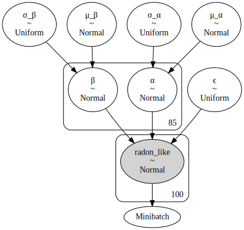
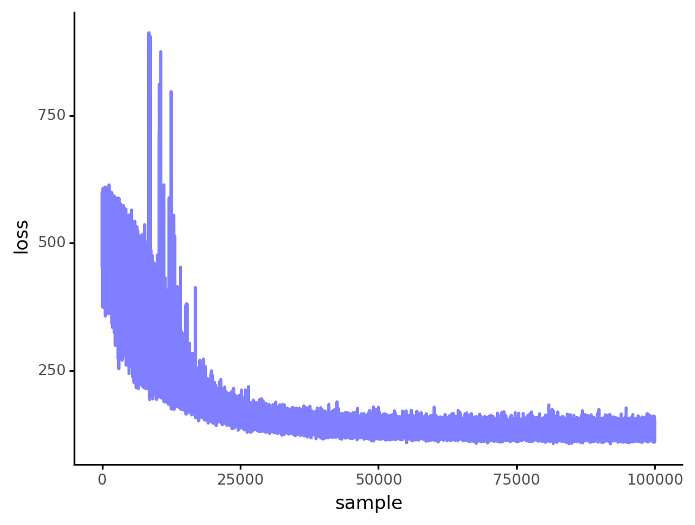
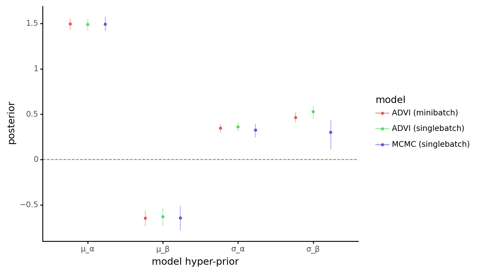
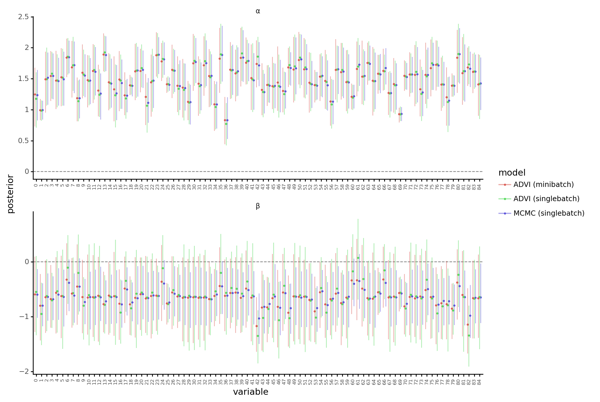

# GLM: Mini-batch ADVI on hierarchical regression model

[**Original Tutorial**](https://docs.pymc.io/notebooks/GLM-hierarchical-advi-minibatch.html)

Regression models have independent variables ($x$).
They affect the likelihood function, but are not random variables.
"When using mini-batch, we should take care of that."

```python
%env THEANO_FLAGS=device=cpu, floatX=float32, warn_float64=ignore

import re
import sys
from typing import Iterable, List, Optional, Tuple

import arviz as az
import matplotlib.pyplot as plt
import numpy as np
import pandas as pd
import plotnine as gg
import pymc3 as pm
import theano
import theano.tensor as tt

%config InlineBackend.figure_format = 'retina'
gg.theme_set(gg.theme_classic() + gg.theme(strip_background=gg.element_blank()))

%load_ext memory_profiler

RANDOM_SEED = 606
np.random.seed(RANDOM_SEED)
```

    env: THEANO_FLAGS=device=cpu, floatX=float32, warn_float64=ignore
    The memory_profiler extension is already loaded. To reload it, use:
      %reload_ext memory_profiler

```python
data = pd.read_csv(pm.get_data("radon.csv"))

county_names = data.county.unique()
county_idx = data["county_code"].values
n_counties = len(county_names)
total_size = data.shape[0]
```

For this example, `log_radon_t` is the dependent variable ($y$) and `floor_t` and `county_idx_t` are the independent variables ($x$).

```python
theano.config.profile = True
theano.config.profile_memory = True
```

```python
batch_size = 100
log_radon_t = pm.Minibatch(data.log_radon.values, batch_size)
floor_t = pm.Minibatch(data.floor.values, batch_size)
county_idx_t = pm.Minibatch(data.county_code.values, batch_size)
```

    /usr/local/Caskroom/miniconda/base/envs/pymc3-tutorials/lib/python3.9/site-packages/pymc3/data.py:316: FutureWarning: Using a non-tuple sequence for multidimensional indexing is deprecated; use `arr[tuple(seq)]` instead of `arr[seq]`. In the future this will be interpreted as an array index, `arr[np.array(seq)]`, which will result either in an error or a different result.
    /usr/local/Caskroom/miniconda/base/envs/pymc3-tutorials/lib/python3.9/site-packages/theano/link/vm.py:909: UserWarning: CVM does not support memory profile, using Stack VM.
    /usr/local/Caskroom/miniconda/base/envs/pymc3-tutorials/lib/python3.9/site-packages/pymc3/data.py:316: FutureWarning: Using a non-tuple sequence for multidimensional indexing is deprecated; use `arr[tuple(seq)]` instead of `arr[seq]`. In the future this will be interpreted as an array index, `arr[np.array(seq)]`, which will result either in an error or a different result.

```python
with pm.Model() as hierarchical_model_batch:
    # Hyperpriors
    μ_α = pm.Normal("μ_α", 0, 100 ** 2)
    σ_α = pm.Uniform("σ_α", lower=0, upper=100)
    μ_β = pm.Normal("μ_β", 0, 100 ** 2)
    σ_β = pm.Uniform("σ_β", 0, 100)

    # Prios
    α = pm.Normal("α", μ_α, σ_α, shape=n_counties)
    β = pm.Normal("β", μ_β, σ_β, shape=n_counties)

    # Main level
    radon_est = α[county_idx_t] + β[county_idx_t] * floor_t

    # Likelihood
    ϵ = pm.Uniform("ϵ", lower=0, upper=100)
    radon_like = pm.Normal(
        "radon_like", radon_est, ϵ, observed=log_radon_t, total_size=total_size
    )
```

```python
pm.model_to_graphviz(hierarchical_model_batch)
```

    /usr/local/Caskroom/miniconda/base/envs/pymc3-tutorials/lib/python3.9/site-packages/theano/link/vm.py:909: UserWarning: CVM does not support memory profile, using Stack VM.
    /usr/local/Caskroom/miniconda/base/envs/pymc3-tutorials/lib/python3.9/site-packages/theano/link/vm.py:909: UserWarning: CVM does not support memory profile, using Stack VM.



Run ADVI with mini-batch.

```python
%%time
with hierarchical_model_batch:
    approx = pm.fit(
        100000,
        callbacks=[pm.callbacks.CheckParametersConvergence(tolerance=1e-4)],
        random_seed=RANDOM_SEED,
    )
```

    /usr/local/Caskroom/miniconda/base/envs/pymc3-tutorials/lib/python3.9/site-packages/theano/link/vm.py:909: UserWarning: CVM does not support memory profile, using Stack VM.

<div>
    <style>
        /*Turns off some styling*/
        progress {
            /*gets rid of default border in Firefox and Opera.*/
            border: none;
            /*Needs to be in here for Safari polyfill so background images work as expected.*/
            background-size: auto;
        }
        .progress-bar-interrupted, .progress-bar-interrupted::-webkit-progress-bar {
            background: #F44336;
        }
    </style>
  <progress value='100000' class='' max='100000' style='width:300px; height:20px; vertical-align: middle;'></progress>
  100.00% [100000/100000 14:07<00:00 Average Loss = 130.23]
</div>

    Finished [100%]: Average Loss = 130.27


    CPU times: user 11min 51s, sys: 18.7 s, total: 12min 9s
    Wall time: 14min 11s

```python
plot_data = pd.DataFrame({"x": np.arange(0, len(approx.hist)), "loss": approx.hist})

(
    gg.ggplot(plot_data, gg.aes(x="x", y="loss"))
    + gg.geom_line(alpha=0.5, color="blue", size=1)
    + gg.labs(x="sample", y="loss")
)
```



    <ggplot: (353796340)>

```python
hierarchical_model_batch.profile(hierarchical_model_batch.logpt).summary()
```

    /usr/local/Caskroom/miniconda/base/envs/pymc3-tutorials/lib/python3.9/site-packages/theano/link/vm.py:909: UserWarning: CVM does not support memory profile, using Stack VM.
    Function profiling
    ==================
      Message: /usr/local/Caskroom/miniconda/base/envs/pymc3-tutorials/lib/python3.9/site-packages/pymc3/model.py:1253
      Time in 1000 calls to Function.__call__: 1.061092e+00s
      Time in Function.fn.__call__: 0.9833240509033203s (92.671%)
      Time in thunks: 0.1417069435119629s (13.355%)
      Total compile time: 1.116527e+00s
        Number of Apply nodes: 58
        Theano Optimizer time: 4.777908e-01s
           Theano validate time: 6.259918e-03s
        Theano Linker time (includes C, CUDA code generation/compiling): 0.07734513282775879s
           Import time 1.759672e-02s
           Node make_thunk time 7.457900e-02s
               Node Elemwise{Composite{(i0 * scalar_sigmoid(i1))}}(TensorConstant{100.0}, ϵ_interval__) time 2.213693e-02s
               Node Elemwise{Composite{((i0 + Switch(Cast{int8}((GE(i1, i2) * LE(i1, i3))), i4, i5)) - ((i6 * scalar_softplus((-i7))) + i7))}}(TensorConstant{4.605170249938965}, ϵ, TensorConstant{0.0}, TensorConstant{100.0}, TensorConstant{-4.605170249938965}, TensorConstant{-inf}, TensorConstant{2.0}, ϵ_interval__) time 7.249117e-03s
               Node Elemwise{Composite{(i0 * (i1 + (i2 * sqr(i3))))}}(TensorConstant{0.5}, TensorConstant{-20.25855827331543}, TensorConstant{-9.9999999..922529e-09}, μ_β) time 3.378868e-03s
               Node InplaceDimShuffle{x}(ϵ) time 1.865149e-03s
               Node mrg_uniform{TensorType(float32, vector),inplace}(<TensorType(int32, matrix)>, TensorConstant{(1,) of 100}) time 1.356125e-03s

    Time in all call to theano.grad() 6.968509e+00s
    Time since theano import 4050.498s
    Class
    ---
    <% time> <sum %> <apply time> <time per call> <type> <#call> <#apply> <Class name>
      37.3%    37.3%       0.053s       1.96e-06s     C    27000      27   theano.tensor.elemwise.Elemwise
      21.3%    58.6%       0.030s       2.15e-06s     C    14000      14   theano.tensor.elemwise.DimShuffle
      16.8%    75.3%       0.024s       4.76e-06s     C     5000       5   theano.tensor.subtensor.AdvancedSubtensor1
      10.7%    86.0%       0.015s       5.03e-06s     C     3000       3   theano.sandbox.rng_mrg.mrg_uniform
       6.9%    92.9%       0.010s       2.43e-06s     C     4000       4   theano.tensor.elemwise.Sum
       5.6%    98.5%       0.008s       2.00e-06s     C     4000       4   theano.compile.ops.Shape_i
       1.5%   100.0%       0.002s       2.12e-06s     C     1000       1   theano.tensor.opt.MakeVector
       ... (remaining 0 Classes account for   0.00%(0.00s) of the runtime)

    Ops
    ---
    <% time> <sum %> <apply time> <time per call> <type> <#call> <#apply> <Op name>
      21.3%    21.3%       0.030s       2.15e-06s     C     14000       14   InplaceDimShuffle{x}
      16.8%    38.0%       0.024s       4.76e-06s     C     5000        5   AdvancedSubtensor1
      10.7%    48.7%       0.015s       5.03e-06s     C     3000        3   mrg_uniform{TensorType(float32, vector),inplace}
       6.9%    55.6%       0.010s       2.43e-06s     C     4000        4   Sum{acc_dtype=float64}
       5.6%    61.2%       0.008s       2.00e-06s     C     4000        4   Shape_i{0}
       4.5%    65.7%       0.006s       2.11e-06s     C     3000        3   Elemwise{Composite{(i0 * scalar_sigmoid(i1))}}
       4.4%    70.1%       0.006s       2.09e-06s     C     3000        3   Elemwise{Composite{((i0 + Switch(Cast{int8}((GE(i1, i2) * LE(i1, i3))), i4, i5)) - ((i6 * scalar_softplus((-i7))) + i7))}}
       4.4%    74.5%       0.006s       2.06e-06s     C     3000        3   Elemwise{Composite{Cast{int64}((i0 * i1))}}
       3.9%    78.3%       0.005s       1.83e-06s     C     3000        3   Elemwise{Composite{(i0 + Cast{float32}(i1))}}
       3.8%    82.1%       0.005s       1.79e-06s     C     3000        3   Elemwise{Composite{log((i0 * i1))}}
       3.7%    85.9%       0.005s       1.77e-06s     C     3000        3   Elemwise{Composite{Cast{int8}(GT(i0, i1))}}
       3.6%    89.5%       0.005s       2.56e-06s     C     2000        2   Elemwise{Composite{Switch(i0, (i1 * ((i2 * i3 * sqr((i4 - i5))) + i6)), i7)}}
       3.3%    92.8%       0.005s       1.56e-06s     C     3000        3   Elemwise{Composite{inv(sqr(i0))}}[(0, 0)]
       2.7%    95.4%       0.004s       1.89e-06s     C     2000        2   Elemwise{Composite{(i0 * (i1 + (i2 * sqr(i3))))}}
       1.8%    97.2%       0.003s       2.54e-06s     C     1000        1   Elemwise{Composite{Switch(i0, (i1 * ((i2 * i3 * sqr((i4 - (i5 + (i6 * i7))))) + i8)), i9)}}[(0, 4)]
       1.5%    98.7%       0.002s       2.12e-06s     C     1000        1   MakeVector{dtype='float32'}
       1.3%   100.0%       0.002s       1.81e-06s     C     1000        1   Elemwise{Composite{((i0 * i1) / Cast{float32}(i2))}}[(0, 1)]
       ... (remaining 0 Ops account for   0.00%(0.00s) of the runtime)

    Apply
    ------
    <% time> <sum %> <apply time> <time per call> <#call> <id> <Mflops> <Gflops/s> <Apply name>
       4.8%     4.8%       0.007s       6.75e-06s   1000     0                     mrg_uniform{TensorType(float32, vector),inplace}(<TensorType(int32, matrix)>, TensorConstant{(1,) of 100})
        input 0: dtype=int32, shape=(16, 6), strides=c
        input 1: dtype=int64, shape=(1,), strides=c
        output 0: dtype=int32, shape=(16, 6), strides=c
        output 1: dtype=float32, shape=(100,), strides=c
       4.7%     9.5%       0.007s       6.71e-06s   1000    41                     AdvancedSubtensor1(<TensorType(float32, vector)>, Elemwise{Composite{Cast{int64}((i0 * i1))}}.0)
        input 0: dtype=float32, shape=(919,), strides=c
        input 1: dtype=int64, shape=(100,), strides=c
        output 0: dtype=float32, shape=(100,), strides=c
       3.9%    13.4%       0.005s       5.49e-06s   1000    43                     AdvancedSubtensor1(<TensorType(float32, vector)>, Elemwise{Composite{Cast{int64}((i0 * i1))}}.0)
        input 0: dtype=float32, shape=(919,), strides=c
        input 1: dtype=int64, shape=(100,), strides=c
        output 0: dtype=float32, shape=(100,), strides=c
       3.4%    16.8%       0.005s       4.86e-06s   1000    42                     AdvancedSubtensor1(<TensorType(int64, vector)>, Elemwise{Composite{Cast{int64}((i0 * i1))}}.0)
        input 0: dtype=int64, shape=(919,), strides=c
        input 1: dtype=int64, shape=(100,), strides=c
        output 0: dtype=int64, shape=(100,), strides=c
       3.1%    19.9%       0.004s       4.32e-06s   1000     1                     mrg_uniform{TensorType(float32, vector),inplace}(<TensorType(int32, matrix)>, TensorConstant{(1,) of 100})
        input 0: dtype=int32, shape=(16, 6), strides=c
        input 1: dtype=int64, shape=(1,), strides=c
        output 0: dtype=int32, shape=(16, 6), strides=c
        output 1: dtype=float32, shape=(100,), strides=c
       2.8%    22.7%       0.004s       4.02e-06s   1000     2                     mrg_uniform{TensorType(float32, vector),inplace}(<TensorType(int32, matrix)>, TensorConstant{(1,) of 100})
        input 0: dtype=int32, shape=(16, 6), strides=c
        input 1: dtype=int64, shape=(1,), strides=c
        output 0: dtype=int32, shape=(16, 6), strides=c
        output 1: dtype=float32, shape=(100,), strides=c
       2.4%    25.1%       0.003s       3.39e-06s   1000    47                     AdvancedSubtensor1(β, Minibatch)
        input 0: dtype=float32, shape=(85,), strides=c
        input 1: dtype=int64, shape=(100,), strides=c
        output 0: dtype=float32, shape=(100,), strides=c
       2.3%    27.4%       0.003s       3.33e-06s   1000    48                     AdvancedSubtensor1(α, Minibatch)
        input 0: dtype=float32, shape=(85,), strides=c
        input 1: dtype=int64, shape=(100,), strides=c
        output 0: dtype=float32, shape=(100,), strides=c
       2.2%    29.6%       0.003s       3.06e-06s   1000    54                     Sum{acc_dtype=float64}(Elemwise{Composite{Switch(i0, (i1 * ((i2 * i3 * sqr((i4 - (i5 + (i6 * i7))))) + i8)), i9)}}[(0, 4)].0)
        input 0: dtype=float32, shape=(100,), strides=c
        output 0: dtype=float32, shape=(), strides=c
       1.9%    31.5%       0.003s       2.68e-06s   1000    49                     Elemwise{Composite{Switch(i0, (i1 * ((i2 * i3 * sqr((i4 - i5))) + i6)), i7)}}(Elemwise{Composite{Cast{int8}(GT(i0, i1))}}.0, TensorConstant{(1,) of 0.5}, TensorConstant{(1,) of -1.0}, InplaceDimShuffle{x}.0, β, InplaceDimShuffle{x}.0, Elemwise{Composite{log((i0 * i1))}}.0, TensorConstant{(1,) of -inf})
        input 0: dtype=int8, shape=(1,), strides=c
        input 1: dtype=float32, shape=(1,), strides=c
        input 2: dtype=float32, shape=(1,), strides=c
        input 3: dtype=float32, shape=(1,), strides=c
        input 4: dtype=float32, shape=(85,), strides=c
        input 5: dtype=float32, shape=(1,), strides=c
        input 6: dtype=float32, shape=(1,), strides=c
        input 7: dtype=float32, shape=(1,), strides=c
        output 0: dtype=float32, shape=(85,), strides=c
       1.9%    33.4%       0.003s       2.65e-06s   1000    15                     InplaceDimShuffle{x}(ϵ)
        input 0: dtype=float32, shape=(), strides=c
        output 0: dtype=float32, shape=(1,), strides=c
       1.8%    35.2%       0.003s       2.54e-06s   1000    51                     Elemwise{Composite{Switch(i0, (i1 * ((i2 * i3 * sqr((i4 - (i5 + (i6 * i7))))) + i8)), i9)}}[(0, 4)](Elemwise{Composite{Cast{int8}(GT(i0, i1))}}.0, TensorConstant{(1,) of 0.5}, TensorConstant{(1,) of -1.0}, InplaceDimShuffle{x}.0, Minibatch, AdvancedSubtensor1.0, AdvancedSubtensor1.0, Minibatch, Elemwise{Composite{log((i0 * i1))}}.0, TensorConstant{(1,) of -inf})
        input 0: dtype=int8, shape=(1,), strides=c
        input 1: dtype=float32, shape=(1,), strides=c
        input 2: dtype=float32, shape=(1,), strides=c
        input 3: dtype=float32, shape=(1,), strides=c
        input 4: dtype=float32, shape=(100,), strides=c
        input 5: dtype=float32, shape=(100,), strides=c
        input 6: dtype=float32, shape=(100,), strides=c
        input 7: dtype=float32, shape=(100,), strides=c
        input 8: dtype=float32, shape=(1,), strides=c
        input 9: dtype=float32, shape=(1,), strides=c
        output 0: dtype=float32, shape=(100,), strides=c
       1.7%    36.9%       0.002s       2.45e-06s   1000    52                     Sum{acc_dtype=float64}(Elemwise{Composite{Switch(i0, (i1 * ((i2 * i3 * sqr((i4 - i5))) + i6)), i7)}}.0)
        input 0: dtype=float32, shape=(85,), strides=c
        output 0: dtype=float32, shape=(), strides=c
       1.7%    38.6%       0.002s       2.44e-06s   1000    50                     Elemwise{Composite{Switch(i0, (i1 * ((i2 * i3 * sqr((i4 - i5))) + i6)), i7)}}(Elemwise{Composite{Cast{int8}(GT(i0, i1))}}.0, TensorConstant{(1,) of 0.5}, TensorConstant{(1,) of -1.0}, InplaceDimShuffle{x}.0, α, InplaceDimShuffle{x}.0, Elemwise{Composite{log((i0 * i1))}}.0, TensorConstant{(1,) of -inf})
        input 0: dtype=int8, shape=(1,), strides=c
        input 1: dtype=float32, shape=(1,), strides=c
        input 2: dtype=float32, shape=(1,), strides=c
        input 3: dtype=float32, shape=(1,), strides=c
        input 4: dtype=float32, shape=(85,), strides=c
        input 5: dtype=float32, shape=(1,), strides=c
        input 6: dtype=float32, shape=(1,), strides=c
        input 7: dtype=float32, shape=(1,), strides=c
        output 0: dtype=float32, shape=(85,), strides=c
       1.7%    40.3%       0.002s       2.43e-06s   1000    18                     InplaceDimShuffle{x}(Shape_i{0}.0)
        input 0: dtype=int64, shape=(), strides=c
        output 0: dtype=int64, shape=(1,), strides=c
       1.6%    41.9%       0.002s       2.31e-06s   1000     7                     Elemwise{Composite{(i0 * scalar_sigmoid(i1))}}(TensorConstant{100.0}, σ_β_interval__)
        input 0: dtype=float32, shape=(), strides=c
        input 1: dtype=float32, shape=(), strides=c
        output 0: dtype=float32, shape=(), strides=c
       1.6%    43.5%       0.002s       2.28e-06s   1000    36                     InplaceDimShuffle{x}(Elemwise{Composite{inv(sqr(i0))}}[(0, 0)].0)
        input 0: dtype=float32, shape=(), strides=c
        output 0: dtype=float32, shape=(1,), strides=c
       1.6%    45.1%       0.002s       2.26e-06s   1000     5                     Shape_i{0}(<TensorType(int64, vector)>)
        input 0: dtype=int64, shape=(919,), strides=c
        output 0: dtype=int64, shape=(), strides=c
       1.6%    46.7%       0.002s       2.23e-06s   1000    17                     InplaceDimShuffle{x}(Shape_i{0}.0)
        input 0: dtype=int64, shape=(), strides=c
        output 0: dtype=int64, shape=(1,), strides=c
       1.5%    48.3%       0.002s       2.18e-06s   1000    33                     Elemwise{Composite{Cast{int64}((i0 * i1))}}(mrg_uniform{TensorType(float32, vector),inplace}.1, Elemwise{Composite{(i0 + Cast{float32}(i1))}}.0)
        input 0: dtype=float32, shape=(100,), strides=c
        input 1: dtype=float32, shape=(1,), strides=c
        output 0: dtype=int64, shape=(100,), strides=c
       ... (remaining 38 Apply instances account for 51.75%(0.07s) of the runtime)

    Memory Profile
    (Sparse variables are ignored)
    (For values in brackets, it's for linker = c|py
    ---
        Max peak memory with current setting
            CPU: 2KB (3KB)
            GPU: 0KB (0KB)
            CPU + GPU: 2KB (3KB)
        Max peak memory with current setting and Theano flag optimizer_excluding=inplace
            CPU: 3KB (4KB)
            GPU: 0KB (0KB)
            CPU + GPU: 3KB (4KB)
        Max peak memory if allow_gc=False (linker don't make a difference)
            CPU: 7KB
            GPU: 0KB
            CPU + GPU: 7KB
    ---

        <Sum apply outputs (bytes)> <Apply outputs shape> <created/inplace/view> <Apply node>

       ... (remaining 58 Apply account for 8455B/8455B ((100.00%)) of the Apply with dense outputs sizes)

        All Apply nodes have output sizes that take less than 1024B.
        <created/inplace/view> is taken from the Op's declaration.
        Apply nodes marked 'inplace' or 'view' may actually allocate memory, this is not reported here. If you use DebugMode, warnings will be emitted in those cases.

    Here are tips to potentially make your code run faster
                     (if you think of new ones, suggest them on the mailing list).
                     Test them first, as they are not guaranteed to always provide a speedup.
      - Try installing amdlibm and set the Theano flag lib__amblibm=True. This speeds up only some Elemwise operation.

---

## Profiling use of Minibatch with ADVI and MCMC

### Data

I will run ADVI and MCMC sampling with and without minibatch.
For MCMC, I will also compare the results of ordering or shuffling the data.

```python
data.head()
```

<div>
<style scoped>
    .dataframe tbody tr th:only-of-type {
        vertical-align: middle;
    }

    .dataframe tbody tr th {
        vertical-align: top;
    }

    .dataframe thead th {
        text-align: right;
    }
</style>
<table border="1" class="dataframe">
  <thead>
    <tr style="text-align: right;">
      <th></th>
      <th>Unnamed: 0</th>
      <th>idnum</th>
      <th>state</th>
      <th>state2</th>
      <th>stfips</th>
      <th>zip</th>
      <th>region</th>
      <th>typebldg</th>
      <th>floor</th>
      <th>room</th>
      <th>...</th>
      <th>pcterr</th>
      <th>adjwt</th>
      <th>dupflag</th>
      <th>zipflag</th>
      <th>cntyfips</th>
      <th>county</th>
      <th>fips</th>
      <th>Uppm</th>
      <th>county_code</th>
      <th>log_radon</th>
    </tr>
  </thead>
  <tbody>
    <tr>
      <th>0</th>
      <td>0</td>
      <td>5081.0</td>
      <td>MN</td>
      <td>MN</td>
      <td>27.0</td>
      <td>55735</td>
      <td>5.0</td>
      <td>1.0</td>
      <td>1.0</td>
      <td>3.0</td>
      <td>...</td>
      <td>9.7</td>
      <td>1146.499190</td>
      <td>1.0</td>
      <td>0.0</td>
      <td>1.0</td>
      <td>AITKIN</td>
      <td>27001.0</td>
      <td>0.502054</td>
      <td>0</td>
      <td>0.832909</td>
    </tr>
    <tr>
      <th>1</th>
      <td>1</td>
      <td>5082.0</td>
      <td>MN</td>
      <td>MN</td>
      <td>27.0</td>
      <td>55748</td>
      <td>5.0</td>
      <td>1.0</td>
      <td>0.0</td>
      <td>4.0</td>
      <td>...</td>
      <td>14.5</td>
      <td>471.366223</td>
      <td>0.0</td>
      <td>0.0</td>
      <td>1.0</td>
      <td>AITKIN</td>
      <td>27001.0</td>
      <td>0.502054</td>
      <td>0</td>
      <td>0.832909</td>
    </tr>
    <tr>
      <th>2</th>
      <td>2</td>
      <td>5083.0</td>
      <td>MN</td>
      <td>MN</td>
      <td>27.0</td>
      <td>55748</td>
      <td>5.0</td>
      <td>1.0</td>
      <td>0.0</td>
      <td>4.0</td>
      <td>...</td>
      <td>9.6</td>
      <td>433.316718</td>
      <td>0.0</td>
      <td>0.0</td>
      <td>1.0</td>
      <td>AITKIN</td>
      <td>27001.0</td>
      <td>0.502054</td>
      <td>0</td>
      <td>1.098612</td>
    </tr>
    <tr>
      <th>3</th>
      <td>3</td>
      <td>5084.0</td>
      <td>MN</td>
      <td>MN</td>
      <td>27.0</td>
      <td>56469</td>
      <td>5.0</td>
      <td>1.0</td>
      <td>0.0</td>
      <td>4.0</td>
      <td>...</td>
      <td>24.3</td>
      <td>461.623670</td>
      <td>0.0</td>
      <td>0.0</td>
      <td>1.0</td>
      <td>AITKIN</td>
      <td>27001.0</td>
      <td>0.502054</td>
      <td>0</td>
      <td>0.095310</td>
    </tr>
    <tr>
      <th>4</th>
      <td>4</td>
      <td>5085.0</td>
      <td>MN</td>
      <td>MN</td>
      <td>27.0</td>
      <td>55011</td>
      <td>3.0</td>
      <td>1.0</td>
      <td>0.0</td>
      <td>4.0</td>
      <td>...</td>
      <td>13.8</td>
      <td>433.316718</td>
      <td>0.0</td>
      <td>0.0</td>
      <td>3.0</td>
      <td>ANOKA</td>
      <td>27003.0</td>
      <td>0.428565</td>
      <td>1</td>
      <td>1.163151</td>
    </tr>
  </tbody>
</table>
<p>5 rows × 30 columns</p>
</div>

```python
data = data.sort_values(["county_code", "floor", "log_radon"]).reset_index(drop=True)

# Single numpy array for data (non-batched)
log_radon = data.log_radon.values
floor = data.floor.values
county_idx = data.county_code.values

# Batched data
batch_size = 100
log_radon_batch = pm.Minibatch(log_radon, batch_size)
floor_batch = pm.Minibatch(floor, batch_size)
county_idx_batch = pm.Minibatch(county_idx, batch_size)

n_counties = len(np.unique(county_idx))
total_size = data.shape[0]

#### Shuffled
data = data.copy().sample(frac=1).reset_index(drop=True)

# Single numpy array for data (non-batched)
log_radon_S = data.log_radon.values
floor_S = data.floor.values
county_idx_S = data.county_code.values

# Batched data
batch_size = 100
log_radon_batch_S = pm.Minibatch(log_radon_S, batch_size)
floor_batch_S = pm.Minibatch(floor_S, batch_size)
county_idx_batch_S = pm.Minibatch(county_idx_S, batch_size)
```

    /usr/local/Caskroom/miniconda/base/envs/pymc3-tutorials/lib/python3.9/site-packages/pymc3/data.py:316: FutureWarning: Using a non-tuple sequence for multidimensional indexing is deprecated; use `arr[tuple(seq)]` instead of `arr[seq]`. In the future this will be interpreted as an array index, `arr[np.array(seq)]`, which will result either in an error or a different result.

### Model

I will use the same model as before, and create a function to build it and sample using either ADVI or MCMC.

```python
def build_and_fit_hierarchical_model(
    radon_data: Iterable[float],
    floor_data: Iterable[float],
    county_idx: Iterable[int],
    n_counties: int,
    total_data_size: int,
    sampling_method: str,
) -> Tuple[pm.model.Model, pm.backends.base.MultiTrace]:

    with pm.Model() as model:
        # Hyperpriors
        μ_α = pm.Normal("μ_α", 1, 5)
        σ_α = pm.HalfNormal("σ_α", 2)
        μ_β = pm.Normal("μ_β", -1, 2)
        σ_β = pm.HalfNormal("σ_β", 1)

        # Prios
        α = pm.Normal("α", μ_α, σ_α, shape=n_counties)
        β = pm.Normal("β", μ_β, σ_β, shape=n_counties)

        # Main level
        radon_est = α[county_idx] + β[county_idx] * floor_data

        # Likelihood
        ϵ = pm.HalfNormal("ϵ", 5)
        radon_liklihood = pm.Normal(
            "radon_liklihood",
            radon_est,
            ϵ,
            observed=radon_data,
            total_size=total_data_size,
        )

    draws = 1000

    if sampling_method == "advi":
        with model:
            approx = pm.fit(
                100000,
                method="advi",
                callbacks=[pm.callbacks.CheckParametersConvergence(tolerance=0.01)],
                random_seed=RANDOM_SEED,
            )
            trace = approx.sample(draws=draws)
    elif sampling_method == "mcmc":
        with model:
            trace = pm.sample(
                draws=draws,
                tune=draws,
                chains=2,
                cores=2,
                random_seed=RANDOM_SEED,
                return_inferencedata=False,
            )

    return model, trace
```

```python
### ADVI
advi_singlebatch = build_and_fit_hierarchical_model(
    radon_data=log_radon,
    floor_data=floor,
    county_idx=county_idx,
    n_counties=n_counties,
    total_data_size=total_size,
    sampling_method="advi",
)

advi_minibatch = build_and_fit_hierarchical_model(
    radon_data=log_radon_batch,
    floor_data=floor_batch,
    county_idx=county_idx_batch,
    n_counties=n_counties,
    total_data_size=total_size,
    sampling_method="advi",
)

### MCMC (sorted data)
mcmc_singlebatch = build_and_fit_hierarchical_model(
    radon_data=log_radon,
    floor_data=floor,
    county_idx=county_idx,
    n_counties=n_counties,
    total_data_size=total_size,
    sampling_method="mcmc",
)

mcmc_minibatch = build_and_fit_hierarchical_model(
    radon_data=log_radon_batch,
    floor_data=floor_batch,
    county_idx=county_idx_batch,
    n_counties=n_counties,
    total_data_size=total_size,
    sampling_method="mcmc",
)

### MCMC (shuffled data)
mcmc_singlebatch_S = build_and_fit_hierarchical_model(
    radon_data=log_radon_S,
    floor_data=floor_S,
    county_idx=county_idx_S,
    n_counties=n_counties,
    total_data_size=total_size,
    sampling_method="mcmc",
)

mcmc_minibatch_S = build_and_fit_hierarchical_model(
    radon_data=log_radon_batch_S,
    floor_data=floor_batch_S,
    county_idx=county_idx_batch_S,
    n_counties=n_counties,
    total_data_size=total_size,
    sampling_method="mcmc",
)
```

    /usr/local/Caskroom/miniconda/base/envs/pymc3-tutorials/lib/python3.9/site-packages/theano/link/vm.py:909: UserWarning: CVM does not support memory profile, using Stack VM.

<div>
    <style>
        /*Turns off some styling*/
        progress {
            /*gets rid of default border in Firefox and Opera.*/
            border: none;
            /*Needs to be in here for Safari polyfill so background images work as expected.*/
            background-size: auto;
        }
        .progress-bar-interrupted, .progress-bar-interrupted::-webkit-progress-bar {
            background: #F44336;
        }
    </style>
  <progress value='100000' class='' max='100000' style='width:300px; height:20px; vertical-align: middle;'></progress>
  100.00% [100000/100000 11:33<00:00 Average Loss = 1,071.2]
</div>

    Finished [100%]: Average Loss = 1,071.2
    /usr/local/Caskroom/miniconda/base/envs/pymc3-tutorials/lib/python3.9/site-packages/theano/link/vm.py:909: UserWarning: CVM does not support memory profile, using Stack VM.
    /usr/local/Caskroom/miniconda/base/envs/pymc3-tutorials/lib/python3.9/site-packages/theano/link/vm.py:909: UserWarning: CVM does not support memory profile, using Stack VM.

<div>
    <style>
        /*Turns off some styling*/
        progress {
            /*gets rid of default border in Firefox and Opera.*/
            border: none;
            /*Needs to be in here for Safari polyfill so background images work as expected.*/
            background-size: auto;
        }
        .progress-bar-interrupted, .progress-bar-interrupted::-webkit-progress-bar {
            background: #F44336;
        }
    </style>
  <progress value='100000' class='' max='100000' style='width:300px; height:20px; vertical-align: middle;'></progress>
  100.00% [100000/100000 14:02<00:00 Average Loss = 116.9]
</div>

    Finished [100%]: Average Loss = 116.98
    /usr/local/Caskroom/miniconda/base/envs/pymc3-tutorials/lib/python3.9/site-packages/theano/link/vm.py:909: UserWarning: CVM does not support memory profile, using Stack VM.
    /usr/local/Caskroom/miniconda/base/envs/pymc3-tutorials/lib/python3.9/site-packages/theano/link/vm.py:909: UserWarning: CVM does not support memory profile, using Stack VM.
    /usr/local/Caskroom/miniconda/base/envs/pymc3-tutorials/lib/python3.9/site-packages/theano/link/vm.py:909: UserWarning: CVM does not support memory profile, using Stack VM.
    /usr/local/Caskroom/miniconda/base/envs/pymc3-tutorials/lib/python3.9/site-packages/theano/link/vm.py:909: UserWarning: CVM does not support memory profile, using Stack VM.
    Auto-assigning NUTS sampler...
    Initializing NUTS using jitter+adapt_diag...
    /usr/local/Caskroom/miniconda/base/envs/pymc3-tutorials/lib/python3.9/site-packages/theano/link/vm.py:909: UserWarning: CVM does not support memory profile, using Stack VM.
    Multiprocess sampling (2 chains in 2 jobs)
    NUTS: [ϵ, β, α, σ_β, μ_β, σ_α, μ_α]

<div>
    <style>
        /*Turns off some styling*/
        progress {
            /*gets rid of default border in Firefox and Opera.*/
            border: none;
            /*Needs to be in here for Safari polyfill so background images work as expected.*/
            background-size: auto;
        }
        .progress-bar-interrupted, .progress-bar-interrupted::-webkit-progress-bar {
            background: #F44336;
        }
    </style>
  <progress value='4000' class='' max='4000' style='width:300px; height:20px; vertical-align: middle;'></progress>
  100.00% [4000/4000 00:40<00:00 Sampling 2 chains, 102 divergences]
</div>

    Sampling 2 chains for 1_000 tune and 1_000 draw iterations (2_000 + 2_000 draws total) took 51 seconds.
    There were 100 divergences after tuning. Increase `target_accept` or reparameterize.
    The acceptance probability does not match the target. It is 0.6715732309871704, but should be close to 0.8. Try to increase the number of tuning steps.
    There were 2 divergences after tuning. Increase `target_accept` or reparameterize.
    The estimated number of effective samples is smaller than 200 for some parameters.
    /usr/local/Caskroom/miniconda/base/envs/pymc3-tutorials/lib/python3.9/site-packages/theano/link/vm.py:909: UserWarning: CVM does not support memory profile, using Stack VM.
    /usr/local/Caskroom/miniconda/base/envs/pymc3-tutorials/lib/python3.9/site-packages/theano/link/vm.py:909: UserWarning: CVM does not support memory profile, using Stack VM.
    Auto-assigning NUTS sampler...
    Initializing NUTS using jitter+adapt_diag...
    /usr/local/Caskroom/miniconda/base/envs/pymc3-tutorials/lib/python3.9/site-packages/theano/link/vm.py:909: UserWarning: CVM does not support memory profile, using Stack VM.
    Multiprocess sampling (2 chains in 2 jobs)
    NUTS: [ϵ, β, α, σ_β, μ_β, σ_α, μ_α]

<div>
    <style>
        /*Turns off some styling*/
        progress {
            /*gets rid of default border in Firefox and Opera.*/
            border: none;
            /*Needs to be in here for Safari polyfill so background images work as expected.*/
            background-size: auto;
        }
        .progress-bar-interrupted, .progress-bar-interrupted::-webkit-progress-bar {
            background: #F44336;
        }
    </style>
  <progress value='4000' class='' max='4000' style='width:300px; height:20px; vertical-align: middle;'></progress>
  100.00% [4000/4000 01:11<00:00 Sampling 2 chains, 1,959 divergences]
</div>

    Sampling 2 chains for 1_000 tune and 1_000 draw iterations (2_000 + 2_000 draws total) took 83 seconds.
    There were 981 divergences after tuning. Increase `target_accept` or reparameterize.
    There were 978 divergences after tuning. Increase `target_accept` or reparameterize.
    The rhat statistic is larger than 1.4 for some parameters. The sampler did not converge.
    The estimated number of effective samples is smaller than 200 for some parameters.
    /usr/local/Caskroom/miniconda/base/envs/pymc3-tutorials/lib/python3.9/site-packages/theano/link/vm.py:909: UserWarning: CVM does not support memory profile, using Stack VM.
    Auto-assigning NUTS sampler...
    Initializing NUTS using jitter+adapt_diag...
    Multiprocess sampling (2 chains in 2 jobs)
    NUTS: [ϵ, β, α, σ_β, μ_β, σ_α, μ_α]

<div>
    <style>
        /*Turns off some styling*/
        progress {
            /*gets rid of default border in Firefox and Opera.*/
            border: none;
            /*Needs to be in here for Safari polyfill so background images work as expected.*/
            background-size: auto;
        }
        .progress-bar-interrupted, .progress-bar-interrupted::-webkit-progress-bar {
            background: #F44336;
        }
    </style>
  <progress value='4000' class='' max='4000' style='width:300px; height:20px; vertical-align: middle;'></progress>
  100.00% [4000/4000 00:43<00:00 Sampling 2 chains, 230 divergences]
</div>

    Sampling 2 chains for 1_000 tune and 1_000 draw iterations (2_000 + 2_000 draws total) took 52 seconds.
    There were 4 divergences after tuning. Increase `target_accept` or reparameterize.
    There were 226 divergences after tuning. Increase `target_accept` or reparameterize.
    The acceptance probability does not match the target. It is 0.50668788285416, but should be close to 0.8. Try to increase the number of tuning steps.
    The rhat statistic is larger than 1.05 for some parameters. This indicates slight problems during sampling.
    The estimated number of effective samples is smaller than 200 for some parameters.
    /usr/local/Caskroom/miniconda/base/envs/pymc3-tutorials/lib/python3.9/site-packages/theano/link/vm.py:909: UserWarning: CVM does not support memory profile, using Stack VM.
    Auto-assigning NUTS sampler...
    Initializing NUTS using jitter+adapt_diag...
    Multiprocess sampling (2 chains in 2 jobs)
    NUTS: [ϵ, β, α, σ_β, μ_β, σ_α, μ_α]

<div>
    <style>
        /*Turns off some styling*/
        progress {
            /*gets rid of default border in Firefox and Opera.*/
            border: none;
            /*Needs to be in here for Safari polyfill so background images work as expected.*/
            background-size: auto;
        }
        .progress-bar-interrupted, .progress-bar-interrupted::-webkit-progress-bar {
            background: #F44336;
        }
    </style>
  <progress value='4000' class='' max='4000' style='width:300px; height:20px; vertical-align: middle;'></progress>
  100.00% [4000/4000 01:11<00:00 Sampling 2 chains, 1,940 divergences]
</div>

    Sampling 2 chains for 1_000 tune and 1_000 draw iterations (2_000 + 2_000 draws total) took 82 seconds.
    There were 967 divergences after tuning. Increase `target_accept` or reparameterize.
    There were 973 divergences after tuning. Increase `target_accept` or reparameterize.
    The rhat statistic is larger than 1.2 for some parameters.
    The estimated number of effective samples is smaller than 200 for some parameters.

```python
labels = [
    "ADVI (singlebatch)",
    "ADVI (minibatch)",
    "MCMC (singlebatch)",
    "MCMC (minibatch)",
]
models = [
    x[0] for x in [advi_singlebatch, advi_minibatch, mcmc_singlebatch, mcmc_minibatch]
]

for model, label in zip(models, labels):
    title = "=" * 10 + " " + label + " " + "=" * 10
    border = "=" * len(title)
    print(border)
    print(title)
    print(border)
    print(model.profile(model.logpt).summary_memory(sys.stdout))
```

    ========================================
    ========== ADVI (singlebatch) ==========
    ========================================


    /usr/local/Caskroom/miniconda/base/envs/pymc3-tutorials/lib/python3.9/site-packages/theano/link/vm.py:909: UserWarning: CVM does not support memory profile, using Stack VM.


    Memory Profile
    (Sparse variables are ignored)
    (For values in brackets, it's for linker = c|py
    ---
        Max peak memory with current setting
            CPU: 7KB (7KB)
            GPU: 0KB (0KB)
            CPU + GPU: 7KB (7KB)
        Max peak memory with current setting and Theano flag optimizer_excluding=inplace
            CPU: 11KB (11KB)
            GPU: 0KB (0KB)
            CPU + GPU: 11KB (11KB)
        Max peak memory if allow_gc=False (linker don't make a difference)
            CPU: 8KB
            GPU: 0KB
            CPU + GPU: 8KB
    ---

        <Sum apply outputs (bytes)> <Apply outputs shape> <created/inplace/view> <Apply node>

         {node_outputs_size:9d}B  [(919,)] c AdvancedSubtensor1(β, TensorConstant{[ 0  0  0 .. 83 84 84]})
         {node_outputs_size:9d}B  [(919,)] c AdvancedSubtensor1(α, TensorConstant{[ 0  0  0 .. 83 84 84]})
         {node_outputs_size:9d}B  [(919,)] i Elemwise{Composite{Switch(i0, (i1 * ((i2 * i3 * sqr((i4 - Cast{float32}((i5 + (i6 * i7)))))) + i8)), i9)}}[(0, 5)](Elemwise{Composite{Cast{int8}(GT(i0, i1))}}.0, TensorConstant{(1,) of 0.5}, TensorConstant{(1,) of -1.0}, InplaceDimShuffle{x}.0, TensorConstant{[ 0.095310...3350011 ]}, AdvancedSubtensor1.0, AdvancedSubtensor1.0, TensorConstant{[0. 0. 0. .. 1. 0. 0.]}, Elemwise{Composite{log((i0 * i1))}}.0, TensorConstant{(1,) of -inf})
       ... (remaining 35 Apply account for  831B/11859B ((7.01%)) of the Apply with dense outputs sizes)

        <created/inplace/view> is taken from the Op's declaration.
        Apply nodes marked 'inplace' or 'view' may actually allocate memory, this is not reported here. If you use DebugMode, warnings will be emitted in those cases.

    None
    ======================================
    ========== ADVI (minibatch) ==========
    ======================================
    Memory Profile
    (Sparse variables are ignored)
    (For values in brackets, it's for linker = c|py
    ---
        Max peak memory with current setting
            CPU: 2KB (3KB)
            GPU: 0KB (0KB)
            CPU + GPU: 2KB (3KB)
        Max peak memory with current setting and Theano flag optimizer_excluding=inplace
            CPU: 3KB (4KB)
            GPU: 0KB (0KB)
            CPU + GPU: 3KB (4KB)
        Max peak memory if allow_gc=False (linker don't make a difference)
            CPU: 7KB
            GPU: 0KB
            CPU + GPU: 7KB
    ---

        <Sum apply outputs (bytes)> <Apply outputs shape> <created/inplace/view> <Apply node>

       ... (remaining 58 Apply account for 8455B/8455B ((100.00%)) of the Apply with dense outputs sizes)

        All Apply nodes have output sizes that take less than 1024B.
        <created/inplace/view> is taken from the Op's declaration.
        Apply nodes marked 'inplace' or 'view' may actually allocate memory, this is not reported here. If you use DebugMode, warnings will be emitted in those cases.

    None
    ========================================
    ========== MCMC (singlebatch) ==========
    ========================================
    Memory Profile
    (Sparse variables are ignored)
    (For values in brackets, it's for linker = c|py
    ---
        Max peak memory with current setting
            CPU: 7KB (7KB)
            GPU: 0KB (0KB)
            CPU + GPU: 7KB (7KB)
        Max peak memory with current setting and Theano flag optimizer_excluding=inplace
            CPU: 11KB (11KB)
            GPU: 0KB (0KB)
            CPU + GPU: 11KB (11KB)
        Max peak memory if allow_gc=False (linker don't make a difference)
            CPU: 8KB
            GPU: 0KB
            CPU + GPU: 8KB
    ---

        <Sum apply outputs (bytes)> <Apply outputs shape> <created/inplace/view> <Apply node>

         {node_outputs_size:9d}B  [(919,)] c AdvancedSubtensor1(β, TensorConstant{[ 0  0  0 .. 83 84 84]})
         {node_outputs_size:9d}B  [(919,)] c AdvancedSubtensor1(α, TensorConstant{[ 0  0  0 .. 83 84 84]})
         {node_outputs_size:9d}B  [(919,)] i Elemwise{Composite{Switch(i0, (i1 * ((i2 * i3 * sqr((i4 - Cast{float32}((i5 + (i6 * i7)))))) + i8)), i9)}}[(0, 5)](Elemwise{Composite{Cast{int8}(GT(i0, i1))}}.0, TensorConstant{(1,) of 0.5}, TensorConstant{(1,) of -1.0}, InplaceDimShuffle{x}.0, TensorConstant{[ 0.095310...3350011 ]}, AdvancedSubtensor1.0, AdvancedSubtensor1.0, TensorConstant{[0. 0. 0. .. 1. 0. 0.]}, Elemwise{Composite{log((i0 * i1))}}.0, TensorConstant{(1,) of -inf})
       ... (remaining 35 Apply account for  831B/11859B ((7.01%)) of the Apply with dense outputs sizes)

        <created/inplace/view> is taken from the Op's declaration.
        Apply nodes marked 'inplace' or 'view' may actually allocate memory, this is not reported here. If you use DebugMode, warnings will be emitted in those cases.

    None
    ======================================
    ========== MCMC (minibatch) ==========
    ======================================
    Memory Profile
    (Sparse variables are ignored)
    (For values in brackets, it's for linker = c|py
    ---
        Max peak memory with current setting
            CPU: 2KB (3KB)
            GPU: 0KB (0KB)
            CPU + GPU: 2KB (3KB)
        Max peak memory with current setting and Theano flag optimizer_excluding=inplace
            CPU: 3KB (4KB)
            GPU: 0KB (0KB)
            CPU + GPU: 3KB (4KB)
        Max peak memory if allow_gc=False (linker don't make a difference)
            CPU: 7KB
            GPU: 0KB
            CPU + GPU: 7KB
    ---

        <Sum apply outputs (bytes)> <Apply outputs shape> <created/inplace/view> <Apply node>

       ... (remaining 58 Apply account for 8455B/8455B ((100.00%)) of the Apply with dense outputs sizes)

        All Apply nodes have output sizes that take less than 1024B.
        <created/inplace/view> is taken from the Op's declaration.
        Apply nodes marked 'inplace' or 'view' may actually allocate memory, this is not reported here. If you use DebugMode, warnings will be emitted in those cases.

    None

```python
def summarize_results(
    res: Tuple[pm.model.Model, pm.backends.base.MultiTrace],
    name: str,
    var_names: Optional[List[str]] = None,
    filter_vars: Optional[str] = None,
) -> pd.DataFrame:
    df = az.summary(
        az.from_pymc3(trace=res[1], model=res[0]),
        var_names=var_names,
        hdi_prob=0.89,
        filter_vars=filter_vars,
    )
    df["model"] = name
    return df


labels = ["ADVI (singlebatch)", "ADVI (minibatch)", "MCMC (singlebatch)"]
res = [advi_singlebatch, advi_minibatch, mcmc_singlebatch]

hyperpriors_summaries = pd.concat(
    [
        summarize_results(r, l, var_names=["μ|σ"], filter_vars="regex")
        for r, l in zip(res, labels)
    ]
)
```

    arviz - WARNING - Shape validation failed: input_shape: (1, 1000), minimum_shape: (chains=2, draws=4)
    /usr/local/Caskroom/miniconda/base/envs/pymc3-tutorials/lib/python3.9/site-packages/theano/link/vm.py:909: UserWarning: CVM does not support memory profile, using Stack VM.
    arviz - WARNING - Shape validation failed: input_shape: (1, 1000), minimum_shape: (chains=2, draws=4)
    /usr/local/Caskroom/miniconda/base/envs/pymc3-tutorials/lib/python3.9/site-packages/theano/link/vm.py:909: UserWarning: CVM does not support memory profile, using Stack VM.

```python
def plot_comparison_of_estimate_summaries(
    df: pd.DataFrame, x="index", xlab: str = "variable", point_size: float = 1.0
) -> gg.ggplot:
    pos = gg.position_dodge(width=0.7)

    return (
        gg.ggplot(df, gg.aes(x=x, color="model"))
        + gg.geom_hline(yintercept=0, alpha=0.5, linetype="--")
        + gg.geom_linerange(
            gg.aes(ymin="hdi_5.5%", ymax="hdi_94.5%"), alpha=0.5, position=pos
        )
        + gg.geom_point(gg.aes(y="mean"), position=pos, size=point_size)
        + gg.labs(x=xlab, y="posterior")
    )
```

```python
plot_comparison_of_estimate_summaries(
    hyperpriors_summaries.reset_index(drop=False), xlab="model hyper-prior"
)
```



    <ggplot: (348779361)>

```python
mainvars_summaries = pd.concat(
    [
        summarize_results(r, l, var_names=["^α|^β"], filter_vars="regex")
        for r, l in zip(res, labels)
    ]
)

# Is α or β
mainvars_summaries["var_group"] = [
    "α" if re.search("α", x) else "β" for x in mainvars_summaries.index.values
]

# County index
mainvars_summaries["var_idx"] = [
    int("".join(re.findall(r"\d", x))) for x in mainvars_summaries.index.values
]

mainvars_summaries.head()
```

    /usr/local/Caskroom/miniconda/base/envs/pymc3-tutorials/lib/python3.9/site-packages/theano/link/vm.py:909: UserWarning: CVM does not support memory profile, using Stack VM.
    arviz - WARNING - Shape validation failed: input_shape: (1, 1000), minimum_shape: (chains=2, draws=4)
    /usr/local/Caskroom/miniconda/base/envs/pymc3-tutorials/lib/python3.9/site-packages/theano/link/vm.py:909: UserWarning: CVM does not support memory profile, using Stack VM.
    arviz - WARNING - Shape validation failed: input_shape: (1, 1000), minimum_shape: (chains=2, draws=4)
    /usr/local/Caskroom/miniconda/base/envs/pymc3-tutorials/lib/python3.9/site-packages/theano/link/vm.py:909: UserWarning: CVM does not support memory profile, using Stack VM.

<div>
<style scoped>
    .dataframe tbody tr th:only-of-type {
        vertical-align: middle;
    }

    .dataframe tbody tr th {
        vertical-align: top;
    }

    .dataframe thead th {
        text-align: right;
    }
</style>
<table border="1" class="dataframe">
  <thead>
    <tr style="text-align: right;">
      <th></th>
      <th>mean</th>
      <th>sd</th>
      <th>hdi_5.5%</th>
      <th>hdi_94.5%</th>
      <th>mcse_mean</th>
      <th>mcse_sd</th>
      <th>ess_mean</th>
      <th>ess_sd</th>
      <th>ess_bulk</th>
      <th>ess_tail</th>
      <th>r_hat</th>
      <th>model</th>
      <th>var_group</th>
      <th>var_idx</th>
    </tr>
  </thead>
  <tbody>
    <tr>
      <th>α[0]</th>
      <td>1.175</td>
      <td>0.284</td>
      <td>0.710</td>
      <td>1.603</td>
      <td>0.009</td>
      <td>0.006</td>
      <td>1004.0</td>
      <td>1001.0</td>
      <td>1003.0</td>
      <td>937.0</td>
      <td>NaN</td>
      <td>ADVI (singlebatch)</td>
      <td>α</td>
      <td>0</td>
    </tr>
    <tr>
      <th>α[1]</th>
      <td>0.984</td>
      <td>0.103</td>
      <td>0.822</td>
      <td>1.151</td>
      <td>0.003</td>
      <td>0.002</td>
      <td>1086.0</td>
      <td>1060.0</td>
      <td>1083.0</td>
      <td>854.0</td>
      <td>NaN</td>
      <td>ADVI (singlebatch)</td>
      <td>α</td>
      <td>1</td>
    </tr>
    <tr>
      <th>α[2]</th>
      <td>1.492</td>
      <td>0.296</td>
      <td>1.063</td>
      <td>2.002</td>
      <td>0.009</td>
      <td>0.007</td>
      <td>1025.0</td>
      <td>1000.0</td>
      <td>1027.0</td>
      <td>795.0</td>
      <td>NaN</td>
      <td>ADVI (singlebatch)</td>
      <td>α</td>
      <td>2</td>
    </tr>
    <tr>
      <th>α[3]</th>
      <td>1.581</td>
      <td>0.241</td>
      <td>1.179</td>
      <td>1.932</td>
      <td>0.008</td>
      <td>0.006</td>
      <td>938.0</td>
      <td>921.0</td>
      <td>941.0</td>
      <td>956.0</td>
      <td>NaN</td>
      <td>ADVI (singlebatch)</td>
      <td>α</td>
      <td>3</td>
    </tr>
    <tr>
      <th>α[4]</th>
      <td>1.472</td>
      <td>0.267</td>
      <td>1.037</td>
      <td>1.892</td>
      <td>0.009</td>
      <td>0.007</td>
      <td>847.0</td>
      <td>811.0</td>
      <td>857.0</td>
      <td>1017.0</td>
      <td>NaN</td>
      <td>ADVI (singlebatch)</td>
      <td>α</td>
      <td>4</td>
    </tr>
  </tbody>
</table>
</div>

```python
(
    plot_comparison_of_estimate_summaries(
        mainvars_summaries, x="factor(var_idx)", point_size=0.5
    )
    + gg.facet_wrap("var_group", nrow=2, scales="free")
    + gg.theme(
        figure_size=(10, 8),
        subplots_adjust={"hspace": 0.2},
        axis_text_x=gg.element_text(angle=90, size=6),
    )
)
```



    <ggplot: (352490451)>

---

```python
%load_ext watermark
%watermark -n -u -v -iv -w
```

    Last updated: Wed Feb 17 2021

    Python implementation: CPython
    Python version       : 3.9.1
    IPython version      : 7.20.0

    plotnine  : 0.7.1
    re        : 2.2.1
    matplotlib: 3.3.4
    numpy     : 1.20.1
    pymc3     : 3.11.1
    sys       : 3.9.1 | packaged by conda-forge | (default, Jan 26 2021, 01:32:59)
    [Clang 11.0.1 ]
    theano    : 1.1.2
    arviz     : 0.11.1
    pandas    : 1.2.2

    Watermark: 2.1.0

```python

```
