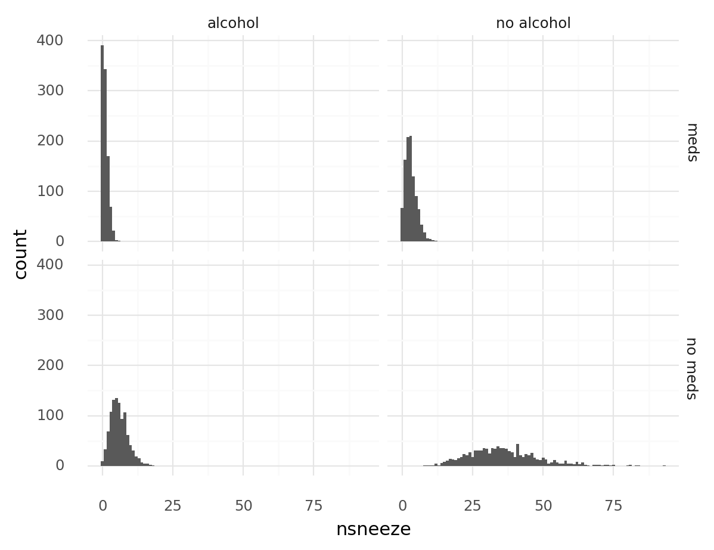
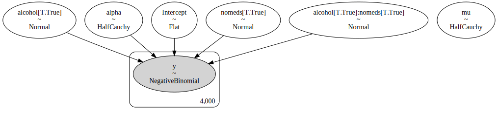
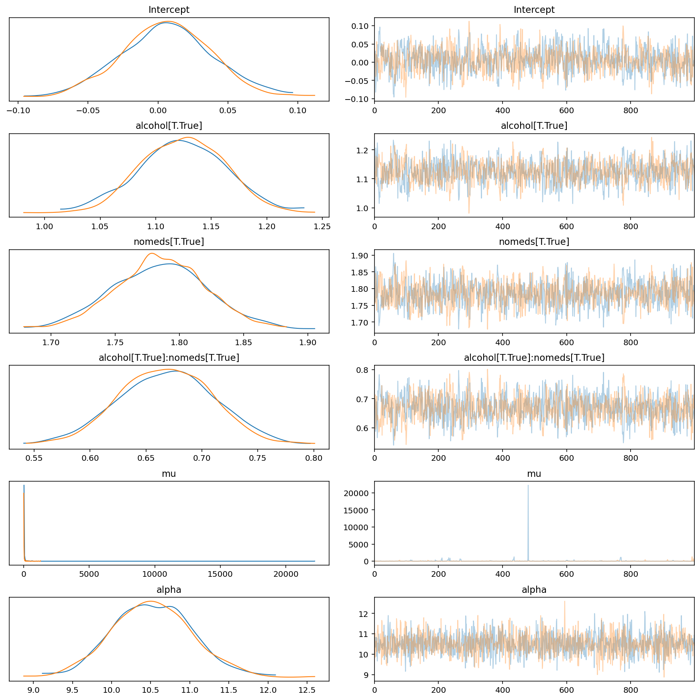
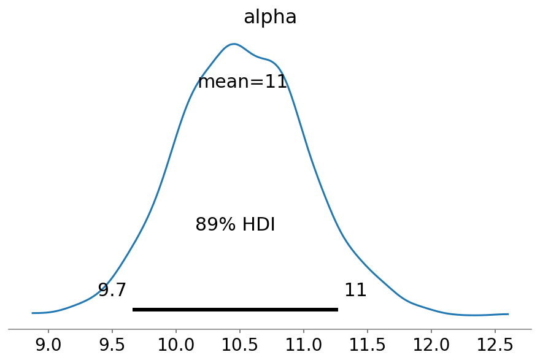

# GLM: Negative Binomial Regression

**[Original tutorial](https://docs.pymc.io/notebooks/GLM-negative-binomial-regression.html)**

Negative binomial (NB) regression is used to model count data where the variance is higher than the mean.
It is a Poisson distribution where the rate parameter is gamma-distributed

```python
import re

import arviz as az
import matplotlib.pyplot as plt
import numpy as np
import pandas as pd
import plotnine as gg
import pymc3 as pm
import seaborn as sns
from scipy import stats

RANDOM_SEED = 8927
np.random.seed(RANDOM_SEED)

%config InlineBackend.figure_format = "retina"
gg.theme_set(gg.theme_minimal)
```

## Data generation

Mock data where number of sneezes is affected by consumption of alcohol and/or medications.

### Poisson data

```python
# Real parameters
theta_noalcohol_meds = 1
theta_alcohol_meds = 3
theta_noalcohol_nomeds = 6
theta_alcohol_nomeds = 36

all_thetas = [
    theta_noalcohol_meds,
    theta_alcohol_meds,
    theta_noalcohol_nomeds,
    theta_alcohol_nomeds,
]

q = 1000
df_pois = pd.DataFrame(
    {
        "nsneeze": np.concatenate(
            [np.random.poisson(theta, q) for theta in all_thetas]
        ),
        "alcohol": np.concatenate(
            [np.repeat(b, q) for b in [False, True, False, True]]
        ),
        "nomeds": np.concatenate([np.repeat(b, q) for b in [False, False, True, True]]),
    }
)
```

The mean and varaince for each group should be very close.

```python
df_pois.groupby(["nomeds", "alcohol"])["nsneeze"].agg(["mean", "var"])
```

<div>
<style scoped>
    .dataframe tbody tr th:only-of-type {
        vertical-align: middle;
    }

    .dataframe tbody tr th {
        vertical-align: top;
    }

    .dataframe thead th {
        text-align: right;
    }
</style>
<table border="1" class="dataframe">
  <thead>
    <tr style="text-align: right;">
      <th></th>
      <th></th>
      <th>mean</th>
      <th>var</th>
    </tr>
    <tr>
      <th>nomeds</th>
      <th>alcohol</th>
      <th></th>
      <th></th>
    </tr>
  </thead>
  <tbody>
    <tr>
      <th rowspan="2" valign="top">False</th>
      <th>False</th>
      <td>1.047</td>
      <td>1.047839</td>
    </tr>
    <tr>
      <th>True</th>
      <td>3.089</td>
      <td>3.066145</td>
    </tr>
    <tr>
      <th rowspan="2" valign="top">True</th>
      <th>False</th>
      <td>6.002</td>
      <td>6.156152</td>
    </tr>
    <tr>
      <th>True</th>
      <td>36.004</td>
      <td>35.781766</td>
    </tr>
  </tbody>
</table>
</div>

### NB data

Suppose every subject in the dataset had the flu, increasing the varaince of their sneezing.

```python
# Gamma shape parameter.
alpha = 10


def get_nb_vals(mu: float, alpha: float, size: int) -> np.ndarray:
    g = stats.gamma.rvs(alpha, scale=mu / alpha, size=size)
    return stats.poisson.rvs(g)


n = 1000
df_nb = pd.DataFrame(
    {
        "nsneeze": np.concatenate(
            [get_nb_vals(theta, alpha, n) for theta in all_thetas]
        ),
        "alcohol": np.concatenate(
            [np.repeat(b, n) for b in [False, True, False, True]]
        ),
        "nomeds": np.concatenate([np.repeat(b, n) for b in [False, False, True, True]]),
    }
)
```

```python
df_nb.groupby(["nomeds", "alcohol"])["nsneeze"].agg(["mean", "var"])
```

<div>
<style scoped>
    .dataframe tbody tr th:only-of-type {
        vertical-align: middle;
    }

    .dataframe tbody tr th {
        vertical-align: top;
    }

    .dataframe thead th {
        text-align: right;
    }
</style>
<table border="1" class="dataframe">
  <thead>
    <tr style="text-align: right;">
      <th></th>
      <th></th>
      <th>mean</th>
      <th>var</th>
    </tr>
    <tr>
      <th>nomeds</th>
      <th>alcohol</th>
      <th></th>
      <th></th>
    </tr>
  </thead>
  <tbody>
    <tr>
      <th rowspan="2" valign="top">False</th>
      <th>False</th>
      <td>1.005</td>
      <td>1.134109</td>
    </tr>
    <tr>
      <th>True</th>
      <td>3.099</td>
      <td>4.255454</td>
    </tr>
    <tr>
      <th rowspan="2" valign="top">True</th>
      <th>False</th>
      <td>5.996</td>
      <td>9.557542</td>
    </tr>
    <tr>
      <th>True</th>
      <td>36.006</td>
      <td>158.450414</td>
    </tr>
  </tbody>
</table>
</div>

## Data visualization

```python
plot_data = df_nb.copy()
plot_data["meds"] = ["no meds" if b else "meds" for b in plot_data.nomeds]
plot_data["alcohol"] = ["no alcohol" if b else "alcohol" for b in plot_data.alcohol]

(
    gg.ggplot(plot_data, gg.aes(x="nsneeze"))
    + gg.facet_grid("meds ~ alcohol")
    + gg.geom_histogram(binwidth=1)
)
```

    /usr/local/Caskroom/miniconda/base/envs/pymc3-tutorials/lib/python3.9/site-packages/plotnine/facets/facet_grid.py:136: FutureWarning: Index.__and__ operating as a set operation is deprecated, in the future this will be a logical operation matching Series.__and__.  Use index.intersection(other) instead
    /usr/local/Caskroom/miniconda/base/envs/pymc3-tutorials/lib/python3.9/site-packages/plotnine/facets/facet_grid.py:137: FutureWarning: Index.__and__ operating as a set operation is deprecated, in the future this will be a logical operation matching Series.__and__.  Use index.intersection(other) instead



    <ggplot: (351093739)>

## Model

```python
with pm.Model() as model:
    pm.glm.GLM.from_formula(
        formula="nsneeze ~ alcohol + nomeds + alcohol:nomeds",
        data=df_nb,
        family=pm.glm.families.NegativeBinomial(),
    )
    trace = pm.sample(1000, init="advi", n_init=15000, tune=1000, cores=2, chains=2)

model_az = az.from_pymc3(trace=trace, model=model)
```

    Auto-assigning NUTS sampler...
    Initializing NUTS using advi...

<div>
    <style>
        /*Turns off some styling*/
        progress {
            /*gets rid of default border in Firefox and Opera.*/
            border: none;
            /*Needs to be in here for Safari polyfill so background images work as expected.*/
            background-size: auto;
        }
        .progress-bar-interrupted, .progress-bar-interrupted::-webkit-progress-bar {
            background: #F44336;
        }
    </style>
  <progress value='13596' class='' max='15000' style='width:300px; height:20px; vertical-align: middle;'></progress>
  90.64% [13596/15000 00:20<00:02 Average Loss = 10,433]
</div>

    Convergence achieved at 13700
    Interrupted at 13,699 [91%]: Average Loss = 14,125
    Multiprocess sampling (2 chains in 2 jobs)
    NUTS: [alpha, mu, alcohol[T.True]:nomeds[T.True], nomeds[T.True], alcohol[T.True], Intercept]

<div>
    <style>
        /*Turns off some styling*/
        progress {
            /*gets rid of default border in Firefox and Opera.*/
            border: none;
            /*Needs to be in here for Safari polyfill so background images work as expected.*/
            background-size: auto;
        }
        .progress-bar-interrupted, .progress-bar-interrupted::-webkit-progress-bar {
            background: #F44336;
        }
    </style>
  <progress value='4000' class='' max='4000' style='width:300px; height:20px; vertical-align: middle;'></progress>
  100.00% [4000/4000 03:31<00:00 Sampling 2 chains, 0 divergences]
</div>

    Sampling 2 chains for 1_000 tune and 1_000 draw iterations (2_000 + 2_000 draws total) took 224 seconds.
    The number of effective samples is smaller than 25% for some parameters.

```python
pm.model_to_graphviz(model)
```



```python
az.plot_trace(model_az, compact=False)
plt.show()
```



```python
np.exp(az.summary(model_az, hdi_prob=0.89)[["mean", "hdi_5.5%", "hdi_94.5%"]])
```

<div>
<style scoped>
    .dataframe tbody tr th:only-of-type {
        vertical-align: middle;
    }

    .dataframe tbody tr th {
        vertical-align: top;
    }

    .dataframe thead th {
        text-align: right;
    }
</style>
<table border="1" class="dataframe">
  <thead>
    <tr style="text-align: right;">
      <th></th>
      <th>mean</th>
      <th>hdi_5.5%</th>
      <th>hdi_94.5%</th>
    </tr>
  </thead>
  <tbody>
    <tr>
      <th>Intercept</th>
      <td>1.006018e+00</td>
      <td>0.948380</td>
      <td>1.053376e+00</td>
    </tr>
    <tr>
      <th>alcohol[T.True]</th>
      <td>3.077138e+00</td>
      <td>2.897940</td>
      <td>3.270687e+00</td>
    </tr>
    <tr>
      <th>nomeds[T.True]</th>
      <td>5.959580e+00</td>
      <td>5.612521</td>
      <td>6.296538e+00</td>
    </tr>
    <tr>
      <th>alcohol[T.True]:nomeds[T.True]</th>
      <td>1.950333e+00</td>
      <td>1.820298</td>
      <td>2.079235e+00</td>
    </tr>
    <tr>
      <th>mu</th>
      <td>1.090317e+18</td>
      <td>1.066092</td>
      <td>5.290344e+19</td>
    </tr>
    <tr>
      <th>alpha</th>
      <td>3.704912e+04</td>
      <td>15677.784668</td>
      <td>7.811989e+04</td>
    </tr>
  </tbody>
</table>
</div>

```python
az.plot_posterior(model_az, var_names=["alpha"], hdi_prob=0.89)
plt.show()
```



---

```python
%load_ext watermark
%watermark -n -u -v -iv -w
```

    Last updated: Mon Feb 08 2021

    Python implementation: CPython
    Python version       : 3.9.1
    IPython version      : 7.20.0

    scipy     : 1.6.0
    plotnine  : 0.7.1
    seaborn   : 0.11.1
    re        : 2.2.1
    numpy     : 1.20.0
    pymc3     : 3.9.3
    arviz     : 0.11.0
    matplotlib: 3.3.4
    pandas    : 1.2.1

    Watermark: 2.1.0
