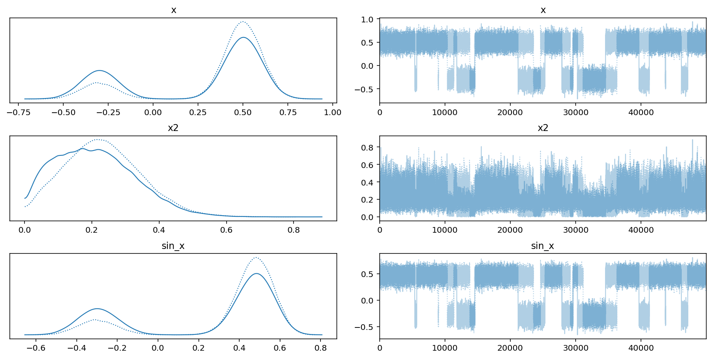

# Variational API Quickstart

[**Original article**](https://docs.pymc.io/notebooks/variational_api_quickstart.html)

The variational inference (VI) API in PyMC3 can be use to approximate posterior distributions for Bayesian models.

```python
from typing import Collection

import arviz as az
import matplotlib.pyplot as plt
import numpy as np
import pandas as pd
import plotnine as gg
import pymc3 as pm
import seaborn as sns
import theano
import theano.tensor as tt
from sklearn.datasets import load_iris
from sklearn.model_selection import train_test_split

%matplotlib inline
%config InlineBackend.figure_format = "retina"

gg.theme_set(gg.theme_classic() + gg.theme(strip_background=gg.element_blank()))

sns_blue = "#1F77B4"

RANDOM_SEED = 42
np.random.seed(RANDOM_SEED)
pm.set_tt_rng(RANDOM_SEED)
```

## Setup

Begin with an example of modeling a mixture model.

```python
w = pm.floatX([0.2, 0.8])
mu = pm.floatX([-0.3, 0.5])
sd = pm.floatX([0.1, 0.1])

with pm.Model() as model:
    x = pm.NormalMixture("x", w=w, mu=mu, sigma=sd, dtype=theano.config.floatX)
    x2 = x ** 2
    sin_x = pm.math.sin(x)
```

The expectations for this model cannot be computed analytically, but an approximation can be found using MCMC methods (e.g. NUTS).

```python
with model:
    pm.Deterministic("x2", x2)
    pm.Deterministic("sin_x", sin_x)

    trace = pm.sample(50000)
```

    /usr/local/Caskroom/miniconda/base/envs/pymc3-tutorials/lib/python3.9/site-packages/pymc3/sampling.py:466: FutureWarning: In an upcoming release, pm.sample will return an `arviz.InferenceData` object instead of a `MultiTrace` by default. You can pass return_inferencedata=True or return_inferencedata=False to be safe and silence this warning.
    Auto-assigning NUTS sampler...
    Initializing NUTS using jitter+adapt_diag...
    Multiprocess sampling (2 chains in 2 jobs)
    NUTS: [x]

<div>
    <style>
        /*Turns off some styling*/
        progress {
            /*gets rid of default border in Firefox and Opera.*/
            border: none;
            /*Needs to be in here for Safari polyfill so background images work as expected.*/
            background-size: auto;
        }
        .progress-bar-interrupted, .progress-bar-interrupted::-webkit-progress-bar {
            background: #F44336;
        }
    </style>
  <progress value='102000' class='' max='102000' style='width:300px; height:20px; vertical-align: middle;'></progress>
  100.00% [102000/102000 00:50<00:00 Sampling 2 chains, 0 divergences]
</div>

    Sampling 2 chains for 1_000 tune and 50_000 draw iterations (2_000 + 100_000 draws total) took 59 seconds.
    The estimated number of effective samples is smaller than 200 for some parameters.

We can plot the traces for $x^2$ and $\sin(x)$ and see the clear multi-modality of the model.

```python
az.plot_trace(az.from_pymc3(trace=trace, model=model));
```



One drawback of the above approach is that we need to know in advance what we want to see in the trace and wrap it with `pm.Deterministic()`.

The VI API takes an alternate approach: we obtain inference from the model, then calculate expressions based on the model.

We will use the same model as an example.

```python
with pm.Model() as model:
    x = pm.NormalMixture("x", w=w, mu=mu, sigma=sd, dtype=theano.config.floatX)
    x2 = x ** 2
    sin_x = pm.math.sin(x)

    mean_field = pm.fit(method="advi")
```

<div>
    <style>
        /*Turns off some styling*/
        progress {
            /*gets rid of default border in Firefox and Opera.*/
            border: none;
            /*Needs to be in here for Safari polyfill so background images work as expected.*/
            background-size: auto;
        }
        .progress-bar-interrupted, .progress-bar-interrupted::-webkit-progress-bar {
            background: #F44336;
        }
    </style>
  <progress value='10000' class='' max='10000' style='width:300px; height:20px; vertical-align: middle;'></progress>
  100.00% [10000/10000 00:00<00:00 Average Loss = 2.2413]
</div>

    Finished [100%]: Average Loss = 2.2687

We can see below that ADVI has failed to approximate the multimodel distribution because it uses a Gaussian distribution with a single mode.

```python
az.plot_trace(az.from_pymc3(trace=mean_field.sample(1000), model=model));
```


## Checking convergence

We can use the `pm.callbacks.CheckParametersConvergence()` callback to check if the VI converges.

```python
with model:
    mean_field = pm.fit(
        method="advi", callbacks=[pm.callbacks.CheckParametersConvergence()]
    )
```

<div>
    <style>
        /*Turns off some styling*/
        progress {
            /*gets rid of default border in Firefox and Opera.*/
            border: none;
            /*Needs to be in here for Safari polyfill so background images work as expected.*/
            background-size: auto;
        }
        .progress-bar-interrupted, .progress-bar-interrupted::-webkit-progress-bar {
            background: #F44336;
        }
    </style>
  <progress value='10000' class='' max='10000' style='width:300px; height:20px; vertical-align: middle;'></progress>
  100.00% [10000/10000 00:00<00:00 Average Loss = 2.2559]
</div>

    Finished [100%]: Average Loss = 2.2763

We can access the inference history in the `.hist` attribute of the `mean_field` object.

```python
def plot_vi_hist(mf: pm.variational.approximations.MeanField) -> gg.ggplot:
    d = pd.DataFrame({"hist": mf.hist, "step": np.arange(len(mf.hist))})
    return (
        gg.ggplot(d, gg.aes(x="step", y="hist"))
        + gg.geom_line(color=sns_blue, alpha=0.8)
        + gg.labs(x="step", y="inference")
    )
```

```python
plot_vi_hist(mean_field)
```


    <ggplot: (355797438)>

This is not a good convergence plot, even though we ran many iterations.
It is poor because the mean of the ADVI approximation is close to 0.
Therefore, taking the relative difference (the default method, `diff="relative"`) is unstable for checking convergence.
We can fix this by setting the `diff` parameter of the callback to `"absolute"`.

```python
with model:
    mean_field = pm.fit(
        method="advi",
        callbacks=[pm.callbacks.CheckParametersConvergence(diff="absolute")],
    )
```

<div>
    <style>
        /*Turns off some styling*/
        progress {
            /*gets rid of default border in Firefox and Opera.*/
            border: none;
            /*Needs to be in here for Safari polyfill so background images work as expected.*/
            background-size: auto;
        }
        .progress-bar-interrupted, .progress-bar-interrupted::-webkit-progress-bar {
            background: #F44336;
        }
    </style>
  <progress value='4349' class='' max='10000' style='width:300px; height:20px; vertical-align: middle;'></progress>
  43.49% [4349/10000 00:00<00:00 Average Loss = 3.3565]
</div>

    Convergence achieved at 4700
    Interrupted at 4,699 [46%]: Average Loss = 4.7996

Now, we can see that convergence is achieved much sooner at 4,700 steps.

```python
plot_vi_hist(mean_field)
```


    <ggplot: (355826261)>

## Tracking parameters

The `Tracker` callback can be used to track parameters during the fitting process.
Note that this can be a memory-intensive callback.
When using the `fit()` function, we do not have access to the approximation before inference, but tracking parameters requires access to the approximation.
This constraint can be evaded by iusing the object-oriented (OO) API for inference.

```python
with model:
    advi = pm.ADVI()
```

```python
advi.approx
```

    <pymc3.variational.approximations.MeanField at 0x153c13760>

Different approximations have different hyperparameters.
In mean-field ADVI, we have $\rho$ and $\mu$.

```python
advi.approx.shared_params
```

    {'mu': mu, 'rho': rho}

There are some convient shortcuts to important statistics associated with the approximation.

```python
advi.approx.mean.eval(), advi.approx.std.eval()
```

    (array([0.34]), array([0.69314718]))

We can wrap these statistics within the `Tracker` callback.

```python
tracker = pm.callbacks.Tracker(
    mean=advi.approx.mean.eval,
    std=advi.approx.std.eval,
)
```

```python
approx = advi.fit(20000, callbacks=[tracker])
```

<div>
    <style>
        /*Turns off some styling*/
        progress {
            /*gets rid of default border in Firefox and Opera.*/
            border: none;
            /*Needs to be in here for Safari polyfill so background images work as expected.*/
            background-size: auto;
        }
        .progress-bar-interrupted, .progress-bar-interrupted::-webkit-progress-bar {
            background: #F44336;
        }
    </style>
  <progress value='20000' class='' max='20000' style='width:300px; height:20px; vertical-align: middle;'></progress>
  100.00% [20000/20000 00:02<00:00 Average Loss = 1.9568]
</div>

    Finished [100%]: Average Loss = 1.9589

We can then plot the mean and standard deviations of the approximation over the ADVI process.

```python
def plot_means_std_hist(
    track_means: Collection[float],
    track_std: Collection[float],
    approx_history: Collection[float],
) -> gg.ggplot:

    titles = ["Mean track", "Std dev track", "Negative ELBO track"]

    d = pd.DataFrame(
        {
            titles[0]: track_means,
            titles[1]: track_std,
            titles[2]: approx_history,
            "x": np.arange(len(track_means)),
        }
    ).melt(id_vars="x", var_name="param", value_name="value")
    d["param"] = pd.Categorical(d.param.values, categories=titles, ordered=True)

    return (
        gg.ggplot(d, gg.aes(x="x", y="value"))
        + gg.facet_wrap("param", nrow=1, scales="free")
        + gg.geom_line(gg.aes(color="param"))
        + gg.scale_x_continuous(expand=(0, 0.02))
        + gg.scale_y_continuous(expand=(0, 0.02))
        + gg.scale_color_brewer(type="qual", palette="Dark2", guide=None)
        + gg.theme(figure_size=(10, 3), subplots_adjust={"wspace": 0.2})
        + gg.labs(x="step", y="value")
    )
```

```python
means = [a[0] for a in tracker["mean"]]
stds = [a[0] for a in tracker["std"]]

plot_means_std_hist(means, stds, advi.hist)
```


    <ggplot: (354908645)>

From the plot of the mean, we can see there were convergence issues, though the lack of convergence does not seem to change the ELBO trajectory substantially.
Since we are using the OO API, we can fun the approximation longer until convergence is achieved.

```python
advi.refine(100000)
```

<div>
    <style>
        /*Turns off some styling*/
        progress {
            /*gets rid of default border in Firefox and Opera.*/
            border: none;
            /*Needs to be in here for Safari polyfill so background images work as expected.*/
            background-size: auto;
        }
        .progress-bar-interrupted, .progress-bar-interrupted::-webkit-progress-bar {
            background: #F44336;
        }
    </style>
  <progress value='100000' class='' max='100000' style='width:300px; height:20px; vertical-align: middle;'></progress>
  100.00% [100000/100000 00:11<00:00 Average Loss = 1.8638]
</div>

    Finished [100%]: Average Loss = 1.8422

```python
means = [a[0] for a in tracker["mean"]]
stds = [a[0] for a in tracker["std"]]

plot_means_std_hist(means, stds, advi.hist)
```


    <ggplot: (355486296)>

The fact that the mean still looks like a random walk indicates that ADVI still did not converge.
This is likely because ADVI is not the best algorithm for performing inference on this model.
The reuslts are *very* unstable and using different random seeds would produce very different results.

We can see again that ADVI is unable to deal multimodality.

```python
d = pd.concat(
    [
        pd.DataFrame({"x": np.random.choice(trace["x"], 1000), "label": "NUTS"}),
        pd.DataFrame({"x": approx.sample(1000)["x"], "label": "ADVI"}),
    ]
).reset_index(drop=True)

(
    gg.ggplot(d, gg.aes(x="x", color="label"))
    + gg.geom_density(size=1)
    + gg.scale_x_continuous(expand=(0, 0))
    + gg.scale_y_continuous(expand=(0, 0, 0.02, 0))
    + gg.scale_color_brewer(type="qual", palette="Set1")
    + gg.labs(x="$x$ posterior", y="density", color="smapling method")
)
```


    <ggplot: (354875908)>

We can try to use the SVGD algorithm instead since it generates an approximation based on a large number of particles.

```python
with model:
    svgd_approx = pm.fit(
        300,
        method="svgd",
        inf_kwargs={"n_particles": 1000},
        obj_optimizer=pm.sgd(learning_rate=0.01),
    )
```

<div>
    <style>
        /*Turns off some styling*/
        progress {
            /*gets rid of default border in Firefox and Opera.*/
            border: none;
            /*Needs to be in here for Safari polyfill so background images work as expected.*/
            background-size: auto;
        }
        .progress-bar-interrupted, .progress-bar-interrupted::-webkit-progress-bar {
            background: #F44336;
        }
    </style>
  <progress value='300' class='' max='300' style='width:300px; height:20px; vertical-align: middle;'></progress>
  100.00% [300/300 00:52<00:00]
</div>

```python
d = pd.concat(
    [
        pd.DataFrame({"x": np.random.choice(trace["x"], 1000), "label": "NUTS"}),
        pd.DataFrame({"x": approx.sample(1000)["x"], "label": "ADVI"}),
        pd.DataFrame({"x": svgd_approx.sample(1000)["x"], "label": "SVGD"}),
    ]
).reset_index(drop=True)

(
    gg.ggplot(d, gg.aes(x="x", color="label"))
    + gg.geom_density(size=1)
    + gg.scale_x_continuous(expand=(0, 0))
    + gg.scale_y_continuous(expand=(0, 0, 0.02, 0))
    + gg.scale_color_brewer(type="qual", palette="Set1")
    + gg.labs(x="$x$ posterior", y="density", color="smapling method")
)
```


    <ggplot: (358493181)>

From this plot, we can see that SVGD was able to identify the multimodal distribution of $x$.

With this approximation, we can calculate arbitrary functions of the parameters.
To evaluate the expressions, use `svgd_approx.sample_node()` and the `eval()` of the sample.

```python
a = x ** 2
b = pm.math.sin(x)

a_sample = svgd_approx.sample_node(a)

# Every evaluation returns a differen value because it is stochastic.
a_sample.eval(), a_sample.eval(), a_sample.eval()
```

    (array(0.37410017), array(0.28284699), array(0.22338846))

We can get many samples using the `size` argument in `.sample_node()`.

```python
a_samples = svgd_approx.sample_node(a, size=1000)

sns.kdeplot(a_samples.eval())
plt.title("$x^2$ distribution");
```


```python
# Calculate variance
a_samples.var(axis=0).eval()
```

    array(0.09817046)

```python
# Calculate mean
a_samples.mean(axis=0).eval()
```

    array(0.25033471)

## Multilabel logisitic regression

We will fit a model for multi-label classification of the Iris data set as an example.

```python
X, y = load_iris(return_X_y=True)
X_train, X_test, y_train, y_test = train_test_split(X, y)
```

```python
num_features = X.shape[1]
num_classes = len(np.unique(y))
```

```python
Xt = theano.shared(X_train)
yt = theano.shared(y_train)

with pm.Model() as iris_model:

    # Coefficients for features.
    β = pm.Normal("β", 0, 100, shape=(num_features, num_classes))

    # Transform to unit interval.
    a = pm.Flat("a", shape=(num_classes,))
    p = tt.nnet.softmax(Xt.dot(β) + a)

    observed = pm.Categorical("obs", p=p, observed=yt)
```

```python
pm.model_to_graphviz(iris_model)
```


PyMC3 models have symbolic inputs for latent variables.
Fixed values need to be provided to evaluate an expression that requires knolwedge of these latent variables.
These values can come from VI approximations.

The `.sample_node()` method removes the symbolic dependencies.

```python
with iris_model:

    # Use SVGD algorithm.
    inference = pm.SVGD(n_particles=500, jitter=1)

    # Create a local reference to the approximation.
    approx = inference.approx

    train_probs = approx.sample_node(p)
    test_probs = approx.sample_node(p, more_replacements={Xt: X_test}, size=100)
```

We now have 100 sampled probabilities for each data point.

We can create symbolic expressions for measuring accuracy.

```python
test_ok = tt.eq(test_probs.argmax(-1), y_test)
train_ok = tt.eq(train_probs.argmax(-1), y_train)
test_accuracy = test_ok.mean(-1)
train_accuracy = train_ok.mean(-1)

eval_tracker = pm.callbacks.Tracker(
    test_accuracy=test_accuracy.eval, train_accuracy=train_accuracy.eval
)

inference.fit(200, callbacks=[eval_tracker])
```

<div>
    <style>
        /*Turns off some styling*/
        progress {
            /*gets rid of default border in Firefox and Opera.*/
            border: none;
            /*Needs to be in here for Safari polyfill so background images work as expected.*/
            background-size: auto;
        }
        .progress-bar-interrupted, .progress-bar-interrupted::-webkit-progress-bar {
            background: #F44336;
        }
    </style>
  <progress value='200' class='' max='200' style='width:300px; height:20px; vertical-align: middle;'></progress>
  100.00% [200/200 00:19<00:00]
</div>

    <pymc3.variational.approximations.Empirical at 0x15220a1c0>

We can now plot the training and test accuracy over the fitting process.

```python
accuracy_results = pd.concat(
    [
        pd.DataFrame(eval_tracker["test_accuracy"])
        .T.melt(var_name="step", value_name="acc")
        .assign(label="test"),
        pd.DataFrame(eval_tracker["train_accuracy"], columns=["acc"])
        .assign(label="train")
        .assign(step=np.arange(len(eval_tracker["train_accuracy"]))),
    ]
)

(
    gg.ggplot(accuracy_results, gg.aes(x="step", y="acc"))
    + gg.geom_smooth(gg.aes(group="label", color="label"), method="lowess", span=0.1)
    + gg.scale_x_continuous(expand=(0, 0))
    + gg.scale_y_continuous(limits=(0, 1), expand=(0, 0.01))
    + gg.scale_color_brewer(type="qual", palette="Set1")
    + gg.labs(x="fitting step", y="accuracy", color="data set")
)
```

    /usr/local/Caskroom/miniconda/base/envs/pymc3-tutorials/lib/python3.9/site-packages/plotnine/stats/smoothers.py:310: PlotnineWarning: Confidence intervals are not yet implementedfor lowess smoothings.


    <ggplot: (356258753)>

It does not look like this worked at all.

We can try a different optimizer to boost the learning rate.

```python
inference.fit(400, obj_optimizer=pm.adamax(learning_rate=0.1), callbacks=[eval_tracker])
```

<div>
    <style>
        /*Turns off some styling*/
        progress {
            /*gets rid of default border in Firefox and Opera.*/
            border: none;
            /*Needs to be in here for Safari polyfill so background images work as expected.*/
            background-size: auto;
        }
        .progress-bar-interrupted, .progress-bar-interrupted::-webkit-progress-bar {
            background: #F44336;
        }
    </style>
  <progress value='400' class='' max='400' style='width:300px; height:20px; vertical-align: middle;'></progress>
  100.00% [400/400 00:38<00:00]
</div>

    <pymc3.variational.approximations.Empirical at 0x15220a1c0>

```python
accuracy_results = pd.concat(
    [
        pd.DataFrame(eval_tracker["test_accuracy"])
        .T.melt(var_name="step", value_name="acc")
        .assign(label="test"),
        pd.DataFrame(eval_tracker["train_accuracy"], columns=["acc"])
        .assign(label="train")
        .assign(step=np.arange(len(eval_tracker["train_accuracy"]))),
    ]
)

(
    gg.ggplot(accuracy_results, gg.aes(x="step", y="acc"))
    + gg.geom_smooth(gg.aes(group="label", color="label"), method="lowess", span=0.1)
    + gg.scale_x_continuous(expand=(0, 0))
    + gg.scale_y_continuous(limits=(0, 1), expand=(0, 0.01))
    + gg.scale_color_brewer(type="qual", palette="Set1")
    + gg.labs(x="fitting step", y="accuracy", color="data set")
)
```

    /usr/local/Caskroom/miniconda/base/envs/pymc3-tutorials/lib/python3.9/site-packages/plotnine/stats/smoothers.py:310: PlotnineWarning: Confidence intervals are not yet implementedfor lowess smoothings.


    <ggplot: (355416068)>

Changing to a Adamax training schedule seems to have worked.

## Minibatches

Minibatch training can be used to speed up and improve approximation when using large datasets.
Use the `pm.Minibatch` class which is just a specialized Theano tensor.

As an example, we will generate a large dataset.

```python
data = np.random.rand(40000, 100)
data *= np.random.randint(1, 10, size=(100,))
data += np.random.rand(100) * 10
```

For comparison we will fit the model with and without minibatching.

```python
with pm.Model() as model:
    mu = pm.Flat("mu", shape=(100,))
    sd = pm.HalfNormal("sd", shape=(100,))
    lik = pm.Normal("lik", mu, sd, observed=data)
```

To not waste too much time, we can create a callback to stop the approximation after 100 steps.

```python
def stop_after_100(approx, loss_history, i):
    if i == 100:
        raise StopIteration("Stopping approximation.")
```

```python
with model:
    advifit = pm.fit(callbacks=[stop_after_100])
```

<div>
    <style>
        /*Turns off some styling*/
        progress {
            /*gets rid of default border in Firefox and Opera.*/
            border: none;
            /*Needs to be in here for Safari polyfill so background images work as expected.*/
            background-size: auto;
        }
        .progress-bar-interrupted, .progress-bar-interrupted::-webkit-progress-bar {
            background: #F44336;
        }
    </style>
  <progress value='99' class='' max='10000' style='width:300px; height:20px; vertical-align: middle;'></progress>
  0.99% [99/10000 00:12<20:56 Average Loss = 6.2737e+08]
</div>

    Stopping approximation.
    Interrupted at 99 [0%]: Average Loss = 6.2211e+08

Now we can use minibatching.

> Rembember to set the `total_size` parameter in the observed variable!

```python
X_batch = pm.Minibatch(data, batch_size=500)

with pm.Model() as model:
    mu = pm.Flat("mu", shape=(100,))
    sd = pm.HalfNormal("sd", shape=(100,))
    likelihood = pm.Normal(
        "likelihood", mu, sd, observed=X_batch, total_size=data.shape
    )
```

    /usr/local/Caskroom/miniconda/base/envs/pymc3-tutorials/lib/python3.9/site-packages/pymc3/data.py:316: FutureWarning: Using a non-tuple sequence for multidimensional indexing is deprecated; use `arr[tuple(seq)]` instead of `arr[seq]`. In the future this will be interpreted as an array index, `arr[np.array(seq)]`, which will result either in an error or a different result.

```python
pm.model_to_graphviz(model)
```


```python
with model:
    advifit = pm.fit()
```

<div>
    <style>
        /*Turns off some styling*/
        progress {
            /*gets rid of default border in Firefox and Opera.*/
            border: none;
            /*Needs to be in here for Safari polyfill so background images work as expected.*/
            background-size: auto;
        }
        .progress-bar-interrupted, .progress-bar-interrupted::-webkit-progress-bar {
            background: #F44336;
        }
    </style>
  <progress value='10000' class='' max='10000' style='width:300px; height:20px; vertical-align: middle;'></progress>
  100.00% [10000/10000 00:13<00:00 Average Loss = 1.5642e+05]
</div>

    Finished [100%]: Average Loss = 1.5636e+05

```python
d = pd.DataFrame({"loss": advifit.hist, "x": np.arange(len(advifit.hist))})

(
    gg.ggplot(d, gg.aes("x", "loss"))
    + gg.geom_line(alpha=0.8, size=0.1, color=sns_blue)
    + gg.scale_x_continuous(expand=(0, 0))
    + gg.scale_y_continuous(expand=(0, 0, 0.02, 0), limits=(0, np.nan))
    + gg.labs(x="step", y="loss")
    + gg.theme(figure_size=(8, 4))
)
```


    <ggplot: (365782583)>

```python
print(pm.Minibatch.__doc__)
```

    Multidimensional minibatch that is pure TensorVariable

        Parameters
        ----------
        data: np.ndarray
            initial data
        batch_size: ``int`` or ``List[int|tuple(size, random_seed)]``
            batch size for inference, random seed is needed
            for child random generators
        dtype: ``str``
            cast data to specific type
        broadcastable: tuple[bool]
            change broadcastable pattern that defaults to ``(False, ) * ndim``
        name: ``str``
            name for tensor, defaults to "Minibatch"
        random_seed: ``int``
            random seed that is used by default
        update_shared_f: ``callable``
            returns :class:`ndarray` that will be carefully
            stored to underlying shared variable
            you can use it to change source of
            minibatches programmatically
        in_memory_size: ``int`` or ``List[int|slice|Ellipsis]``
            data size for storing in ``theano.shared``

        Attributes
        ----------
        shared: shared tensor
            Used for storing data
        minibatch: minibatch tensor
            Used for training

        Notes
        -----
        Below is a common use case of Minibatch with variational inference.
        Importantly, we need to make PyMC3 "aware" that a minibatch is being used in inference.
        Otherwise, we will get the wrong :math:`logp` for the model.
        the density of the model ``logp`` that is affected by Minibatch. See more in the examples below.
        To do so, we need to pass the ``total_size`` parameter to the observed node, which correctly scales
        the density of the model ``logp`` that is affected by Minibatch. See more in the examples below.

        Examples
        --------
        Consider we have `data` as follows:

        >>> data = np.random.rand(100, 100)

        if we want a 1d slice of size 10 we do

        >>> x = Minibatch(data, batch_size=10)

        Note that your data is cast to ``floatX`` if it is not integer type
        But you still can add the ``dtype`` kwarg for :class:`Minibatch`
        if you need more control.

        If we want 10 sampled rows and columns
        ``[(size, seed), (size, seed)]`` we can use

        >>> x = Minibatch(data, batch_size=[(10, 42), (10, 42)], dtype='int32')
        >>> assert str(x.dtype) == 'int32'


        Or, more simply, we can use the default random seed = 42
        ``[size, size]``

        >>> x = Minibatch(data, batch_size=[10, 10])


        In the above, `x` is a regular :class:`TensorVariable` that supports any math operations:


        >>> assert x.eval().shape == (10, 10)


        You can pass the Minibatch `x` to your desired model:

        >>> with pm.Model() as model:
        ...     mu = pm.Flat('mu')
        ...     sd = pm.HalfNormal('sd')
        ...     lik = pm.Normal('lik', mu, sd, observed=x, total_size=(100, 100))


        Then you can perform regular Variational Inference out of the box


        >>> with model:
        ...     approx = pm.fit()


        Important note: :class:``Minibatch`` has ``shared``, and ``minibatch`` attributes
        you can call later:

        >>> x.set_value(np.random.laplace(size=(100, 100)))

        and minibatches will be then from new storage
        it directly affects ``x.shared``.
        A less convenient convenient, but more explicit, way to achieve the same
        thing:

        >>> x.shared.set_value(pm.floatX(np.random.laplace(size=(100, 100))))

        The programmatic way to change storage is as follows
        I import ``partial`` for simplicity
        >>> from functools import partial
        >>> datagen = partial(np.random.laplace, size=(100, 100))
        >>> x = Minibatch(datagen(), batch_size=10, update_shared_f=datagen)
        >>> x.update_shared()

        To be more concrete about how we create a minibatch, here is a demo:
        1. create a shared variable

            >>> shared = theano.shared(data)

        2. take a random slice of size 10:

            >>> ridx = pm.tt_rng().uniform(size=(10,), low=0, high=data.shape[0]-1e-10).astype('int64')

        3) take the resulting slice:

            >>> minibatch = shared[ridx]

        That's done. Now you can use this minibatch somewhere else.
        You can see that the implementation does not require a fixed shape
        for the shared variable. Feel free to use that if needed.
        *FIXME: What is "that" which we can use here?  A fixed shape?  Should this say
        "but feel free to put a fixed shape on the shared variable, if appropriate?"*

        Suppose you need to make some replacements in the graph, e.g. change the minibatch to testdata

        >>> node = x ** 2  # arbitrary expressions on minibatch `x`
        >>> testdata = pm.floatX(np.random.laplace(size=(1000, 10)))

        Then you should create a `dict` with replacements:

        >>> replacements = {x: testdata}
        >>> rnode = theano.clone(node, replacements)
        >>> assert (testdata ** 2 == rnode.eval()).all()

        *FIXME: In the following, what is the **reason** to replace the Minibatch variable with
        its shared variable?  And in the following, the `rnode` is a **new** node, not a modification
        of a previously existing node, correct?*
        To replace a minibatch with its shared variable you should do
        the same things. The Minibatch variable is accessible through the `minibatch` attribute.
        For example

        >>> replacements = {x.minibatch: x.shared}
        >>> rnode = theano.clone(node, replacements)

        For more complex slices some more code is needed that can seem not so clear

        >>> moredata = np.random.rand(10, 20, 30, 40, 50)

        The default ``total_size`` that can be passed to ``PyMC3`` random node
        is then ``(10, 20, 30, 40, 50)`` but can be less verbose in some cases

        1. Advanced indexing, ``total_size = (10, Ellipsis, 50)``

            >>> x = Minibatch(moredata, [2, Ellipsis, 10])

            We take the slice only for the first and last dimension

            >>> assert x.eval().shape == (2, 20, 30, 40, 10)

        2. Skipping a particular dimension, ``total_size = (10, None, 30)``:

            >>> x = Minibatch(moredata, [2, None, 20])
            >>> assert x.eval().shape == (2, 20, 20, 40, 50)

        3. Mixing both of these together, ``total_size = (10, None, 30, Ellipsis, 50)``:

            >>> x = Minibatch(moredata, [2, None, 20, Ellipsis, 10])
            >>> assert x.eval().shape == (2, 20, 20, 40, 10)

---

```python
%load_ext watermark
%watermark -n -u -v -iv -w
```

    Last updated: Thu Feb 18 2021

    Python implementation: CPython
    Python version       : 3.9.1
    IPython version      : 7.20.0

    pandas    : 1.2.2
    numpy     : 1.20.1
    theano    : 1.1.2
    seaborn   : 0.11.1
    matplotlib: 3.3.4
    plotnine  : 0.7.1
    pymc3     : 3.11.1
    arviz     : 0.11.1

    Watermark: 2.1.0

```python

```
