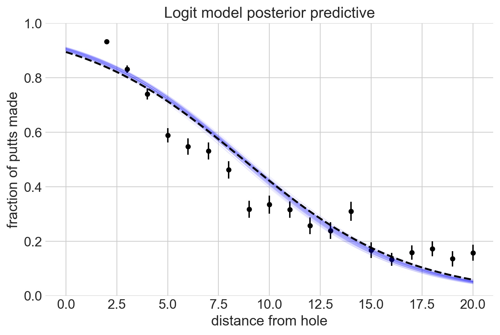
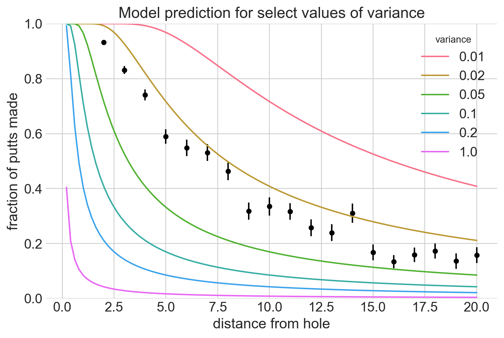

# Model building and expansion for golf putting

[Tutorial](https://docs.pymc.io/pymc-examples/examples/case_studies/putting_workflow.html)

## Setup

### Imports

```python
import io
from typing import Optional, Sequence, Union

import arviz as az
import janitor
import matplotlib.pyplot as plt
import numpy as np
import pandas as pd
import plotnine as gg
import pymc3 as pm
import scipy
import scipy.stats as st
import seaborn as sns
import theano.tensor as tt
```

### Settings

```python
%config InlineBackend.figure_format = "retina"

az.style.use("arviz-darkgrid")
gg.theme_set(gg.theme_minimal)
sns.set_style("whitegrid")

RANDOM_SEED = 432
np.random.seed(RANDOM_SEED)

HDI_PROB = 0.89
```

### Data

```python
# golf putting data from berry (1996)
golf_data_str = """
distance tries successes
2 1443 1346
3 694 577
4 455 337
5 353 208
6 272 149
7 256 136
8 240 111
9 217 69
10 200 67
11 237 75
12 202 52
13 192 46
14 174 54
15 167 28
16 201 27
17 195 31
18 191 33
19 147 20
20 152 24
"""


golf_data = pd.read_csv(io.StringIO(golf_data_str), sep=" ")
golf_data.head()
```

<div>
<style scoped>
    .dataframe tbody tr th:only-of-type {
        vertical-align: middle;
    }

    .dataframe tbody tr th {
        vertical-align: top;
    }

    .dataframe thead th {
        text-align: right;
    }
</style>
<table border="1" class="dataframe">
  <thead>
    <tr style="text-align: right;">
      <th></th>
      <th>distance</th>
      <th>tries</th>
      <th>successes</th>
    </tr>
  </thead>
  <tbody>
    <tr>
      <th>0</th>
      <td>2</td>
      <td>1443</td>
      <td>1346</td>
    </tr>
    <tr>
      <th>1</th>
      <td>3</td>
      <td>694</td>
      <td>577</td>
    </tr>
    <tr>
      <th>2</th>
      <td>4</td>
      <td>455</td>
      <td>337</td>
    </tr>
    <tr>
      <th>3</th>
      <td>5</td>
      <td>353</td>
      <td>208</td>
    </tr>
    <tr>
      <th>4</th>
      <td>6</td>
      <td>272</td>
      <td>149</td>
    </tr>
  </tbody>
</table>
</div>

```python
def plot_golf_data(
    df: pd.DataFrame, ax: Optional[plt.Axes] = None, plt_title: Optional[str] = None
) -> plt.Axes:
    df["frac_success"] = df.successes / df.tries
    success_intervals = st.beta(df.successes, df.tries - df.successes)
    df["success_interval_low"] = success_intervals.interval(0.68)[0]
    df["success_interval_high"] = success_intervals.interval(0.68)[1]

    ax = sns.scatterplot(data=df, x="distance", y="frac_success", color="black", ax=ax)
    ax.vlines(df.distance, *success_intervals.interval(0.68), color="black", label=None)
    ax.set_xlabel("distance from hole")
    ax.set_ylabel("fraction of putts made")
    if plt_title is not None:
        ax.set_title(plt_title)
    ax.set_ylim(bottom=0, top=1)
    sns.despine(ax=ax)
    return ax
```

```python
plot_golf_data(golf_data);
```


## Modeling

### Logit model

A traditional logit-binomial model on the number of success given the number of trials.

$$
\text{num. success} \sim \text{Binomial}(\text{tries}, p(\text{successes})) \\
p(\text{success}) = \text{logit}^{-1} (a \times \text{distance} + b) \\
a \sim \mathcal{N}(0, 1) \quad b \sim \mathcal{N}(0, 1)
$$

```python
def logit_model(data: pd.DataFrame) -> pm.Model:
    with pm.Model() as logit_binom:
        a = pm.Normal("a", 0, 1)
        b = pm.Normal("b", 0, 1)

        success = pm.Binomial(
            "success",
            n=data.tries,
            p=pm.math.invlogit(a * data.distance + b),
            observed=data.successes,
        )
    return logit_binom
```

```python
m1_logit_model = logit_model(golf_data)
pm.model_to_graphviz(m1_logit_model)
```


```python
sampling_kwargs = {
    "draws": 1000,
    "tune": 1000,
    "chains": 4,
    "cores": 2,
    "random_seed": RANDOM_SEED,
    "return_inferencedata": True,
}

with m1_logit_model:
    m1_logit_trace = pm.sample(**sampling_kwargs, target_accept=0.95)

pm.summary(m1_logit_trace)
```

    Auto-assigning NUTS sampler...
    Initializing NUTS using jitter+adapt_diag...
    Multiprocess sampling (4 chains in 2 jobs)
    NUTS: [b, a]

<div>
    <style>
        /*Turns off some styling*/
        progress {
            /*gets rid of default border in Firefox and Opera.*/
            border: none;
            /*Needs to be in here for Safari polyfill so background images work as expected.*/
            background-size: auto;
        }
        .progress-bar-interrupted, .progress-bar-interrupted::-webkit-progress-bar {
            background: #F44336;
        }
    </style>
  <progress value='8000' class='' max='8000' style='width:300px; height:20px; vertical-align: middle;'></progress>
  100.00% [8000/8000 00:07<00:00 Sampling 4 chains, 0 divergences]
</div>

    Sampling 4 chains for 1_000 tune and 1_000 draw iterations (4_000 + 4_000 draws total) took 21 seconds.

<div>
<style scoped>
    .dataframe tbody tr th:only-of-type {
        vertical-align: middle;
    }

    .dataframe tbody tr th {
        vertical-align: top;
    }

    .dataframe thead th {
        text-align: right;
    }
</style>
<table border="1" class="dataframe">
  <thead>
    <tr style="text-align: right;">
      <th></th>
      <th>mean</th>
      <th>sd</th>
      <th>hdi_3%</th>
      <th>hdi_97%</th>
      <th>mcse_mean</th>
      <th>mcse_sd</th>
      <th>ess_bulk</th>
      <th>ess_tail</th>
      <th>r_hat</th>
    </tr>
  </thead>
  <tbody>
    <tr>
      <th>a</th>
      <td>-0.255</td>
      <td>0.007</td>
      <td>-0.268</td>
      <td>-0.243</td>
      <td>0.000</td>
      <td>0.000</td>
      <td>1211.0</td>
      <td>1223.0</td>
      <td>1.0</td>
    </tr>
    <tr>
      <th>b</th>
      <td>2.226</td>
      <td>0.058</td>
      <td>2.116</td>
      <td>2.335</td>
      <td>0.002</td>
      <td>0.001</td>
      <td>1226.0</td>
      <td>1225.0</td>
      <td>1.0</td>
    </tr>
  </tbody>
</table>
</div>

```python
az.plot_trace(m1_logit_trace, compact=False);
```


```python
az.plot_posterior(m1_logit_trace, hdi_prob=HDI_PROB);
```


```python
with m1_logit_model:
    m1_logit_ppc = pm.sample_posterior_predictive(m1_logit_trace, progressbar=False)
```

```python
logit_ppc_success = m1_logit_ppc["success"].T / golf_data.tries.values.reshape(-1, 1)
```

```python
def plot_logit_model_results(
    trace: az.InferenceData, ax: plt.Axes, distances: np.ndarray
) -> plt.Axes:
    a_post = trace.posterior["a"].values.flatten()
    b_post = trace.posterior["b"].values.flatten()

    for i in np.random.randint(0, len(a_post), 50):
        y = scipy.special.expit(a_post[i] * d + b_post[i])
        ax.plot(d, y, alpha=0.05, lw=1, color="blue")

    y_mean = scipy.special.expit(a_post * d.reshape(-1, 1) + b_post).mean(axis=1)
    ax.plot(d, y, "k--", lw=2, label="logit-binomial model")
    return ax
```

```python
ax = plot_golf_data(golf_data, plt_title="Logit model posterior predictive")
d = np.linspace(0, golf_data.distance.max(), 100)
plot_logit_model_results(m1_logit_trace, ax, d)
plt.show()
```



```python
a_post = m1_logit_trace.posterior["a"].values.flatten()
b_post = m1_logit_trace.posterior["b"].values.flatten()

prob_at_50 = scipy.special.expit(a_post * 50 + b_post).mean() * 100
print(f"probability of success at 50 feet: {prob_at_50:.5f}%")
```

    probability of success at 50 feet: 0.00276%

```python
az.plot_pair(m1_logit_trace, var_names=["a", "b"]);
```


### Geometry-based model

A professional golfer can hit a ball in a certain direction with some normally-distributed error.
The ball will go in the hole when the angle is small enough that the ball hists the cup.
Using basic geometry, we can get the following model for the probability of success given some variance of accuracy and distance from the hole.

$$
p(\text{success} | \sigma_{\text{angle}}, \text{distance}) = 2 \Phi \lgroup \frac{\arcsin(R -r) / \text{distance}}{\sigma_{\text{angle}}} \rgroup
$$

where $\Phi$ is the normal cumulative density function, $R$ is the radius of the cup (2.125 inches), and $r$ is the radius of the golf ball (0.84 inches).

```python
# Constants in feet.
BALL_RADIUS = (1.68 / 2) / 12
CUP_RADIUS = (4.25 / 2) / 12
```

```python
def forward_angle_model(
    variance_of_shot: float, distances: Union[Sequence[float], float]
) -> np.ndarray:
    frac = np.arcsin(CUP_RADIUS - BALL_RADIUS) / distances
    return 2 * st.norm(0, variance_of_shot).cdf(frac) - 1
```

```python
distances = np.linspace(0, golf_data.distance.max(), 100)[1:]
variances = (0.01, 0.02, 0.05, 0.1, 0.2, 1)

variance_probs_df = pd.concat(
    [
        pd.DataFrame(
            {
                "variance": v,
                "distance": distances,
                "prob_success": forward_angle_model(v, distances),
            }
        )
        for v in variances
    ]
).astype({"variance": "category"})

ax = plot_golf_data(
    golf_data, plt_title="Model prediction for select values of variance"
)
sns.lineplot(
    data=variance_probs_df,
    x="distance",
    y="prob_success",
    hue="variance",
    palette="husl",
    ax=ax,
);
```



```python
def Phi(x: tt.TensorVariable) -> tt.TensorVariable:
    """The standard normal cumulative distribution function."""
    y = 0.5 + 0.5 * tt.erf(x / tt.sqrt(2.0))
    return y
```

```python
def angle_model(data: pd.DataFrame) -> pm.Model:
    with pm.Model() as model:
        variance_of_shot = pm.HalfNormal("sigma_angle", 1)
        p_goes_in_hole = pm.Deterministic(
            "p_goes_in_hole",
            2
            * Phi(
                tt.arcsin((CUP_RADIUS - BALL_RADIUS) / data.distance) / variance_of_shot
            )
            - 1,
        )
        n_success = pm.Binomial(
            "n_success", n=data.tries, p=p_goes_in_hole, observed=data.successes
        )
    return model
```

```python
m2_angle_model = angle_model(golf_data)
pm.model_to_graphviz(m2_angle_model)
```


```python
with m2_angle_model:
    angle_prior = pm.sample_prior_predictive(500, random_seed=RANDOM_SEED)
```

```python
shot_angle = np.random.normal(0, angle_prior["sigma_angle"])  # radians
distance = 20  # feet

end_positions = np.array([distance * np.cos(shot_angle), distance * np.sin(shot_angle)])

fig, ax = plt.subplots()
for x, y in end_positions.T:
    ax.plot([0, x], [0, y], "k-o", lw=1, mfc="w", alpha=0.3)

ax.plot([0, distance - 1], [0, 0], "g-->", alpha=1)
ax.plot(0, 0, "bo", label="start", mfc="b", ms=10)
ax.plot(distance, 0, "ro", label="hole", mfc="r", ms=10)

ax.set_xlabel("x")
ax.set_ylabel("y")
ax.set_title(f"Prior distribution of putts from {distance}ft away")
ax.legend()

plt.show()
```


```python
with m2_angle_model:
    m2_angle_trace = pm.sample(**sampling_kwargs, target_accept=0.95)
```

    Auto-assigning NUTS sampler...
    Initializing NUTS using jitter+adapt_diag...
    Multiprocess sampling (4 chains in 2 jobs)
    NUTS: [sigma_angle]

<div>
    <style>
        /*Turns off some styling*/
        progress {
            /*gets rid of default border in Firefox and Opera.*/
            border: none;
            /*Needs to be in here for Safari polyfill so background images work as expected.*/
            background-size: auto;
        }
        .progress-bar-interrupted, .progress-bar-interrupted::-webkit-progress-bar {
            background: #F44336;
        }
    </style>
  <progress value='8000' class='' max='8000' style='width:300px; height:20px; vertical-align: middle;'></progress>
  100.00% [8000/8000 00:05<00:00 Sampling 4 chains, 0 divergences]
</div>

    Sampling 4 chains for 1_000 tune and 1_000 draw iterations (4_000 + 4_000 draws total) took 20 seconds.

```python
az.plot_trace(m2_angle_trace, var_names=["sigma_angle"], compact=False);
```


```python
az.plot_posterior(m2_angle_trace, var_names=["sigma_angle"], hdi_prob=HDI_PROB);
```


```python
def plot_geomtry_model_results(
    trace: az.InferenceData, ax: plt.Axes, distances: np.ndarray
) -> plt.Axes:
    sigma_angle_post = trace.posterior["sigma_angle"].values.flatten()

    for i in np.random.randint(0, len(sigma_angle_post), 50):
        ax.plot(
            distances,
            forward_angle_model(sigma_angle_post[i], distances),
            alpha=0.1,
            color="g",
        )

    ax.plot(
        distances,
        forward_angle_model(sigma_angle_post.mean(), distances),
        color="C1",
        linestyle="--",
        lw=2,
        label="geometry-based model",
    )
    return ax
```

```python
ax = plot_golf_data(
    golf_data,
    plt_title="Comparing the fits of the logit-binomial and geometry-based models",
)
distances = np.linspace(0, golf_data.distance.max(), 200)[1:]

plot_logit_model_results(m1_logit_trace, ax, distances)
plot_geomtry_model_results(m2_angle_trace, ax, distances)


ax.legend()
plt.show()
```


```python
sigma_angle_post = m2_angle_trace.posterior["sigma_angle"].values.flatten()
prob_at_50 = forward_angle_model(sigma_angle_post, 50)[0] * 100
print(f"probability of success at 50 feet: {prob_at_50:.2f}%")
```

    probability of success at 50 feet: 6.49%

```python
shot_angle = np.random.normal(0, np.random.choice(sigma_angle_post, 500))  # radians
distance = 20  # feet

end_positions = np.array([distance * np.cos(shot_angle), distance * np.sin(shot_angle)])

fig, ax = plt.subplots()
for x, y in end_positions.T:
    ax.plot([0, x], [0, y], "k-o", lw=1, mfc="w", alpha=0.3)

ax.plot([0, distance - 0.5], [0, 0], "g-->", alpha=1)
ax.plot(0, 0, "bo", label="start", mfc="b", ms=10)
ax.plot(distance, 0, "ro", label="hole", mfc="r", ms=10)

ax.set_xlabel("x")
ax.set_ylabel("y")
ax.set_title(f"Posterior distribution of putts from {distance}ft away")
ax.legend()

plt.show()
```


```python

```

```python

```

```python

```

```python

```

```python

```

```python

```

```python

```

```python

```

```python

```

```python

```

---

```python
%load_ext watermark
%watermark -n -u -v -iv -w
```

    Last updated: Fri Aug 06 2021

    Python implementation: CPython
    Python version       : 3.9.6
    IPython version      : 7.26.0

    janitor   : 0.21.0
    scipy     : 1.7.0
    matplotlib: 3.4.2
    pymc3     : 3.11.2
    seaborn   : 0.11.1
    numpy     : 1.21.1
    theano    : 1.1.2
    pandas    : 1.3.1
    plotnine  : 0.8.0
    arviz     : 0.11.2

    Watermark: 2.2.0
