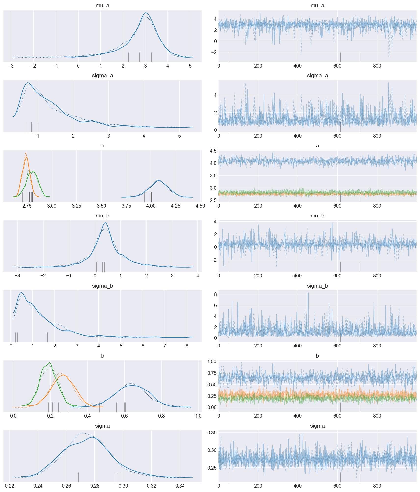

# Making posterior predictions on new groups in a hierarchcial model

```python
from typing import Optional

import arviz as az
import janitor
import matplotlib.pyplot as plt
import numpy as np
import pandas as pd
import plotnine as gg
import pymc3 as pm
import seaborn as sns

_ = gg.theme_set(
    gg.theme_classic()
    + gg.theme(axis_ticks=gg.element_blank(), strip_background=gg.element_blank())
)
plt.style.use("seaborn-darkgrid")
%matplotlib inline
%config InlineBackend.figure_format='retina'
```

```python
iris = sns.load_dataset("iris")
assert isinstance(iris, pd.DataFrame)
iris["species"] = pd.Categorical(iris.species, ordered=True)
iris.head()
```

<div>
<style scoped>
    .dataframe tbody tr th:only-of-type {
        vertical-align: middle;
    }

    .dataframe tbody tr th {
        vertical-align: top;
    }

    .dataframe thead th {
        text-align: right;
    }
</style>
<table border="1" class="dataframe">
  <thead>
    <tr style="text-align: right;">
      <th></th>
      <th>sepal_length</th>
      <th>sepal_width</th>
      <th>petal_length</th>
      <th>petal_width</th>
      <th>species</th>
    </tr>
  </thead>
  <tbody>
    <tr>
      <th>0</th>
      <td>5.1</td>
      <td>3.5</td>
      <td>1.4</td>
      <td>0.2</td>
      <td>setosa</td>
    </tr>
    <tr>
      <th>1</th>
      <td>4.9</td>
      <td>3.0</td>
      <td>1.4</td>
      <td>0.2</td>
      <td>setosa</td>
    </tr>
    <tr>
      <th>2</th>
      <td>4.7</td>
      <td>3.2</td>
      <td>1.3</td>
      <td>0.2</td>
      <td>setosa</td>
    </tr>
    <tr>
      <th>3</th>
      <td>4.6</td>
      <td>3.1</td>
      <td>1.5</td>
      <td>0.2</td>
      <td>setosa</td>
    </tr>
    <tr>
      <th>4</th>
      <td>5.0</td>
      <td>3.6</td>
      <td>1.4</td>
      <td>0.2</td>
      <td>setosa</td>
    </tr>
  </tbody>
</table>
</div>

```python
iris.shape
```

    (150, 5)

```python
sns.scatterplot(data=iris, x="sepal_length", y="sepal_width", hue="species")
```

    <AxesSubplot:xlabel='sepal_length', ylabel='sepal_width'>


```python
def scale(
    x: np.ndarray, m: Optional[float] = None, s: Optional[float] = None
) -> np.ndarray:
    if m is None:
        m = np.mean(x)
    if s is None:
        s = np.std(x)

    return (x - m) / s
```

```python
iris["sepal_length_z"] = scale(iris.sepal_length.values)
```

```python
def get_index(df: pd.DataFrame, col: str) -> np.ndarray:
    return df[col].cat.codes.values
```

```python
def iris_model_factory(
    sepal_len: np.ndarray,
    sepal_width: np.ndarray,
    species_idx: np.ndarray,
    n_species: int,
) -> pm.Model:
    s = species_idx
    with pm.Model() as m:
        mu_b = pm.Normal("mu_b", 1, 2)
        sigma_b = pm.Gamma("sigma_b", 3, 1)
        b = pm.Normal("b", mu_b, sigma_b, shape=(n_species))

        mu_a = pm.Normal("mu_a", 0, 2)
        sigma_a = pm.HalfNormal("sigma_a", 2)
        a = pm.Normal("a", mu_a, sigma_a, shape=(n_species))

        mu = pm.Deterministic("mu", a[s] + b[s] * sepal_len)
        sigma = pm.HalfNormal("sigma", 1)

        y = pm.Normal("sepal_width", mu, sigma, observed=sepal_width)
    return m
```

```python
with iris_model_factory(
    sepal_len=iris.sepal_length_z.values,
    sepal_width=iris.sepal_width.values,
    species_idx=get_index(iris, "species"),
    n_species=3,
) as m:
    iris_multitrace = pm.sample(
        target_accept=0.95, random_seed=90, return_inferencedata=False
    )
    iris_ppc = pm.sample_posterior_predictive(iris_multitrace)
    iris_trace = az.from_pymc3(trace=iris_multitrace, posterior_predictive=iris_ppc)

assert isinstance(iris_trace, az.InferenceData)
```

    Auto-assigning NUTS sampler...
    Initializing NUTS using jitter+adapt_diag...
    Multiprocess sampling (2 chains in 2 jobs)
    NUTS: [sigma, a, sigma_a, mu_a, b, sigma_b, mu_b]

<div>
    <style>
        /*Turns off some styling*/
        progress {
            /*gets rid of default border in Firefox and Opera.*/
            border: none;
            /*Needs to be in here for Safari polyfill so background images work as expected.*/
            background-size: auto;
        }
        .progress-bar-interrupted, .progress-bar-interrupted::-webkit-progress-bar {
            background: #F44336;
        }
    </style>
  <progress value='4000' class='' max='4000' style='width:300px; height:20px; vertical-align: middle;'></progress>
  100.00% [4000/4000 00:17<00:00 Sampling 2 chains, 3 divergences]
</div>

    Sampling 2 chains for 1_000 tune and 1_000 draw iterations (2_000 + 2_000 draws total) took 27 seconds.
    There were 2 divergences after tuning. Increase `target_accept` or reparameterize.
    There was 1 divergence after tuning. Increase `target_accept` or reparameterize.

<div>
    <style>
        /*Turns off some styling*/
        progress {
            /*gets rid of default border in Firefox and Opera.*/
            border: none;
            /*Needs to be in here for Safari polyfill so background images work as expected.*/
            background-size: auto;
        }
        .progress-bar-interrupted, .progress-bar-interrupted::-webkit-progress-bar {
            background: #F44336;
        }
    </style>
  <progress value='2000' class='' max='2000' style='width:300px; height:20px; vertical-align: middle;'></progress>
  100.00% [2000/2000 00:02<00:00]
</div>

```python
pm.model_to_graphviz(m)
```


```python
az.plot_trace(
    iris_trace, var_names=["mu_a", "sigma_a", "a", "mu_b", "sigma_b", "b", "sigma"]
)
plt.tight_layout()
plt.show()
```



```python
az.plot_ppc(iris_trace, num_pp_samples=100)
```

    <AxesSubplot:xlabel='sepal_width / sepal_width'>


```python
iris_ppc_mean = (
    iris_trace.posterior_predictive["sepal_width"]
    .values.reshape(-1, len(iris))
    .mean(axis=0)
)

(
    gg.ggplot(iris.assign(ppc_mean=iris_ppc_mean), gg.aes(x="sepal_length_z"))
    + gg.geom_jitter(
        gg.aes(y="sepal_width", color="species"),
        alpha=0.5,
        size=1,
        width=0.05,
        height=0,
    )
    + gg.geom_point(gg.aes(y="ppc_mean", color="species"), shape="D")
    + gg.scale_color_brewer(type="qual", palette="Dark2")
)
```


    <ggplot: (352017375)>

```python
n_new_species = 1
_new_sepal_len = np.arange(
    np.min(iris.sepal_length_z) - 0.1, np.max(iris.sepal_length_z) + 0.2, 0.1
)
new_sepal_len = np.tile(_new_sepal_len, n_new_species)
new_species_idx = np.repeat(
    np.arange(n_new_species), len(new_sepal_len) / n_new_species
)
new_sepal_width = np.empty(new_sepal_len.shape[0], dtype=int)

new_iris = pd.DataFrame(
    {
        "sepal_length_z": new_sepal_len,
        "sepal_width": new_sepal_width,
        "species": new_species_idx,
    }
)
new_iris.head()
```

<div>
<style scoped>
    .dataframe tbody tr th:only-of-type {
        vertical-align: middle;
    }

    .dataframe tbody tr th {
        vertical-align: top;
    }

    .dataframe thead th {
        text-align: right;
    }
</style>
<table border="1" class="dataframe">
  <thead>
    <tr style="text-align: right;">
      <th></th>
      <th>sepal_length_z</th>
      <th>sepal_width</th>
      <th>species</th>
    </tr>
  </thead>
  <tbody>
    <tr>
      <th>0</th>
      <td>-1.970024</td>
      <td>5764607523034234880</td>
      <td>0</td>
    </tr>
    <tr>
      <th>1</th>
      <td>-1.870024</td>
      <td>5764607523034234880</td>
      <td>0</td>
    </tr>
    <tr>
      <th>2</th>
      <td>-1.770024</td>
      <td>4606281698874490908</td>
      <td>0</td>
    </tr>
    <tr>
      <th>3</th>
      <td>-1.670024</td>
      <td>607985949695017</td>
      <td>0</td>
    </tr>
    <tr>
      <th>4</th>
      <td>-1.570024</td>
      <td>5764607523034234880</td>
      <td>0</td>
    </tr>
  </tbody>
</table>
</div>

```python
new_iris.shape
```

    (47, 3)

```python
top_vars = ["mu_a", "sigma_a", "mu_b", "sigma_b", "sigma"]
```

```python
trace_records = (
    iris_trace.posterior.get(top_vars)
    .to_dataframe()
    .reset_index(drop=True)
    .to_dict("records")
)

trace_records[0]
```

    {'mu_a': 3.1152680422925645,
     'sigma_a': 1.2364984403432382,
     'mu_b': 0.8132218090892008,
     'sigma_b': 0.7701813152174082,
     'sigma': 0.29127900855782063}

```python
trace_records = pm.trace_to_dataframe(
    iris_multitrace, varnames=top_vars, include_transformed=True
).to_dict("records")

trace_records[0]
```

    {'mu_a': 3.1152680422925645,
     'sigma_a': 1.2364984403432382,
     'mu_b': 0.8132218090892008,
     'sigma_b': 0.7701813152174082,
     'sigma': 0.29127900855782063}

```python
with iris_model_factory(
    sepal_len=new_iris.sepal_length_z,
    sepal_width=new_iris.sepal_width,
    species_idx=new_iris.species,
    n_species=n_new_species,
):
    new_iris_ppc = pm.sample_posterior_predictive(
        trace=trace_records,
        samples=len(trace_records),
        var_names=["a", "b", "sepal_width"],
    )
```

<div>
    <style>
        /*Turns off some styling*/
        progress {
            /*gets rid of default border in Firefox and Opera.*/
            border: none;
            /*Needs to be in here for Safari polyfill so background images work as expected.*/
            background-size: auto;
        }
        .progress-bar-interrupted, .progress-bar-interrupted::-webkit-progress-bar {
            background: #F44336;
        }
    </style>
  <progress value='2000' class='' max='2000' style='width:300px; height:20px; vertical-align: middle;'></progress>
  100.00% [2000/2000 00:12<00:00]
</div>

```python
az.plot_posterior(iris_trace, var_names=["mu_a", "sigma_a"])
```

    array([<AxesSubplot:title={'center':'mu_a'}>,
           <AxesSubplot:title={'center':'sigma_a'}>], dtype=object)


```python
new_data_posterior_a = pd.DataFrame(
    new_iris_ppc["a"], columns=[f"s{i}" for i in range(n_new_species)]
).pivot_longer(names_to="species")

iris_posterior_a = (
    pd.DataFrame(
        iris_trace.posterior["a"].values.reshape(-1, iris.species.nunique()),
        columns=iris.species.cat.categories,
    )
    .head()
    .pivot_longer(names_to="species")
)

(
    gg.ggplot(new_data_posterior_a, gg.aes(x="value"))
    + gg.geom_density(
        gg.aes(y=gg.after_stat("scaled")), color="black", fill="black", alpha=0.1
    )
    + gg.geom_density(
        gg.aes(color="species", fill="species", y=gg.after_stat("scaled")),
        data=iris_posterior_a,
        alpha=0.2,
    )
    + gg.scale_color_brewer(type="qual", palette="Dark2")
    + gg.scale_fill_brewer(type="qual", palette="Dark2")
    + gg.scale_x_continuous(expand=0)
    + gg.scale_y_continuous(expand=(0, 0, 0.02, 0))
)
```


    <ggplot: (352581105)>

```python
for param in ["a", "b"]:
    prop_pos = np.mean(new_iris_ppc[param] > 0).round(2)
    print(f"proportion of '{param}' > 0: {prop_pos}")
```

    proportion of 'a' > 0: 0.93
    proportion of 'b' > 0: 0.68

```python
new_ppc_df = (
    pd.DataFrame(new_iris_ppc["sepal_width"])
    .reset_index(drop=False)
    .rename(columns={"index": "draw"})
    .pivot_longer("draw", names_to="data_pt", values_to="value")
    .set_index("data_pt")
    .merge(new_iris, left_index=True, right_index=True)
    .reset_index(drop=False)
    .rename(columns={"index": "data_pt"})
)

new_ppc_df.head()
```

<div>
<style scoped>
    .dataframe tbody tr th:only-of-type {
        vertical-align: middle;
    }

    .dataframe tbody tr th {
        vertical-align: top;
    }

    .dataframe thead th {
        text-align: right;
    }
</style>
<table border="1" class="dataframe">
  <thead>
    <tr style="text-align: right;">
      <th></th>
      <th>data_pt</th>
      <th>draw</th>
      <th>value</th>
      <th>sepal_length_z</th>
      <th>sepal_width</th>
      <th>species</th>
    </tr>
  </thead>
  <tbody>
    <tr>
      <th>0</th>
      <td>0</td>
      <td>0</td>
      <td>-2.008921</td>
      <td>-1.970024</td>
      <td>5764607523034234880</td>
      <td>0</td>
    </tr>
    <tr>
      <th>1</th>
      <td>0</td>
      <td>1</td>
      <td>2.738855</td>
      <td>-1.970024</td>
      <td>5764607523034234880</td>
      <td>0</td>
    </tr>
    <tr>
      <th>2</th>
      <td>0</td>
      <td>2</td>
      <td>2.432017</td>
      <td>-1.970024</td>
      <td>5764607523034234880</td>
      <td>0</td>
    </tr>
    <tr>
      <th>3</th>
      <td>0</td>
      <td>3</td>
      <td>3.334118</td>
      <td>-1.970024</td>
      <td>5764607523034234880</td>
      <td>0</td>
    </tr>
    <tr>
      <th>4</th>
      <td>0</td>
      <td>4</td>
      <td>-0.886592</td>
      <td>-1.970024</td>
      <td>5764607523034234880</td>
      <td>0</td>
    </tr>
  </tbody>
</table>
</div>

```python
new_ppc_df_avg = (
    new_ppc_df.groupby(["data_pt", "sepal_length_z"])["value"]
    .mean()
    .reset_index(drop=False)
    .merge(
        pd.DataFrame(
            az.hdi(new_iris_ppc["sepal_width"], hdi_prob=0.89),
            columns=["hdi_low", "hdi_high"],
        ),
        left_index=True,
        right_index=True,
    )
)

new_ppc_df_avg.head()
```

    /var/folders/r4/qpcdgl_14hbd412snp1jnv300000gn/T/ipykernel_45817/4113931169.py:7: FutureWarning: hdi currently interprets 2d data as (draw, shape) but this will change in a future release to (chain, draw) for coherence with other functions

<div>
<style scoped>
    .dataframe tbody tr th:only-of-type {
        vertical-align: middle;
    }

    .dataframe tbody tr th {
        vertical-align: top;
    }

    .dataframe thead th {
        text-align: right;
    }
</style>
<table border="1" class="dataframe">
  <thead>
    <tr style="text-align: right;">
      <th></th>
      <th>data_pt</th>
      <th>sepal_length_z</th>
      <th>value</th>
      <th>hdi_low</th>
      <th>hdi_high</th>
    </tr>
  </thead>
  <tbody>
    <tr>
      <th>0</th>
      <td>0</td>
      <td>-1.970024</td>
      <td>1.872095</td>
      <td>-3.758199</td>
      <td>7.363495</td>
    </tr>
    <tr>
      <th>1</th>
      <td>1</td>
      <td>-1.870024</td>
      <td>1.920238</td>
      <td>-3.155270</td>
      <td>7.723792</td>
    </tr>
    <tr>
      <th>2</th>
      <td>2</td>
      <td>-1.770024</td>
      <td>1.957975</td>
      <td>-2.971501</td>
      <td>7.447237</td>
    </tr>
    <tr>
      <th>3</th>
      <td>3</td>
      <td>-1.670024</td>
      <td>1.988461</td>
      <td>-2.740075</td>
      <td>7.235244</td>
    </tr>
    <tr>
      <th>4</th>
      <td>4</td>
      <td>-1.570024</td>
      <td>2.044742</td>
      <td>-2.386891</td>
      <td>7.108347</td>
    </tr>
  </tbody>
</table>
</div>

```python
_blue = "blue"

(
    gg.ggplot(
        new_ppc_df.query("draw < 500"),
        gg.aes(x="sepal_length_z", y="value"),
    )
    + gg.geom_line(gg.aes(group="draw"), alpha=0.1)
    + gg.geom_line(data=new_ppc_df_avg, color=_blue, size=1.2, linetype="--", alpha=0.5)
    + gg.geom_ribbon(
        gg.aes(ymin="hdi_low", ymax="hdi_high"),
        data=new_ppc_df_avg,
        fill=_blue,
        alpha=0.1,
    )
    + gg.geom_jitter(
        gg.aes(x="sepal_length_z", y="sepal_width"),
        data=iris,
        size=1,
        width=0.05,
        height=0,
        alpha=0.7,
    )
    + gg.geom_hline(yintercept=0)
    + gg.geom_vline(xintercept=0)
    + gg.scale_x_continuous(expand=(0, 0))
    + gg.scale_y_continuous(limits=(-5, 12), expand=(0, 0))
    + gg.labs(
        x="sepal length (scaled)",
        y="sepal width",
        title="Posterior predictive distribution on new groups",
    )
)
```


    <ggplot: (352579988)>

---

```python
%load_ext watermark
%watermark -n -u -v -iv -w
```

    Last updated: Wed Nov 17 2021

    Python implementation: CPython
    Python version       : 3.9.7
    IPython version      : 7.29.0

    janitor   : 0.21.2
    plotnine  : 0.8.0
    pymc3     : 3.11.2
    sys       : 3.9.7 | packaged by conda-forge | (default, Sep 29 2021, 20:33:18)
    [Clang 11.1.0 ]
    seaborn   : 0.11.2
    numpy     : 1.21.4
    pandas    : 1.3.4
    arviz     : 0.11.4
    matplotlib: 3.4.3

    Watermark: 2.2.0

```python

```
